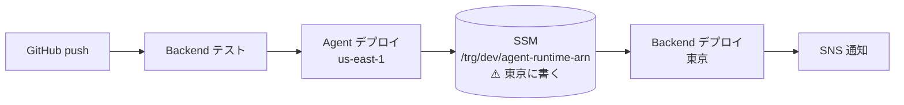

# CICD/ — 自動デプロイ（CodeBuild）

**GitHubにpushしたら、AgentとBackendが自動でデプロイされる。**

```
buildspec.yml        ⚠️ リポジトリ直下。実際のデプロイ手順はここ
CICD/
  build.yaml         CodeBuildプロジェクト（CloudFormation）
  notice.yaml        ビルド結果を通知するSNSトピック
  deploy-sample.sh   CI/CD自体を立てるスクリプトの雛形
  README.md
```

> ⚠️ **`buildspec.yml` はリポジトリ直下に置く**（`CICD/` の中ではない）。
> CodeBuildが既定で見る場所であり、**将来 `Agent/` `Backend/` を
> 別リポジトリに分けたときも、そのまま各リポジトリの直下になる**。

## 何をデプロイするか

| 対象 | デプロイする | 理由 |
|---|---|---|
| [`Agent/`](../Agent/) | ✅ | AgentCore（CDK）。**us-east-1** |
| [`Backend/`](../Backend/) | ✅ | SAM。**東京** |
| [`App/`](../App/) | ❌ | **Expo経由で配布する**ので、AWSにデプロイするものが無い |

## ⚠️ 順序が決まっている（入れ替えられない）



**BackendはAgentのRuntime ARNを必要とする**ので、Agentを先にデプロイする。

- Agentのデプロイ後、**ARNをSSMパラメータに書く**（`/trg/<env>/agent-runtime-arn`）
- BackendのSAMテンプレートは、そのパラメータ名を受け取って**CloudFormationが値を解決する**

### ⚠️ なぜCloudFormationのエクスポートではないのか

**AgentCoreのスタックはRuntime ARNをエクスポートしている**（`...-RuntimeArn`）。
それでも使えないのは、**エクスポートが us-east-1 にあり、Backendは東京にある**から。
**`Fn::ImportValue` はリージョンを跨げない。**

SSMはAPIで読むだけなので、**リージョンは引数にすぎない**。
そのため**パラメータは東京に書く**（読む側がそこを見るため）。

> 📌 **アカウントIDがリポジトリに残らない**という副次的な利点もある。
> 渡すのは**パラメータ名**（`/trg/dev/agent-runtime-arn`）だけで、
> ARN実体はParameter Storeの中にある。

### テストは先に走る

`buildspec.yml` の `pre_build` で `pytest` を実行する。
⚠️ **落ちたらデプロイに進まない**（デプロイ後に気づいても遅い）。

## 準備（初回だけ）

### 1. GitHub接続を作る

CodeBuildがGitHubを見るには、**コンソールで接続を作って承認する**必要がある。

1. AWSコンソール → Developer Tools → Settings → **Connections**
2. 「Create connection」→ **GitHub** を選ぶ
3. 名前をつけて作成（例: `trg-github`）
4. ⚠️ **「Pending」のままでは動かない。** 接続を選び
   「Update pending connection」でGitHubのOAuthを承認する
5. 承認後、**接続のARNをコピー**する

> ⚠️ **接続を承認しただけでは足りない。**
> Webhook付きのCodeBuildは、**接続を「CodeBuild自身の認証情報」として登録**する必要がある。
> 登録が無いとスタック作成が次で失敗する:
>
> ```
> Failed to call CreateWebhook, reason: Access token not found in
> CodeBuild project for server type github
> ```
>
> `deploy.sh` が**自動で登録する**ので通常は意識しなくてよい。手でやるなら:
>
> ```sh
> AWS_PROFILE=touring aws codebuild import-source-credentials \
>   --server-type GITHUB --auth-type CODECONNECTIONS \
>   --token "<接続のARN>" --region ap-northeast-1
> ```
>
> **アカウント＋リージョン単位**の設定なので、一度やれば以降は不要。

> ⚠️ **初回だけ、通知ルールの作成に失敗することがある。**
>
> ```
> Invalid request provided: AWS::CodeStarNotifications::NotificationRule
> ```
>
> **原因**: CodeStar Notifications は**サービスリンクドロール**
> （`AWSServiceRoleForCodeStarNotifications`）を要する。これは初回リクエスト時に
> **自動作成されるが最大15分かかり**、通知ルールの作成は**その完了を待たない**。
>
> **対処**: **10〜15分待ってから再デプロイする**（スタックの削除を忘れずに）。
> ⚠️ **一度ロールができれば二度と起きない。**

> ⚠️ **失敗したスタックは消してから作り直す。**
> 作成に失敗したスタックは `ROLLBACK_COMPLETE` で残り、**この状態は更新できない**。
> 原因を直して再実行する前に消すこと（中身は既に消えているので実害はない）:
>
> ```sh
> AWS_PROFILE=touring aws cloudformation delete-stack \
>   --stack-name stack-trg-dev-cicd-main --region ap-northeast-1
> ```

### 2. デプロイスクリプトを作る

⚠️ **接続ARNにはアカウントIDが含まれる**ので、スクリプトはコミットしない
（`.gitignore` 済み）。雛形をコピーして使う。

```sh
cd CICD
cp deploy-sample.sh deploy.sh
vi deploy.sh          # CODESTAR_CONNECTION_ARN を埋める
./deploy.sh
```

これで **CodeBuildプロジェクトとSNSトピックが立つ**。
以降は**pushするだけ**でアプリがデプロイされる。

### 3. 通知を受け取る（任意）

⚠️ **SNSの購読はテンプレートに書いていない。**
メールアドレスは受信箱で確認操作が要るうえ、**公開リポジトリに個人のメールアドレスは書けない**ため。

```sh
AWS_PROFILE=touring aws sns subscribe \
  --topic-arn "$(AWS_PROFILE=touring aws cloudformation describe-stacks \
      --stack-name stack-trg-common-cicd-notice --region ap-northeast-1 \
      --query "Stacks[0].Outputs[?OutputKey=='TopicArn'].OutputValue" --output text)" \
  --protocol email --notification-endpoint <自分のメールアドレス> \
  --region ap-northeast-1
```

届いた確認メールのリンクを踏むと有効になる。

## パラメータ

| パラメータ | 既定値 | 意味 |
|---|---|---|
| `Env` | `dev` | 環境識別子。スタック名に入る |
| `GitHubOwner` | `h-akira` | リポジトリのオーナー |
| `GitHubRepo` | `TouringProject` | リポジトリ名 |
| `GitHubBranch` | `main` | ビルド対象のブランチ |
| `CodeStarConnectionArn` | — | ⚠️ **必須。** GitHub接続のARN |
| `EnableWebhook` | `true` | pushで自動ビルドするか |
| `EnableNotification` | `false` | SNS通知を出すか |
| `NotificationEnv` | `common` | 通知先トピックの環境識別子 |

## ⚠️ ドキュメントだけの変更ではビルドしない

`build.yaml` のWebhookに**パスのフィルタ**を入れている:

```
^(Agent/|Backend/|CICD/|buildspec\.yml$)
```

**このリポジトリは半分がドキュメント**なので、これが無いと
`docs/` を直すたびにビルドが走り、**何もデプロイしないのに課金される**。

## 費用について

- **CodeBuildは実行時間に対して課金される**（待機中は無料）。
- ⚠️ **AgentCoreはCI/CDとは無関係にアイドル中も課金される。**
  長期間開発しないなら、Agentのスタックごと消すのが有効
  （`.memory/todo.md` の「アイドル課金の実測」）。

## 将来やるかもしれないこと

- **AgentとBackendのCodeBuildを分ける。**
  いまは1つでまとめているが、**受け渡しが既にSSM経由**なので、
  分けるときは「Agentの後にBackendを走らせる」順序を担保するだけでよい。
- **prod環境と手動承認（CodePipeline）。**
  いまは `dev` しか無いので入れていない。
- **App（Expo）のビルド。** EAS Buildを使うなら別系統になる。

> ⚠️ **デプロイの実行はユーザーが行う**（`CLAUDE.md`）。
> CI/CDが入った後も、**CI/CD自体を立てる `deploy.sh` は手で実行する。**
