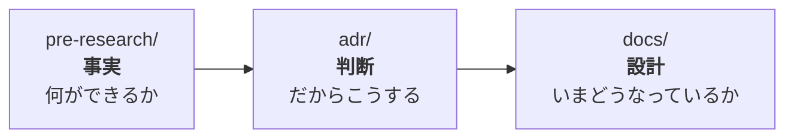

# TouringProject

**バイクでのツーリング中に、現在地・進行方向の文脈に基づいてAIと音声で対話するアプリ。**

走行中は手が使えないので、イヤモニ経由の音声入出力とハンズフリー起動が前提。

> 「右手に見える山は何？」
> 「この地域の特色は？」

## このリポジトリについて

**開発の記録を兼ねた学習用リポジトリでもある。**
開発者はWeb開発（AWS/Vue/Lambda/JS）の経験はあるがモバイルは未経験のため、
**判断の過程・つまずき・設計理由をドキュメントに残しながら**進めている。

## 構成

⚠️ **`App/` `Backend/` `Agent/` `CICD/` は submodule**（それぞれ別リポジトリ・[adr/011](adr/011_repository_split.md)）。
**設計と記録（`docs/` `adr/` `pre-research/` `learning/`）はこの親リポジトリにある。**

| ディレクトリ | 中身 |
|---|---|
| [`App/`](https://github.com/h-akira/TouringProject_App) | React Native (Expo) アプリ本体 |
| [`Backend/`](https://github.com/h-akira/TouringProject_Backend) | AWSバックエンド（SAM, Python）。API Gateway + Lambda + SQS + DynamoDB |
| [`Agent/`](https://github.com/h-akira/TouringProject_Agent) | AgentCoreのエージェント本体（Strands）。会話の継続とWeb検索を担う |
| [`CICD/`](https://github.com/h-akira/TouringProject_CICD) | CI/CD。⚠️ **非公開** |
| [`docs/`](docs/) | **現在の設計。** 要件定義・アーキテクチャ・API仕様 |
| [`adr/`](adr/) | **決定の記録。** なぜそう決めたか、何を却下したか |
| [`pre-research/`](pre-research/) | **技術検証。** 実測値と検証スクリプト |
| [`learning/`](learning/) | **学習教材。** 使った技術の基礎を、既存のWeb知識と対応づけて書いたメモ |

## 取得する

```sh
git clone https://github.com/h-akira/TouringProject.git
cd TouringProject
git submodule update --init App Backend Agent   # CICD は非公開なので除く
```

⚠️ **submodule を取得しないと `App/` などが空のディレクトリになる。**

## 動かす

**アプリは実機Android + Expo Development Build**、バックエンドはAWSにデプロイして使う。

⚠️ **Expo Go では動かない**（US-2.04のハンズフリー起動にネイティブコードが要るため。
[adr/006](adr/006_handsfree_launch_mechanism.md)）。初回はAndroid Studio等の
セットアップとネイティブビルドが要る。**使い方は [App/README.md](https://github.com/h-akira/TouringProject_App/blob/main/README.md)、
初回セットアップとトラブルシュートは [App/SETUP.md](https://github.com/h-akira/TouringProject_App/blob/main/SETUP.md)**
（初回セットアップ・APIキーの取得・開発の中断/再開・つまずいたとき）。

```sh
cd App
npm install            # API の型は postinstall で自動生成される
cp .env.example .env   # APIのURLを書く（⚠️ APIキーはここに書かない）
npx expo run:android    # 初回はビルドして実機にインストール
npx expo start          # 2回目以降はこれだけで実機のアプリから繋がる
```

| やりたいこと | 見るところ |
|---|---|
| アプリを動かす | [App/README.md](https://github.com/h-akira/TouringProject_App/blob/main/README.md) |
| バックエンドをデプロイ / APIキーを取り出す | [Backend/README.md](https://github.com/h-akira/TouringProject_Backend/blob/main/README.md) |
| CI/CD | [CICD/](https://github.com/h-akira/TouringProject_CICD)（⚠️ **非公開**） |

### ドキュメントの使い分け

同じ話題が複数の場所に出てくることがあるが、**役割が違う**。



- **`pre-research/`** は検証の記録。「Nova 2 Sonic は日本語に対応していない」のような**事実**。
- **`adr/`** は決定の記録。「だから方式1を採る」という**判断**と、却下した案。
- **`docs/`** は現在の設計。**履歴は書かない**（いまの姿が読み取れなくなるため）。

`learning/` はこの流れとは別軸で、**技術そのものを学ぶためのメモ**。
このリポジトリが学習を兼ねているために置いている。
同じ話題が `docs/` と両方に出てくることもあるが、**書く目的が違う**
（例: 逆ジオコーディングの一般論と、このアプリでの使い方）。

## 技術選定

| レイヤ | 採用 |
|---|---|
| フロント | React Native (Expo) — 既存のJS/TS知識を活かせる |
| ハンズフリー起動 | **`android.intent.action.VOICE_COMMAND` の intent-filter**（[adr/006](adr/006_handsfree_launch_mechanism.md)）。インカムのボタンで起動する |
| バックエンド | API Gateway + Lambda (Python)。IaCは SAM |
| AI | Amazon Bedrock AgentCore（会話継続・Web検索） |
| STT / TTS | Amazon Transcribe / Polly |
| 対象OS | Android |
| CI/CD | AWS CodeBuild |

詳細と選定理由は [docs/01_architecture.md](docs/01_architecture.md)、
検討の経緯は [pre-research/02_tech_selection.md](pre-research/02_tech_selection.md)。

## 開発の状況

**画面に触れずに一巡できる。** インカムのボタン → 起動 → 録音 →
**もう一度押して送信** → 回答の読み上げ → **マップアプリへ復帰**まで実機で動いている
（位置情報・会話継続・Web検索を含む）。⚠️ **本プロジェクト唯一の技術的リスク**
（US-2.04・ハンズフリー起動）は実機で成立を確認できた
（[adr/006](adr/006_handsfree_launch_mechanism.md)・[adr/007](adr/007_return_to_map_after_answer.md)）。

📌 **終話の判定は音量を見ない**（[adr/008](adr/008_end_of_speech_detection.md)）。
⚠️ **エンジン音で音量が飽和して無音検知が成立しない**と実測で分かったため、
**インカムのボタン再押し**と**録音の上限**で終える。

📌 **Metro無しで動く単体ビルド（release APK）も用意した**ので、
**Macから離れて走れる**（[App/SETUP.md](https://github.com/h-akira/TouringProject_App/blob/main/SETUP.md)）。

⚠️ **残るのは実走行での通し確認**と、**限定配信の実現**（[learning/13](learning/13_private_app_distribution.md)）。

進捗と残作業は [`.memory/`](.memory/)（開発中の覚え書き）にある。

## 決定の記録（ADR）

**なぜそう決めたか・何を却下したか**を残している。⚠️ **ADRは「その時点の判断」の記録なので、
現在の設計は [docs/](docs/) を見ること。**

| # | 決定 | 日付 |
|---|---|---|
| [011](adr/011_repository_split.md) | Agent・Backend・App・CICD を別リポジトリに分け、この親から submodule で束ねる | 2026-09-25 |
| [008](adr/008_end_of_speech_detection.md) | 走行中の終話はインカムのボタン再押し＋録音の上限で判定する（音量ベースのVADは走行中に不成立） | 2026-09-09 |
| [007](adr/007_return_to_map_after_answer.md) | 応答後は設定で選んだアプリをLAUNCHERインテントで開いて戻る | 2026-08-21 |
| [006](adr/006_handsfree_launch_mechanism.md) | ハンズフリー起動は `VOICE_COMMAND` の intent-filter で受ける（`VoiceInteractionService` 方式から改訂） | 2026-08-17 |
| [005](adr/005_cross_stack_handoff.md) | スタック間の受け渡しをSSMにし、パイプラインは暫定で1本にする | 2026-08-15 |
| [004](adr/004_api_key_auth.md) | APIの保護をIP制限からAPIキーに替える | 2026-08-15 |
| [001](adr/001_async_ask.md) | 回答の受け取りを非同期にする | 2026-08-13 |
| [002](adr/002_speech_on_device.md) | 音声方式は「手前でSTT」（Nova 2 Sonic は日本語非対応）。⚠️ STTの呼び出し元は 2026-08-16 に改訂 | 2026-08-12 |
| [003](adr/003_agentcore_as_orchestrator.md) | 会話の司令塔を AgentCore にする（Lexは使わない） | 2026-07-30 |

> 番号は**採番順**で、日付順ではない。過去の決定も必要になった時点で書き起こす。
