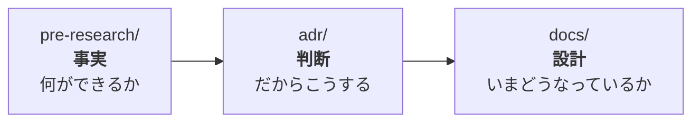

# TouringProject

**バイクでのツーリング中に、現在地・進行方向の文脈に基づいてAIと音声で対話するアプリ。**

走行中は手が使えないので、イヤモニ経由の音声入出力とハンズフリー起動が前提。

> 「右手に見える山は何？」
> 「この地域の特色は？」

## このリポジトリについて

**開発の記録を兼ねた学習用リポジトリでもある。**
開発者はWeb開発（AWS/Vue/Lambda/JS）の経験はあるがモバイルは未経験のため、
**判断の過程・つまずき・設計理由をドキュメントに残しながら**進めている。

## 構成

| ディレクトリ | 中身 |
|---|---|
| [`app/`](app/) | React Native (Expo) アプリ本体 |
| [`backend/`](backend/) | AWSバックエンド（SAM, Python）。API Gateway + Lambda + SQS + DynamoDB |
| [`touringAgent/`](touringAgent/) | AgentCoreのエージェント本体（Strands）。会話の継続とWeb検索を担う |
| [`docs/`](docs/) | **現在の設計。** 要件定義・アーキテクチャ・API仕様 |
| [`adr/`](adr/) | **決定の記録。** なぜそう決めたか、何を却下したか |
| [`pre-research/`](pre-research/) | **技術検証。** 実測値と検証スクリプト |
| [`learning/`](learning/) | 学習メモ（他プロジェクトでも通用する汎用知識） |

### ドキュメントの使い分け

同じ話題が複数の場所に出てくることがあるが、**役割が違う**。



- **`pre-research/`** は検証の記録。「Nova 2 Sonic は日本語に対応していない」のような**事実**。
- **`adr/`** は決定の記録。「だから方式1を採る」という**判断**と、却下した案。
- **`docs/`** は現在の設計。**履歴は書かない**（いまの姿が読み取れなくなるため）。

## 技術選定

| レイヤ | 採用 |
|---|---|
| フロント | React Native (Expo) — 既存のJS/TS知識を活かせる |
| ウェイクワード | Picovoice Porcupine（オンデバイス） |
| バックエンド | API Gateway + Lambda (Python)。IaCは SAM |
| AI | Amazon Bedrock AgentCore（会話継続・Web検索） |
| STT / TTS | Amazon Transcribe / Polly |
| 対象OS | Android |

詳細と選定理由は [docs/01_architecture.md](docs/01_architecture.md)、
検討の経緯は [pre-research/02_tech_selection.md](pre-research/02_tech_selection.md)。

## 開発の状況

**MVP（位置情報＋テキストでの質問・会話継続・Web検索）は動作している。**
現在は音声化に向けた作業中。

進捗と残作業は [`.memory/`](.memory/)（開発中の覚え書き）にある。

## ADRの書き方

`adr/NNN_<短い題>.md`（3桁の連番）。

- **番号は再利用しない。** 却下された決定も番号を空けたまま残す。
- **後から書き換えない。** 決定が覆ったら**新しいADRを書き**、古い方に追記して繋ぐ。
- 1ページに収める。詳細な設計は `docs/`、詳細な検証は `pre-research/` へ置いてリンクする。

```markdown
# NNN. <決定の題>

- **日付**: YYYY-MM-DD
- **ステータス**: 採用 / 却下 / 保留 / (NNN で置き換え)

## 背景
## 選択肢    ← 却下したものも書く
## 決定
## 影響
```

| # | 決定 | 日付 |
|---|---|---|
| [001](adr/001_async_ask.md) | 回答の受け取りを非同期にする | 2026-08-13 |

> 2026-08-13 より前の決定はADR化していない。
> 経緯は [`pre-research/`](pre-research/) にある。
