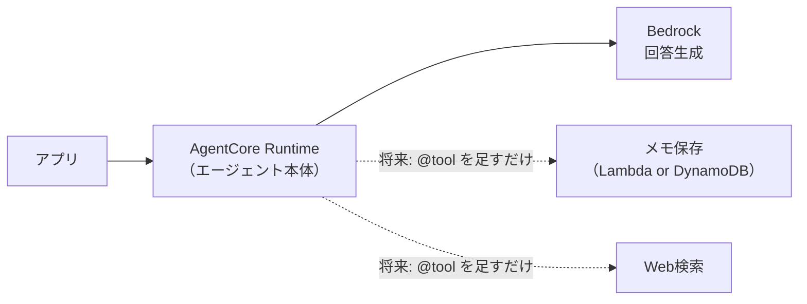

# 要件定義（ユーザーストーリー）

> このアプリが「誰の、どんな困りごとを、どう解決するか」を定める。
> **技術選定より先に、こちらが上位**。設計（[01](01_architecture.md)）で迷ったら、ここに立ち返って判断する。
> 技術的な検討経緯は [pre-research/](../pre-research/) を参照。

## 1. 誰のためのアプリか

**バイクでツーリングをするライダー。当面は開発者本人ひとり。**

| 特徴 | 設計への影響 |
|---|---|
| 走行中は**手が使えない** | 画面操作を前提にできない。音声が主 |
| 走行中は**画面を見られない** | 回答は読み上げる。Markdown等の記号は害 |
| ヘルメット内は**騒がしい** | イヤモニ＋マイク前提 |
| **移動し続けている** | 「今どこにいるか」が刻々と変わる |
| 一人で走っている | 話し相手がいない。AIがその役を担う |

## 2. 何に困っているか

走っていると**気になるものが次々に現れるが、確かめる手段がない**。

- 「右手に見えるあの山、何ていう山だろう」
- 「この地域って何が有名なんだろう」
- 「さっき通った橋、やたら立派だったな」

停まってスマホで調べれば分かる。しかし**停まりたくない**し、走行中は**触れない**。
結果、**気になったまま流れていく**。

> ⚠️ ここが本アプリの核心。「調べ物ができない」のではなく、
> **「その瞬間に、その場所で、聞けない」**ことが問題。後で調べても価値が薄い。

## 3. コアとなる体験（これが実現できれば成功）

```
ライダー「（ウェイクワード）、右手に見える山は何？」
   ↓ （手も目も使わない）
アプリ  「愛鷹山だと思われます。富士山の南東にある火山で…」
   ↓
ライダー「へえ。それって登れるの？」    ← 続けて聞ける
アプリ  「登山道が整備されていて…」
```

**要点は3つ:**

1. **手も目も使わずに聞ける**（ウェイクワード → 音声で質問 → 音声で回答）
2. **今いる場所・向いている方向を踏まえて答える**（「右手」が通じる）
3. **続けて質問できる**（「それ」で前の話を受けられる）

## 4. ユーザーストーリー

優先度は **P0 = MVPに必須 / P1 = 次に欲しい / P2 = 将来**。

### P0：MVP（今つくるもの）

| ID | ストーリー | 受け入れ条件 |
|---|---|---|
| **US-1** | ライダーとして、**今いる場所を踏まえてAIに質問したい**。その土地のことを知りたいから | 現在地が回答に反映される |
| **US-2** | ライダーとして、**続けて質問したい**。一問一答では会話にならないから | 「それ」等の指示語が前の質問を受けて解釈される |
| **US-3** | ライダーとして、**スマホアプリから使いたい**。バイクに積むのはスマホだから | 実機（Android）で動作する |

> **US-1〜3 が「いますぐやりたいこと」。** 音声もウェイクワードも、まずは無しでよい。
> **画面で入力して、画面で読む**形でコア体験（位置＋会話）を先に成立させる。

### P1：音声化（コア体験の完成）

| ID | ストーリー | 備考 |
|---|---|---|
| **US-4** | **声で質問したい**。走行中は入力できないから | STT（Transcribe） |
| **US-5** | **声で回答を聞きたい**。走行中は読めないから | TTS（Polly） |
| **US-6** | **進行方向を踏まえてほしい**（「右手」が通じる） | GPS2点から方位算出 |
| **US-7** | **手を使わずに起動したい** | ウェイクワード（Porcupine）。**最大の技術リスク** |

### P2：将来（今はやらない）

| ID | ストーリー | 判断 |
|---|---|---|
| **US-8** | **AIに最新情報を調べてほしい**（Web検索） | AgentCore採用の主目的。P1後 |
| **US-9** | **気になった場所をメモに残したい**。後で見返したいから | **今は作らないが、作れる構造にしておく**（§6） |
| **US-10** | 走行ログを残したい | US-9と同系統 |
| **US-11** | 他の人にも使ってもらう | 認証・コスト設計が変わる |

## 5. やらないこと（スコープ外）

**明示的にやらないと決めたもの。** 迷ったらここを見る。

| やらないこと | 理由 |
|---|---|
| **iOS対応** | 当面は自分のAndroidのみ |
| **ナビゲーション機能** | 既存のナビアプリを使う。本アプリは併用する前提 |
| **15分以上あけた会話の継続** | 要件は「一問一答＋α」。連続して聞くときに繋がればよい |
| **凝ったUI** | 動作確認に足る最小限。価値はAWS側にある |
| **複数ユーザー対応** | 当面は本人のみ。必要になったら認証を見直す |

## 6. 「今やらないが、将来やる」ものへの備え

**US-9（メモ機能）は将来必要**と考えている。ただし**学習しながらの開発では初手から重い**ため、今は作らない。

代わりに、**後から足せる構造にしておく**。



**エージェントに「ツール」を足す形で拡張できる**のがAgentCoreを選んだ理由のひとつ。
メモ機能なら、エージェントに以下のような関数を1つ足せばよい:

```python
@tool
def save_memo(text: str) -> str:
    """ライダーのメモを保存する"""
    # Lambda を呼ぶ / DynamoDB に直接書く
```

→ **今の設計判断で「後からツールを足せなくなる」ことだけ避ければよい。**
　メモ機能そのものの設計は、必要になった時点で行う。

## 7. 成功の判定

**MVP（P0）が成功したと言える条件:**

- [ ] 実機のスマホアプリから、現在地とともに質問を送れる
- [ ] AIが現在地を踏まえた回答を返す
- [ ] 続けて質問すると、前の会話を踏まえて答える

**その先（P1）:**

- [ ] 走りながら、手も目も使わずに、上記ができる

## 8. 未確定事項

- [ ] ウェイクワードのバックグラウンド常駐が実機で成立するか（**最大のリスク**。破綻したらKotlinネイティブ再検討）
- [ ] 走行中の騒音下でSTTがどこまで実用になるか
- [ ] 停車中・低速時の「進行方向」の扱い（GPS2点が近すぎる場合）
- [ ] コストが現実的な範囲に収まるか
