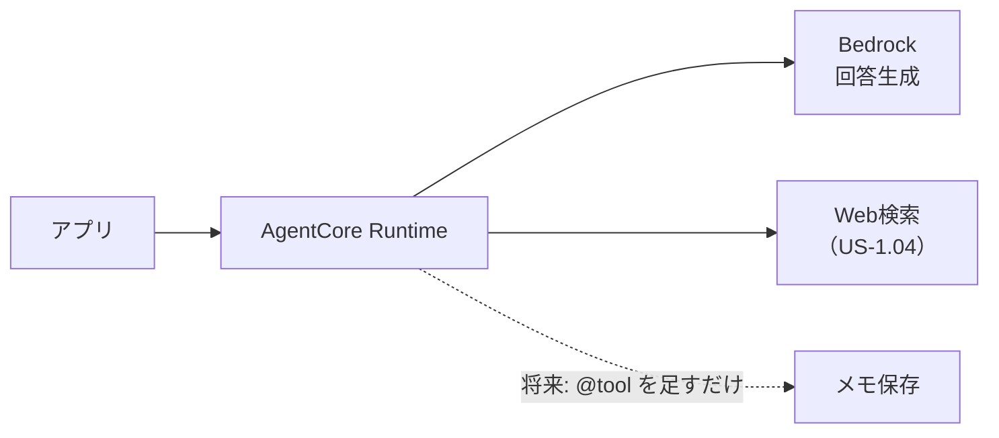

# 要件定義（ユーザーストーリー）

> このアプリが「誰の、どんな困りごとを、どう解決するか」を定める。
> **技術選定より上位**。設計（[01](01_architecture.md)）で迷ったらここに立ち返る。

## 1. 誰のためのアプリか

**バイクでツーリングをするライダー。当面は開発者本人ひとり。**

| 特徴 | 設計への影響 |
|---|---|
| 走行中は**手が使えない** | 画面操作を前提にできない |
| 走行中は**画面を見られない** | 回答は読み上げる。Markdown等の記号は害 |
| ヘルメット内は**騒がしい** | イヤモニ＋マイク前提 |
| **移動し続けている** | 「今どこにいるか」が刻々と変わる |
| 一人で走っている | 話し相手がいない |

## 2. 何に困っているか

走っていると**気になるものが次々に現れるが、確かめる手段がない**。

- 「右手に見えるあの山、何ていう山だろう」
- 「この先で給油できるところある？」
- 「この地域って何が有名なんだろう」

停まってスマホで調べれば分かる。しかし**停まりたくない**し、走行中は**触れない**。
結果、**気になったまま流れていく**。

> 核心は「調べ物ができない」ことではなく、**「その瞬間に、その場所で、聞けない」**こと。

## 3. コアとなる体験

```
ライダー「（インカムのボタンを押す）右手に見える山は何？」
アプリ  「愛鷹山です。富士山の南東にある火山で…」

ライダー「へえ。この先で給油できる？」      ← 続けて聞ける
アプリ  「5km先の国道沿いにスタンドがあります」  ← 自分で調べて答える
```

1. **手も目も使わずに聞ける**
2. **今いる場所を踏まえて答える**
3. **続けて質問できる**
4. **AIが自分で調べて答える**（「アプリで検索して」と言わない）

## 4. ユーザーストーリー

**P0 = MVP / P1 = 次 / X = 将来（優先度未定）**

IDは `US-<優先度>.<連番>`。**連番は詰め直さない**（他ドキュメントからの参照が壊れるため）。

### P0：MVP

| ID | ストーリー | 受け入れ条件 |
|---|---|---|
| **US-1.01** | ライダーとして、**今いる場所を踏まえてAIに質問したい**。その土地のことを知りたいから | 現在地が回答に反映される |
| **US-1.02** | ライダーとして、**続けて質問したい**。一問一答では会話にならないから | 指示語（「それ」）が前の質問を受けて解釈される |
| **US-1.03** | ライダーとして、**スマホアプリから使いたい**。バイクに積むのはスマホだから | 実機（Android）で動作する |
| **US-1.04** | ライダーとして、**AIに自分で調べて答えてほしい**。「アプリで検索して」と言われても走行中はできないから | 「調べられません」で終わらず、調べた上で答える |
| **US-1.05** | ライダーとして、**会話を明示的に区切りたい**。話題が変わったのに前の文脈を引きずられたくないから | 会話をリセットする操作があり、以降の質問に前の文脈が影響しない |

> MVPでは**音声を使わない**。画面で入力・表示する形で、位置・会話・調査を先に成立させる。

### P1：音声化

| ID | ストーリー | 備考 |
|---|---|---|
| **US-2.01** | ライダーとして、**声で質問したい**。走行中は入力できないから | STT（Transcribe） |
| **US-2.02** | ライダーとして、**声で回答を聞きたい**。走行中は読めないから | TTS（Polly） |
| **US-2.03** | ライダーとして、**進行方向を踏まえてほしい**。「右手に見える山」と聞きたいから | GPS2点から方位算出 |
| **US-2.04** | ライダーとして、**スマホに触れずに起動したい**。走行中の画面操作は法律上できないから | ⚠️ **最大の技術リスク。** **インカムのボタンで起動する**（補足C） |

### X：将来（優先度未定）

| ID | ストーリー | 備考 |
|---|---|---|
| **US-X.01** | ライダーとして、**気になった場所をメモに残したい**。後で見返したいから | 今は作らないが、作れる構造にしておく（補足B） |
| **US-X.02** | ライダーとして、**走った道の記録を残したい**。振り返りたいから | US-X.01と同系統 |

## 5. やらないこと

| やらないこと | 理由 |
|---|---|
| **iOS対応** | 当面は自分のAndroidのみ |
| **ナビゲーション機能** | 既存のナビアプリと併用する前提 |
| **15分以上あけた会話の継続** | 連続して聞くときに繋がればよい |
| **凝ったUI** | 動作確認に足る最小限。価値はAWS側にある |
| **複数ユーザー対応** | 当面は本人のみ。配布するなら認証・流量制限・コスト設計の見直しが要る |

## 6. 成功の判定

**MVP（P0）:**

- [x] 実機のスマホアプリから、現在地とともに質問を送れる
- [x] AIが現在地を踏まえた回答を返す（**現在地が正確であることを実機で確認**）
- [x] 続けて質問すると、前の会話を踏まえて答える
- [x] 「今日の天気は？」に、AIが自分で調べて答える（「アプリで確認して」と返さない）
- [x] 会話をリセットすると、前の文脈が引き継がれない

**その先（P1）:**

- [x] 声で質問し、声で回答が返る（US-2.01/2.02）
- [x] 進行方向を踏まえて答える（US-2.03）
- [ ] **スマホに触れずに起動できる**（US-2.04。⚠️ **ここだけ残っている**）
- [ ] 走りながら、上記が通しでできる

## 7. 未確定事項

- [ ] **スマホに触れずに起動する手段が実機で成立するか**（**最大のリスク**。補足C）
- [ ] 走行中の騒音下でSTTがどこまで実用になるか（⚠️ **停車中は実用と確認済み**）
- [ ] 停車中・低速時の「進行方向」の扱い（GPS2点が近すぎる場合）
- [ ] コストが現実的な範囲に収まるか

---

## 補足A：なぜWeb検索（US-1.04）がMVPに必要か

検索なし（LLMの知識のみ）で答えられるか実測した結果:

| 質問 | 回答 | 判定 |
|---|---|---|
| 道の駅は？ | 「富士川楽座があります」 | ✅ |
| 絶景スポットは？ | 「田子の浦みなと公園」 | ✅ |
| ガソリンスタンドは？ | 「**Googleマップで検索**するのが確実です」 | ❌ |
| 今日のイベントは？ | 「リアルタイムの情報にアクセスできません」 | ❌ |
| 今日の天気は？ | 「**天気予報アプリで確認**してください」 | ❌ |

**「アプリで確認してください」は走行中のライダーには実行不可能**で、
手も目も使えないという前提（§1）を回答そのものが裏切る。

有名な観光地の話だけなら検索なしでも成立するが、
**「今この瞬間・この場所」の情報（給油・天気・イベント・営業状況）には検索が要る。**
ツーリング中に本当に聞きたいのはむしろ後者。

## 補足B：P2（メモ機能）への備え

**US-X.01（メモ機能）は将来必要**だが、学習しながらの開発では初手から重いため今は作らない。
代わりに**後から足せる構造**にしておく。



エージェントに**ツールを足す形で拡張できる**のが、この構成を選んだ理由のひとつ。

```python
@tool
def save_memo(text: str) -> str:
    """ライダーのメモを保存する"""
```

→ 今やるべきは「**後からツールを足せる状態を保つ**」ことだけ。

## 補足C：US-2.04「触れずに起動」の許容範囲

**要件は「スマホに触れないこと」であって、「ウェイクワードであること」ではない。**

走行中の画面操作は**法律上できない**（道路交通法）。ここが動かせない制約で、
**「アプリを開いて押す」は解にならない。** 一方、その条件さえ満たせば手段は問わない。

| 手段 | 可否 |
|---|---|
| **インカムのボタン** | ✅ **これを採る。** ハンドルから手を離さずに押せる |
| **ウェイクワード**（オンデバイス） | ⚠️ **理想だが却下**（常時マイクを占有するため） |
| 画面のボタン | ❌ **不可**（法律） |

> 📌 **実現方法は「Androidの既定のアシスタントになる」**（`VoiceInteractionService`）。
> **インカムのボタンが起動するのはアシスタントなので、そこに自アプリを据える。**
> ⚠️ **代償として Google Assistant とマップの音声入力を明け渡す**
> （**音声案内は残る**）。検証の詳細は
> [pre-research/handsfree/](../pre-research/handsfree/)。

⚠️ **どちらの手段でも Expo Development Build への移行が要る**（Expo Go では動かない）。
