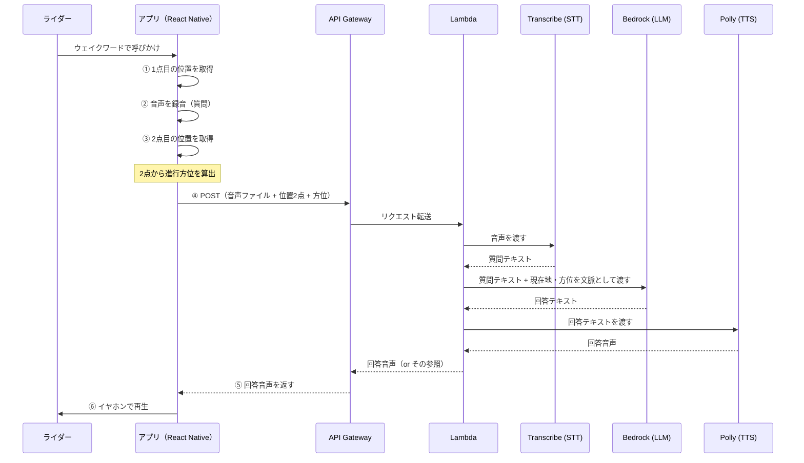
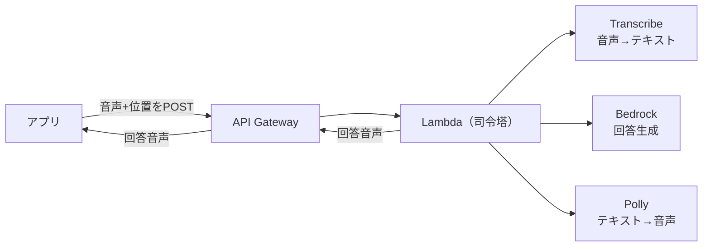
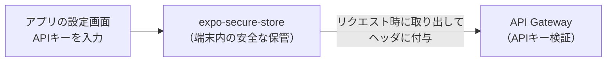
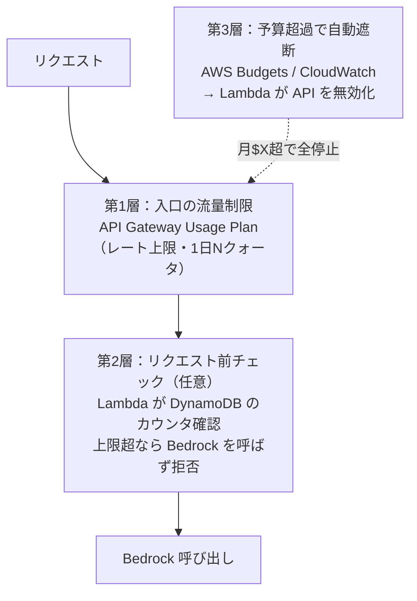
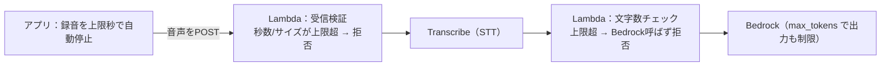

# 全体アーキテクチャ

> このドキュメントは、アプリ全体の**責務分担（ローカル vs AWS）**と**データの流れ**を定める。
> 前提となる構想・技術選定は [pre-research/](../pre-research/) を参照。
> 初心者でも追えるよう、まず全体像から入り、各役割を順に説明する。

## 1. ひとことで言うと

**アプリ（React Native）は"薄いクライアント"に徹し、賢い処理はすべて AWS 側で行う。**

- アプリの仕事: 位置を取る・音声を録る・AWSに送る・返ってきた音声を鳴らす。
- AWSの仕事: 音声を文字にする・現在地を踏まえて回答を考える・回答を音声にする。

この分担は [プロジェクト方針 §2.1](../pre-research/00_project_policy.md)（モバイルは必要最低限、ロジックはAWS）に沿っている。

## 2. 1回の対話の流れ（データフロー）

ユーザーがウェイクワードで呼びかけてから、音声で回答が返るまでの1往復。

### なぜ「位置を2点」取るのか

走行中に**進行方向（方位）**を知るため。1点だけでは「どちらを向いているか」が分からない。
録音の前後で位置を取り、その2点を結んだ向きを「進行方向＝ライダーの視線方向」とみなす。
これで「右手に見える山は？」（＝進行方向から時計回りに90°）が計算できる。
（詳細な算出方法は別ドキュメントで扱う予定。）

## 3. 責務分担（どちらが何をやるか）

| 処理 | 担当 | 使うもの | 補足 |
|---|---|---|---|
| ウェイクワード検知 | アプリ（オンデバイス） | Porcupine | 常時サーバー送信を避ける（プライバシー・通信量）。詳細は別途 |
| 位置取得（2点）・方位算出 | アプリ | expo-location | 方位＝2点間から計算 |
| 音声録音 | アプリ | expo-av 等（今後選定） | 録音ファイルを作る |
| 音声のAWS送信 | アプリ | HTTP POST | **音声ファイルをそのまま送る**（アプリは薄く保つ） |
| 音声 → テキスト（STT） | **AWS** | Amazon Transcribe | 走行騒音下の精度もAWS側で対処しやすい |
| 回答生成（LLM） | **AWS** | Amazon Bedrock | 現在地・方位を文脈に含めて回答 |
| テキスト → 音声（TTS） | **AWS** | Amazon Polly | 回答を音声化して返す |
| 全体のオーケストレーション | **AWS** | AWS Lambda | 上記STT→LLM→TTSを順に呼ぶ司令塔 |
| 入口（HTTPエンドポイント） | **AWS** | API Gateway | アプリからのPOSTを受ける |
| 音声の再生 | アプリ | expo-av 等 | 返ってきた音声を鳴らすだけ |

**要点**: STT・LLM・TTS はすべて AWS 側。アプリは「録って送って鳴らす」だけの薄い層。

## 4. 使うAWSサービスと、その選定理由

| サービス | 役割 | 採用理由 |
|---|---|---|
| **API Gateway** | HTTPの入口 | アプリからのPOSTを受け、Lambdaに繋ぐ標準的な構成 |
| **Lambda** | 司令塔（STT→LLM→TTSを順に実行） | サーバー常駐不要・開発者の得意領域。1リクエスト＝1対話を捌く |
| **Transcribe** | STT（音声→テキスト） | AWSマネージドのSTT。日本語対応 |
| **Bedrock** | LLM（回答生成） | アプリの頭脳。現在地・方位を文脈に含めて自由に回答 |
| **Polly** | TTS（テキスト→音声） | AWSマネージドのTTS。自然な音声を返す |

### なぜ Amazon Lex は使わないのか（重要な設計判断）

「音声＝Lex」と考えがちだが、**本アプリでは Lex を使わない**。

- **Lex は"定型的なチャットボット"用**の意図理解エンジン。「ピザを注文」→注文フローに分岐、のような**あらかじめ決めた意図に振り分ける**用途に向く。
- 本アプリがやりたいのは「**自由な質問に LLM が自由に答える**」こと。意図理解は **Bedrock(LLM) 自身が行う**ため、間に Lex を挟むと二重になり、対話の自由度をむしろ制約する。
- よって **Transcribe(STT) → Bedrock(LLM) → Polly(TTS)** の3本柱で構成し、Lexは挟まない。
  （AWS公式の Bedrock 音声会話サンプルも同じ構成。）

## 5. この設計で確定していること

- アプリは録音音声を**そのままPOST**する（STTはAWS側）。
- 回答は AWS で **Polly により音声化して返す**（アプリは再生するだけ）。
- **Lex は使わない**。STT/LLM/TTS の3サービス＋Lambda＋API Gatewayで構成。
- 認証は **APIキー方式**（アプリ画面から入力、ハードコードしない）。詳細は §6。
- 悪用・コスト暴走対策は **多層で設計**（流量制限＋予算超過で自動遮断）。詳細は §7。
- 構成管理（IaC）は **AWS SAM 単体**。詳細は §8。

## 6. 認証：APIキー方式（アプリ画面から入力）

当面の対象は「自分のAndroidだけ」なので、まずは軽量な **APIキー認証**で始める。
将来、複数ユーザーに配布・ユーザー別の利用制御が必要になったら **Amazon Cognito** への移行を検討する。

### 仕組み

- **API Gateway の APIキー ＋ Usage Plan** を使う。キーを持つリクエストだけがAPIを叩ける。
- Usage Plan により、**キー単位でレート上限・1日あたりのクォータ**を設定できる（§7の流量制限を兼ねる）。

### ⚠️ 最重要ルール：APIキーをアプリにハードコードしない

- **アプリのコードに鍵を直書きしない。** 配布した瞬間に鍵が漏れ、悪用される。
- 代わりに **アプリの設定画面からユーザーがAPIキーを入力**し、
  **端末内の安全な保管領域（`expo-secure-store` = OSのKeychain/Keystore）に保存**する。
- APIキーは端末に留め、リポジトリにもアプリバイナリにも埋め込まれない。
  （開発者の規約「秘密情報のハードコード禁止・環境変数/設定で管理」と一致。）

### 将来 Cognito に移行する場合の位置づけ

- Cognito は「ユーザーごとのログイン・ユーザー別の利用量制御・多人数配布」に強い。
- 今は過剰なので採用しないが、**多人数化・ユーザー別課金/制限が必要になった段階で移行**する想定。
- APIキー方式のまま作っておけば、認証層を差し替えるだけで移行でき、後戻りは小さい。

## 7. 悪用・コスト暴走対策（多層防御）

AI（Bedrock）を公開する以上、**「一定以上使われたら完全に停止する」仕組みは必須**。
単一の対策に頼らず、**複数の層で守る**。

| 層 | 仕組み | 役割 | 採否 |
|---|---|---|---|
| **入口の流量制限（回数）** | API Gateway の Usage Plan（レート＋クォータ） | 連打・DoS的な多用を防ぐ。日常的な上限 | ✅ 採用（APIキーとセット） |
| **入力量の上限（1回あたり）** | 音声の長さ・文字数・出力長を制限（下記 §7.1） | **1リクエストの最大コストを頭打ち**にする | ✅ 採用 |
| **予算超過で自動遮断（金額）** | AWS Budgets/CloudWatch アラーム → Lambda がAPIキー/APIを無効化 | **「今月$Xを超えたら丸ごと停止」の最終防衛線** | ✅ 採用（"完全停止"の中核） |
| **リクエスト前チェック（累積）** | Lambda が DynamoDB のカウンタを見て上限超なら拒否 | トークン消費の前に止める最も確実な制御 | △ まずは他の層で始め、必要なら追加 |

### 設計の考え方

- **流量制限**で、通常運用の「使いすぎ（回数）」を日次で頭打ちにする。
- **入力量の上限**で、「1回あたりの最大コスト」を頭打ちにする（後述 §7.1）。長い音声・長文で単価を膨らませる攻撃を防ぐ。
- **予算遮断**で、想定外の暴走に対し**金額ベースで完全停止**する。これがあなたの狙う「一定以上で停止」の核。
- **前チェック（累積）**は最も堅牢だが作り込みが要るので、他の層で運用してみて必要なら足す（段階的）。

> ポイント: 「回数」「1回あたりの入力量」「累計金額」の3つの軸で守る。
> これで「安いのを大量」「1回を極端に長く」「じわじわ累積」のどのパターンも捕捉できる。

### 7.1 入力量の上限（音声の長さ・文字数・出力長）

**不正に長い音声や長文を送られると、1リクエストのコストが跳ね上がる**ため、入力量そのものに上限をかける。

| 制限対象 | なぜ効くか | どこで弾くか |
|---|---|---|
| **音声の長さ（秒数 / ファイルサイズ）** | Transcribe は**音声の秒数課金**。長い音声＝STTコスト増 | ① アプリで録音時間を上限で自動停止 ＋ ② **Lambdaで受信時に秒数/サイズ検証** |
| **文字数（STT後のテキスト長）** | Bedrock は**入力トークン課金**。長文＝入力単価増 | **Lambdaで、Transcribe結果が上限超なら Bedrock を呼ばず拒否** |
| **回答の長さ（出力）** | Bedrock の**出力トークン**＋ Polly の**文字数課金**の両方に効く | **Bedrock 呼び出し時に `max_tokens` で上限**。走行中の応答は簡潔が望ましく体験にも合う |

#### 2段階で守る（重要）

- **アプリ側**（録音時間の上限）で、そもそも長い入力を作らせない。
- **Lambda側**（受信検証）で、**アプリを改造して長い音声を直接APIに投げられても弾く**。
  → アプリ側の制限だけでは、APIを直接叩かれると回避される。**Lambda側の検証が本命の防衛線**。

> 具体的な上限値（録音は何秒まで・文字数は何文字まで・max_tokensはいくつ）は §9 の閾値設計で決める。

## 8. 構成管理（IaC）：AWS SAM 単体

インフラはコード管理（IaC）する。本プロジェクトの構成は **ほぼサーバーレス**（Lambda / API Gateway / DynamoDB / IAM 等）なので、**AWS SAM 単体で十分**。

- **SAMを選ぶ理由**: サーバーレス構成に特化したYAMLで簡潔。`sam local` でLambda/API Gatewayをローカル実行・テストできる。学習・個人開発に向く。
- **CDKを併用しない理由**: CDKは EC2/RDS 等の非サーバーレスも混ざる大規模構成で真価を発揮する。本構成には過剰で、個人プロジェクトで最初から併用すると複雑さが勝つ。
- **将来**: どうしても必要になれば SAM + CDK 併用（CDKで定義し `sam local` でテスト）も可能。必要になった段階で再検討する。

## 9. 未決事項・次に詰めること

- [ ] 音声フォーマットと送信方法の詳細（録音形式、API Gateway のペイロード上限、大きい音声はS3経由にするか）
- [ ] 回答音声の返し方（音声バイナリを直接返すか、S3に置いてURLを返すか）
- [ ] Transcribe/Bedrock/Polly の同期・非同期の扱い（1回のLambda内で完結できるか、処理時間・タイムアウト）
- [ ] 進行方位の算出ロジックの詳細設計（2点間の方位計算、低速・停車時の扱い）
- [ ] コスト制御の閾値設計（Usage Planの1日クォータ・レート、Budgetsの月額上限を具体値で決める）
- [ ] 入力量の上限値の決定（録音の最大秒数、STT後テキストの最大文字数、Bedrockの `max_tokens`）と、アプリ側／Lambda側それぞれの検証実装
- [ ] 予算超過時の自動遮断の実装方式（Budgets/CloudWatch → Lambda がAPIキー無効化 or ステージ無効化、の具体手順）
- [ ] APIキーの端末保管（expo-secure-store 導入）と、設定画面のUI（必要最小限）
- [ ] エラー時の挙動（STT失敗・LLMタイムアウト・利用停止中に何を音声で返すか）
- [ ] Bedrockの実装は `claude-api` スキルを参照して行う（モデルID等は記憶に頼らない）

## 参考

- [amazon-bedrock-voice-conversation (AWS Samples)](https://github.com/aws-samples/amazon-bedrock-voice-conversation) — Transcribe→Bedrock→Polly の音声会話構成例
- [How to limit usage and cost on Amazon Bedrock (AWS Builder Center)](https://builder.aws.com/content/3DIYzXtsMwvVh1jsn1CSpa8k2rL/limiting-bedrock-usage-and-controlling-costs) — 流量制限・予算アラーム・前チェックの3アプローチ
- [Choosing between AWS CDK vs SAM for Serverless (Medium)](https://medium.com/@aarunbala/choosing-between-aws-cdk-vs-sam-for-serverless-applications-1246a07b97d9) — SAM/CDKの使い分け
