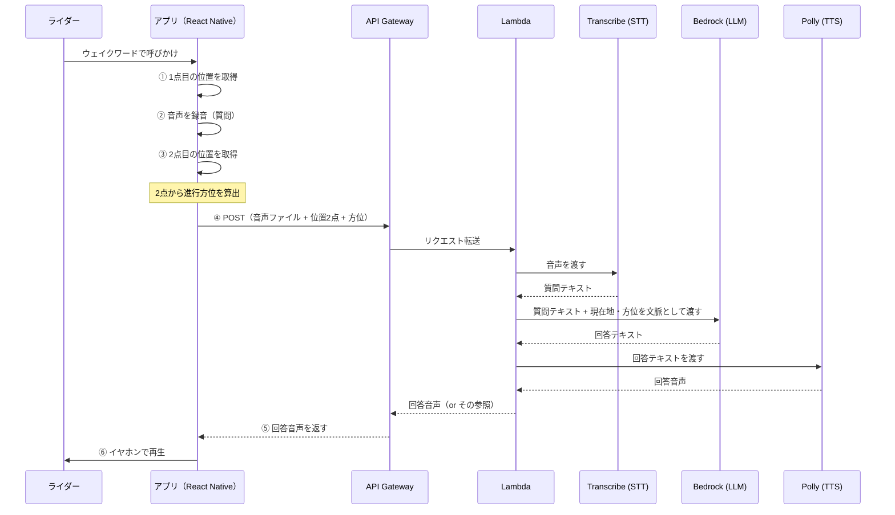
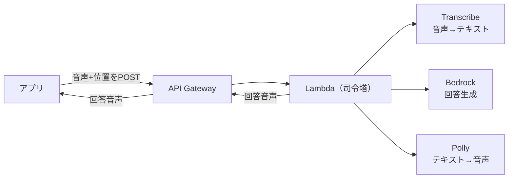
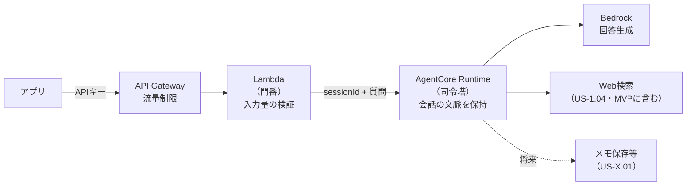
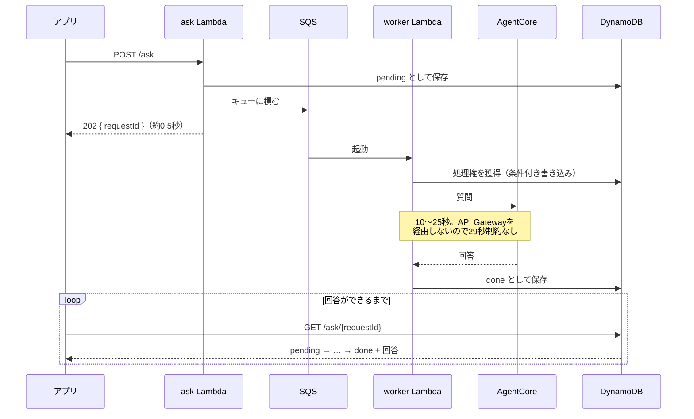
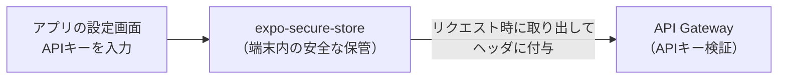
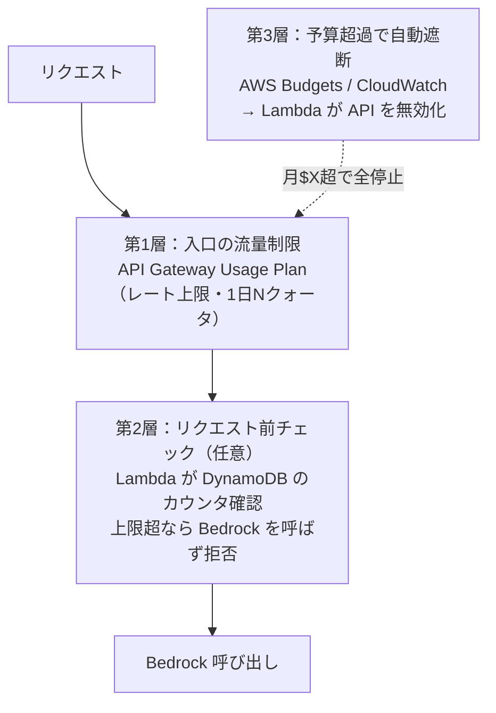
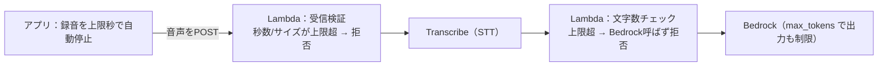

# 全体アーキテクチャ

> このドキュメントは、アプリ全体の**責務分担（ローカル vs AWS）**と**データの流れ**を定める。
> **上位に [00_user_stories.md](00_user_stories.md)（要件定義）がある。** 設計で迷ったらそちらに立ち返る。
> 技術選定の検討経緯は [pre-research/](../pre-research/) を参照。
> 初心者でも追えるよう、まず全体像から入り、各役割を順に説明する。

> ## ⚠️ この文書の読み方
>
> **§1〜§4 は当初の構想（2026-07）で、一部が現在の実装と異なる。**
> 検証を経て変わった点は **§5.1〜§5.4** にまとめてあり、**そちらが正**。
>
> | 変わった点 | 当初（§1〜§4） | 現在 |
> |---|---|---|
> | 会話の組み立て | Lambdaが司令塔 | **AgentCore**（§5.1） |
> | 音声の扱い | AWS側でSTT/TTS | **アプリ側**でSTT/TTS（§5.3） |
> | 座標→住所 | （考慮なし） | **Lambdaで解決**（§5.4） |
> | 進行方位の算出 | アプリ | **Lambdaで算出**（§5.5） |
>
> §1〜§4 を残しているのは、**なぜその構成を選んだか**（Lexを使わない理由など）が
> 今も有効だから。**構成図とデータフローは古い。**

## 1. ひとことで言うと

**アプリ（React Native）は"薄いクライアント"に徹し、賢い処理はすべて AWS 側で行う。**

- アプリの仕事: 位置を取る・音声を録る・AWSに送る・返ってきた音声を鳴らす。
- AWSの仕事: 音声を文字にする・現在地を踏まえて回答を考える・回答を音声にする。

この分担は [プロジェクト方針 §2.1](../pre-research/00_project_policy.md)（モバイルは必要最低限、ロジックはAWS）に沿っている。

## 2. 1回の対話の流れ（データフロー）

ユーザーがウェイクワードで呼びかけてから、音声で回答が返るまでの1往復。



### なぜ「位置を2点」取るのか

走行中に**進行方向（方位）**を知るため。1点だけでは「どちらを向いているか」が分からない。
録音の前後で位置を取り、その2点を結んだ向きを「進行方向＝ライダーの視線方向」とみなす。
これで「右手に見える山は？」（＝進行方向から時計回りに90°）が計算できる。
（詳細な算出方法は別ドキュメントで扱う予定。）

## 3. 責務分担（どちらが何をやるか）

| 処理 | 担当 | 使うもの | 補足 |
|---|---|---|---|
| ウェイクワード検知 | アプリ（オンデバイス） | Porcupine | 常時サーバー送信を避ける（プライバシー・通信量）。詳細は別途 |
| 位置取得（2点）・方位算出 | アプリ | expo-location | ⚠️ **現在は方位算出のみ Lambda 側**（§5.5）。アプリは2点を送るだけ |
| 音声録音 | アプリ | expo-av 等（今後選定） | 録音ファイルを作る |
| 音声のAWS送信 | アプリ | HTTP POST | **音声ファイルをそのまま送る**（アプリは薄く保つ） |
| 音声 → テキスト（STT） | **AWS** | Amazon Transcribe | 走行騒音下の精度もAWS側で対処しやすい |
| 回答生成（LLM） | **AWS** | Amazon Bedrock | 現在地・方位を文脈に含めて回答 |
| テキスト → 音声（TTS） | **AWS** | Amazon Polly | 回答を音声化して返す |
| 全体のオーケストレーション | **AWS** | AWS Lambda | 上記STT→LLM→TTSを順に呼ぶ司令塔 |
| 入口（HTTPエンドポイント） | **AWS** | API Gateway | アプリからのPOSTを受ける |
| 音声の再生 | アプリ | expo-av 等 | 返ってきた音声を鳴らすだけ |

**要点**: STT・LLM・TTS はすべて AWS 側。アプリは「録って送って鳴らす」だけの薄い層。

## 4. 使うAWSサービスと、その選定理由



| サービス | 役割 | 採用理由 |
|---|---|---|
| **API Gateway** | HTTPの入口 | アプリからのPOSTを受け、Lambdaに繋ぐ標準的な構成 |
| **Lambda** | 司令塔（STT→LLM→TTSを順に実行） | サーバー常駐不要・開発者の得意領域。1リクエスト＝1対話を捌く |
| **Transcribe** | STT（音声→テキスト） | AWSマネージドのSTT。日本語対応 |
| **Bedrock** | LLM（回答生成） | アプリの頭脳。現在地・方位を文脈に含めて自由に回答 |
| **Polly** | TTS（テキスト→音声） | AWSマネージドのTTS。自然な音声を返す |

### なぜ Amazon Lex は使わないのか（重要な設計判断）

「音声＝Lex」と考えがちだが、**本アプリでは Lex を使わない**。

- **Lex は"定型的なチャットボット"用**の意図理解エンジン。「ピザを注文」→注文フローに分岐、のような**あらかじめ決めた意図に振り分ける**用途に向く。
- 本アプリがやりたいのは「**自由な質問に LLM が自由に答える**」こと。意図理解は **Bedrock(LLM) 自身が行う**ため、間に Lex を挟むと二重になり、対話の自由度をむしろ制約する。
- よって **Transcribe(STT) → Bedrock(LLM) → Polly(TTS)** の3本柱で構成し、Lexは挟まない。
  （AWS公式の Bedrock 音声会話サンプルも同じ構成。）

## 5. この設計で確定していること

> ⚠️ **§1〜§4 は当初の構想（2026-07）で、音声の扱いが現在の決定と異なる。**
> 実装の正は本節以降。差分は §5.1〜§5.3 にまとめてある。

- **音声はアプリ側で扱う**（Transcribe/Pollyをアプリから呼び、APIには**テキスト**を送る）。
  → 詳細と却下した案は §5.3。
- **Lex は使わない**。意図理解はLLM自身が行う。
- 認証は **APIキー方式**（アプリ画面から入力、ハードコードしない）。詳細は §6。
- 悪用・コスト暴走対策は **多層で設計**（流量制限＋予算超過で自動遮断）。詳細は §7。
- 構成管理（IaC）は **SAM＋CDKの併用**。詳細は §8。

## 5.1 ⚠️ AgentCore 採用による構成変更（重要）

**「続けて質問できる」ことを要件に加えた結果（[00_user_stories.md](00_user_stories.md) US-1.02）、
会話の司令塔は Lambda から **Amazon Bedrock AgentCore** に移った。**

Bedrock の Converse API はステートレスで、会話を継続するには毎回全履歴を送り直す必要がある。
それを自前でやるより、セッション管理がネイティブな AgentCore に任せる方が筋がよいと判断した。
（判断の経緯は [pre-research/agentcore/](../pre-research/agentcore/)）

### Lambda の役割が変わった

| | 当初の設計 | **現在** |
|---|---|---|
| **Lambda** | **司令塔**（STT→LLM→TTSを順に呼ぶ） | **門番**（認証・流量制限・入力検証してAgentCoreに渡す） |
| 会話の組み立て | Lambda が履歴を管理 | **AgentCore がセッションで保持** |
| Bedrock呼び出し | Lambda から直接 | **AgentCore 内のエージェントから** |



### なぜ Lambda を残すのか

AgentCore は**それ自体がエンドポイントを持つ**ため、アプリから直接呼ぶこともできる
（Cognito + JWT。実現可能性は確認済み）。それでも当面 Lambda を挟むのは:

- **流量制限**（§7）は API Gateway の Usage Plan に依存しており、AgentCore に同等の機能が見当たらない
- **入力量の上限**（§7.1）を、Bedrockを呼ぶ前に手前で弾ける
- **後から外すのは容易だが、外した後で足すのは再設計**になる

→ 詳細な比較は [pre-research/agentcore/AUTH.md](../pre-research/agentcore/AUTH.md)。

### 将来の拡張（メモ機能など）

**エージェントに「ツール」を足す形で拡張する。** この構成を選んだ理由のひとつ。

```python
@tool
def save_memo(text: str) -> str:
    """ライダーのメモを保存する"""   # Lambda or DynamoDB を呼ぶ
```

今やるべきは「後からツールを足せる状態を保つ」ことだけ（[00_user_stories.md](00_user_stories.md) 補足B）。

## 5.2 ⚠️ リージョンは用途で分かれている

**`backend/` は東京、`touringAgent/` はバージニア。** 混同すると動かないので注意。

| 対象 | リージョン | 理由 |
|---|---|---|
| `backend/`（SAM: API Gateway + Lambda） | **`ap-northeast-1`**（東京） | 利用者が日本にいる。変更する理由がない |
| `touringAgent/`（AgentCore: Runtime + Gateway） | **`us-east-1`**（バージニア） | **Web検索コネクタが us-east-1 でしか提供されていない**ため |

Web検索（US-1.04）は AgentCore Gateway の**組み込みコネクタ**で実現しており、
これが us-east-1 限定。Runtime と Gateway を別リージョンに分けるとリージョンを跨ぐので、
**`touringAgent/` ごと us-east-1 に置いている**（[pre-research/websearch/](../pre-research/websearch/)）。

### ⚠️ これに伴う制約

**モデルIDは `us.` 系を使う。**

| | モデルID | 使えるか |
|---|---|---|
| 当初（東京） | `jp.anthropic.claude-sonnet-4-6` | ap-northeast 専用 |
| **現在（バージニア）** | **`us.anthropic.claude-sonnet-4-6`** | ✅ |

`jp.` は ap-northeast 専用の**推論プロファイル**なので、us-east-1 から呼ぶと
`ValidationException: The provided model identifier is invalid` になる（実測）。

> ⚠️ **Lambdaから AgentCore を呼ぶ場合、東京のLambdaが us-east-1 のRuntimeを呼ぶことになる。**
> boto3 クライアントの**リージョン指定を明示すること**（既定のままだと東京を見に行って
> `ResourceNotFoundException` になる）。

> 📌 **将来リージョンを揃えられる可能性はある。** 東京移設の条件は
> 「Web検索コネクタが東京で使えるようになること」。

## 5.3 ⚠️ 音声はアプリ側で扱う（§1〜§4 からの変更）

**当初は「音声ファイルをそのままPOSTし、AWS側でSTT/TTSする」設計だった**（§2・§3）。
検証の結果、**アプリ側でSTT/TTSを行い、APIにはテキストを送る**方式に変更した。

| | 当初（§1〜§4） | 現在 |
|---|---|---|
| アプリ→API に送るもの | **音声ファイル** | **テキスト**（＋位置） |
| STT（音声→テキスト） | AWS（Lambda が Transcribe を呼ぶ） | **アプリが Transcribe を呼ぶ** |
| TTS（テキスト→音声） | AWS（Lambda が Polly を呼び、音声を返す） | **アプリが Polly を呼んで読み上げる** |

**なぜ変更したか**（詳細は [../pre-research/voice/](../pre-research/voice/)）:

- 音声を直接やり取りする案（`/ws` で双方向）や、**Nova 2 Sonic**（音声→音声の基盤モデル）も検討した。
- ⚠️ **Nova 2 Sonic は日本語に対応していない**（音声一覧に `ja-JP` が無い）ため**採用不可**。
  技術的には最も自然な会話が実現できるので、**日本語が追加されたら再検討の価値がある**。
- 残る2案のうち、**アプリ側でSTT**が最も実装が軽く、既存のエージェントを変更せずに済む。

**この変更の波及**:

- ✅ `POST /ask` は**テキストを受ける**（`docs/02_api_openapi.yaml` の `question`）。
- ✅ **Lambdaを中継役として使える**（WebSocketなら中継できなかった。§5.1 の判断を裏づけた）。
- ⚠️ **§7.1 の「音声の長さの検証」は Lambda では行えない**（音声がLambdaに来ないため）。
  入力量の制御は**文字数**で行う（実装済み: `question` は500文字上限）。

## 5.4 ⚠️ 座標→住所の解決は Lambda で行う

**LLMに緯度経度を渡して場所を判断させると、約40kmずれた市を答えた**（実測）。
座標の逆変換はLLMが原理的に苦手なため、**Lambdaで Amazon Location Service を呼び、
住所を事実として渡す**（詳細は [../pre-research/geocoding/](../pre-research/geocoding/)）。

- これは §5.1 の「Lambdaは門番」という役割に、
  **「LLMに渡す前に事実を確定させる」**という積極的な意味を加えるものでもある。
- エージェント側の `@tool` にはしない。**現在地は毎回必要な前提情報**なので、
  LLMに「呼ぶかどうか」を判断させない。

## 5.5 ⚠️ 進行方位の算出も Lambda で行う（§1〜§4 からの変更）

**§2 の表では「方位算出＝アプリ」としていたが、Lambda 側に置いた**（US-2.03）。
理由は §5.4 と同じで、**LLMに渡す前に事実を確定させる**ため。
方位は三角関数で確定するので、推測させる余地を残さない。

- アプリの仕事は **2点の座標を送るだけ**（`start`＝現在地、`end`＝ひとつ前の位置）。
  座標→住所を Lambda に寄せた判断と揃い、アプリは薄いクライアントのままでいられる。
- ⚠️ **2点を読む向きに注意。** `start` は現在地（住所解決にも使う）なので、
  `end` の方が**古い**。方位は **`end` → `start`** の向きで計算する。
  逆に読むと方位が180度ずれ、**ライダーの左右が入れ替わる**。
- 計算は `backend/src/lib/geo.py`、プロンプトへの反映は `handlers/ask.py`。

### 2点目はアプリが履歴から選ぶ

**直前の1点をそのまま使うのではない。** 低速だと直前の点は近すぎて方位が出せず、
逆に停車後は「最後に動いていた頃の点」が残り続けて古い方位を出してしまう。

そこでアプリは**直近の位置を履歴として持ち、新しい方から遡って
「5m以上離れた最初の点」を起点に選ぶ**。

```
現在地 D ← 起点を探す
    C  … 3m（近すぎる。さらに遡る）
    B  … 8m ← これを end として送る
    A  … 40m（Bが見つかったので、Aより古い点は破棄）
```

| 定数 | 値 | 役割 |
|---|---|---|
| `MIN_DISTANCE_METERS` | 5m | これ未満はGPS誤差。起点にしない |
| `MAX_ORIGIN_AGE_MS` | 30秒 | これより古い点は「いまの向き」の根拠にしない |
| `MAX_HISTORY_AGE_MS` | 2分 | 履歴の保持上限 |

- **起点が決まったら、それより古い点は破棄する。** 用途が無く、残すと誤用の元になる。
- ⚠️ **距離で上限を切ってはいけない。** 速度で2点間の距離は大きく変わる
  （60km/h なら3秒で50m、100km/h なら83m）。距離を上限にすると**高速走行時に
  方位が出なくなる**。時間で切れば速度に依存しない。

### 方位を出さない場合がある（仕様）

次の場合は方位を付けずに質問だけを通す。**異常ではなく正常な動作。**

| 状況 | なぜ出さないか |
|---|---|
| 起動直後で履歴が足りない | 2点目が無い |
| 停車中・信号待ち（5m以上動いた点が無い） | GPS誤差でしかない |
| **方向転換の直後**（起点が30秒より古い） | 曲がっている最中の「右手」は数秒で変わる |

- ⚠️ **同一座標かどうかでは判定しない。** 停車中でもGPSは1〜2m揺れるため、
  2点が完全一致することはまずない。**距離のしきい値**で判定する。
- **誤った方位を渡すよりは、渡さない方がよい**
  （「右手の山」に左右が逆の答えを返すのが最悪）。
- 転回時の判定を専用に書く必要は無い。**「古い点を使わない」だけで自然に方位なしになり、
  直進が数秒続けば復活する。**

### 会話中は「どの時点の位置か」をAIが判断する

⚠️ **ここだけはAIに任せる。** 走行中は質問ごとに位置が変わるため、会話履歴には
複数の位置が並ぶ。「さっきの山」が**どの位置から見た山か**は、
**質問の意味からしか決まらない**（アルゴリズムでは判定できない）。

- 「いま右手に見える〜」→ 最新の位置・方位
- 「さっきの山」「あれの標高」→ **その話題が出たときの位置・方位**

そのための手がかりとして、Lambda は経過時間を添える
（`AskRequest.elapsedSeconds` → 「【この質問は、会話の最初の質問から約N分後のものです】」）。
時間が空いているほど移動しているので、指示語の解釈に効く。

> 📌 **方位の「計算」はAIにさせない**（§5.4 と同じ理由）が、
> **「どの時点の方位を参照するか」の選択はAIに任せる**。この2つは別のこと。

- 絶対時刻ではなく**経過時間**を渡している。AIが必要とするのは経過の方で、
  かつ**行動記録をプロンプトに残さない**ためでもある。
- 1分未満は差が無いので添えない（最初の質問にも付かない）。

## 5.6 ⚠️ 回答は非同期で受け取る（29秒制約の回避）

**API Gateway は1リクエスト29秒で必ず切れる**（変更不可）。
一方エージェントの生成には時間がかかり、**最悪25.5秒を実測**した。余裕は3.5秒しかない。

さらに実測で分かったのは、**コールドスタートを除いても生成に約10秒かかる**こと:

| | geocode | エージェント応答開始 | 生成完了まで |
|---|---|---|---|
| 初回（コールド） | 609ms | 8.6秒 | 12.5秒 |
| 2回目（ウォーム） | 185ms | 0.27秒 | **10.2秒** |

→ **音声化（STT/TTS）が乗れば確実に29秒を超える。** そこで**待つのをやめた**。

### 構成



- **`POST /ask` は回答を返さない。** 202 と `requestId` を返すだけ。
- **待ち時間そのものは短くならない。** タイムアウトしなくなるだけ。
  体感を縮めるには回答を短くするなど別の手が要る（`.memory/todo.md`）。

### なぜ SQS を挟むか

Lambda を別の Lambda から直接呼ばず、キューを介するのが一般的な作法。
呼び出し元と処理側が切り離される。

> 📌 Lambda の**非同期呼び出し**（`InvocationType='Event'`）にもAWS内部のキューがあり、
> 直呼びではない。ただし**そのキューは自分のものではない**ので、
> 滞留の可視化や制御ができない。ここでは可視性の高い SQS を採る。

### ⚠️ 二重処理を防ぐ（最重要）

**SQSは「少なくとも1回」配信**で、同じメッセージが2回届き得る。
[AWS公式](https://docs.aws.amazon.com/lambda/latest/dg/with-sqs.html) も
"we strongly recommend that you make your function code idempotent" と明記している。

**このアプリでは二重処理＝AgentCoreの二重呼び出し＝二重課金**になる。対策は2層:

| 対策 | 内容 |
|---|---|
| **時間の大小関係** | worker の Timeout(120秒) **＜** キューの可視性タイムアウト(180秒)。逆だと処理中に再配信される |
| **条件付き書き込み** | worker は `pending → processing` を DynamoDB の `ConditionExpression` で行う。**2つ目は獲得に失敗し、AgentCoreを呼ばずに終わる** |

詳細は [03_dynamodb_table.md](03_dynamodb_table.md) §4。

### アプリ側のポーリング

⚠️ **必ず止まるように作る**（無限に叩き続けない）。

| 経過 | 間隔 |
|---|---|
| 0〜20秒 | 1秒 |
| 20〜40秒 | 2秒 |
| 40〜80秒 | 4秒 |
| **80秒** | **打ち切ってエラー表示** |

- 実測10〜13秒なので**大半は最初の帯で終わる**。
- **画面を離れた/会話をリセットしたら即座に停止**する。
- 通信が一時的に切れても、その1回は無視して打ち切り時間まで続ける
  （走行中は電波が不安定なため）。

## 6. 認証：APIキー方式（アプリ画面から入力）

当面の対象は「自分のAndroidだけ」なので、まずは軽量な **APIキー認証**で始める。
将来、複数ユーザーに配布・ユーザー別の利用制御が必要になったら **Amazon Cognito** への移行を検討する。

### 仕組み

- **API Gateway の APIキー ＋ Usage Plan** を使う。キーを持つリクエストだけがAPIを叩ける。
- Usage Plan により、**キー単位でレート上限・1日あたりのクォータ**を設定できる（§7の流量制限を兼ねる）。

### ⚠️ 最重要ルール：APIキーをアプリにハードコードしない

- **アプリのコードに鍵を直書きしない。** 配布した瞬間に鍵が漏れ、悪用される。
- 代わりに **アプリの設定画面からユーザーがAPIキーを入力**し、
  **端末内の安全な保管領域（`expo-secure-store` = OSのKeychain/Keystore）に保存**する。
- APIキーは端末に留め、リポジトリにもアプリバイナリにも埋め込まれない。
  （開発者の規約「秘密情報のハードコード禁止・環境変数/設定で管理」と一致。）



### 将来 Cognito に移行する場合の位置づけ

- Cognito は「ユーザーごとのログイン・ユーザー別の利用量制御・多人数配布」に強い。
- 今は過剰なので採用しないが、**多人数化・ユーザー別課金/制限が必要になった段階で移行**する想定。
- APIキー方式のまま作っておけば、認証層を差し替えるだけで移行でき、後戻りは小さい。

## 7. 悪用・コスト暴走対策（多層防御）

AI（Bedrock）を公開する以上、**「一定以上使われたら完全に停止する」仕組みは必須**。
単一の対策に頼らず、**複数の層で守る**。



| 層 | 仕組み | 役割 | 採否 |
|---|---|---|---|
| **入口の流量制限（回数）** | API Gateway の Usage Plan（レート＋クォータ） | 連打・DoS的な多用を防ぐ。日常的な上限 | ✅ 採用（APIキーとセット） |
| **入力量の上限（1回あたり）** | 音声の長さ・文字数・出力長を制限（下記 §7.1） | **1リクエストの最大コストを頭打ち**にする | ✅ 採用 |
| **予算超過で自動遮断（金額）** | AWS Budgets/CloudWatch アラーム → Lambda がAPIキー/APIを無効化 | **「今月$Xを超えたら丸ごと停止」の最終防衛線** | ✅ 採用（"完全停止"の中核） |
| **リクエスト前チェック（累積）** | Lambda が DynamoDB のカウンタを見て上限超なら拒否 | トークン消費の前に止める最も確実な制御 | △ まずは他の層で始め、必要なら追加 |

### 設計の考え方

- **流量制限**で、通常運用の「使いすぎ（回数）」を日次で頭打ちにする。
- **入力量の上限**で、「1回あたりの最大コスト」を頭打ちにする（後述 §7.1）。長い音声・長文で単価を膨らませる攻撃を防ぐ。
- **予算遮断**で、想定外の暴走に対し**金額ベースで完全停止**する。これがあなたの狙う「一定以上で停止」の核。
- **前チェック（累積）**は最も堅牢だが作り込みが要るので、他の層で運用してみて必要なら足す（段階的）。

> ポイント: 「回数」「1回あたりの入力量」「累計金額」の3つの軸で守る。
> これで「安いのを大量」「1回を極端に長く」「じわじわ累積」のどのパターンも捕捉できる。

### 7.1 入力量の上限（音声の長さ・文字数・出力長）

> ⚠️ **この節は §5.3（音声はアプリ側で扱う）より前の設計。** 音声はLambdaに届かないので、
> **「Lambdaで秒数/サイズを検証」する層は成立しない。** 下表のうち音声の行は無効。
> **実装済みの防衛線は文字数**（`question` は500文字上限）と `max_tokens`。
> ⚠️ **STTがアプリ側になったことで、Transcribeの秒数課金はアプリの改造で回避される。**
> 音声化（US-2.01）の際に、この層をどう補うか要検討。

**不正に長い音声や長文を送られると、1リクエストのコストが跳ね上がる**ため、入力量そのものに上限をかける。

| 制限対象 | なぜ効くか | どこで弾くか |
|---|---|---|
| **音声の長さ（秒数 / ファイルサイズ）** | Transcribe は**音声の秒数課金**。長い音声＝STTコスト増 | ① アプリで録音時間を上限で自動停止 ＋ ② **Lambdaで受信時に秒数/サイズ検証** |
| **文字数（STT後のテキスト長）** | Bedrock は**入力トークン課金**。長文＝入力単価増 | **Lambdaで、Transcribe結果が上限超なら Bedrock を呼ばず拒否** |
| **回答の長さ（出力）** | Bedrock の**出力トークン**＋ Polly の**文字数課金**の両方に効く | **Bedrock 呼び出し時に `max_tokens` で上限**。走行中の応答は簡潔が望ましく体験にも合う |

#### 2段階で守る（重要）

- **アプリ側**（録音時間の上限）で、そもそも長い入力を作らせない。
- **Lambda側**（受信検証）で、**アプリを改造して長い音声を直接APIに投げられても弾く**。
  → アプリ側の制限だけでは、APIを直接叩かれると回避される。**Lambda側の検証が本命の防衛線**。



> 具体的な上限値（録音は何秒まで・文字数は何文字まで・max_tokensはいくつ）は §9 の閾値設計で決める。

## 8. 構成管理（IaC）：SAM ＋ CDK の併用（当初方針から変更）

インフラはコード管理（IaC）する。**当初は SAM 単体の方針だったが、AgentCore の採用に伴い CDK を併用する**。

| 対象 | IaC | 理由 |
|---|---|---|
| `backend/`（Lambda / API Gateway 等） | **SAM** | サーバーレス構成に特化したYAMLで簡潔。`sam local` でローカル実行・テストできる |
| `touringAgent/`（AgentCore Runtime） | **CDK** | `agentcore deploy` が内部でCDKを使う。**CLIの仕様であり選択の余地がない** |

### なぜ方針を変更したか

当初は「CDKは大規模構成向けで、本構成には過剰」として**併用しない**方針だった。
しかし会話継続の要件から AgentCore を採用した結果、**AgentCore CLI が生成するプロジェクトが CDK 前提**だった
（`agentcore/agentcore.json` の `"managedBy": "CDK"`、`agentcore/cdk/` にスタック定義が生成される）。

- CDKを迂回して API 直接デプロイも理論上は可能だが、**CLIの恩恵（zip作成・S3アップロード・Runtime作成の自動化）を捨てる**ことになる
- 学習コストを払ってでも自前実装する利点が薄いため、**CLIの流儀に乗る**判断をした

### 運用上の注意

- **2つのIaCが並存する**ため、どちらで管理されているリソースかを意識する必要がある
- `backend/` と `touringAgent/` は**別スタック**。相互参照が必要になったら、SSMパラメータ等での受け渡しを検討する
- CDKの学習は最小限でよい（`agentcore` CLI が隠蔽してくれるため、直接 `cdk` コマンドを叩く場面は少ない）

## 9. 未決事項・次に詰めること

- [ ] 音声フォーマットと送信方法の詳細（録音形式、API Gateway のペイロード上限、大きい音声はS3経由にするか）
- [ ] 回答音声の返し方（音声バイナリを直接返すか、S3に置いてURLを返すか）
- [ ] Transcribe/Bedrock/Polly の同期・非同期の扱い（1回のLambda内で完結できるか、処理時間・タイムアウト）
- [ ] コスト制御の閾値設計（Usage Planの1日クォータ・レート、Budgetsの月額上限を具体値で決める）
- [ ] 入力量の上限値の決定（録音の最大秒数、STT後テキストの最大文字数、Bedrockの `max_tokens`）と、アプリ側／Lambda側それぞれの検証実装
- [ ] 予算超過時の自動遮断の実装方式（Budgets/CloudWatch → Lambda がAPIキー無効化 or ステージ無効化、の具体手順）
- [ ] APIキーの端末保管（expo-secure-store 導入）と、設定画面のUI（必要最小限）
- [ ] エラー時の挙動（STT失敗・LLMタイムアウト・利用停止中に何を音声で返すか）
- [ ] Bedrockの実装は `claude-api` スキルを参照して行う（モデルID等は記憶に頼らない）

## 参考

- [amazon-bedrock-voice-conversation (AWS Samples)](https://github.com/aws-samples/amazon-bedrock-voice-conversation) — Transcribe→Bedrock→Polly の音声会話構成例
- [How to limit usage and cost on Amazon Bedrock (AWS Builder Center)](https://builder.aws.com/content/3DIYzXtsMwvVh1jsn1CSpa8k2rL/limiting-bedrock-usage-and-controlling-costs) — 流量制限・予算アラーム・前チェックの3アプローチ
- [Choosing between AWS CDK vs SAM for Serverless (Medium)](https://medium.com/@aarunbala/choosing-between-aws-cdk-vs-sam-for-serverless-applications-1246a07b97d9) — SAM/CDKの使い分け
