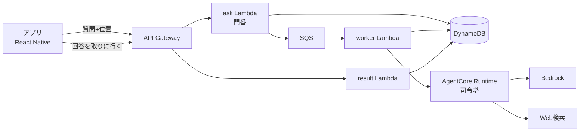

# 全体アーキテクチャ

> アプリ全体の**責務分担（アプリ vs AWS）**と**データの流れ**を定める。
> **上位に [00_user_stories.md](00_user_stories.md)（要件定義）がある。** 設計で迷ったらそちらに立ち返る。
> 初心者でも追えるよう、まず全体像から入り、各役割を順に説明する。

## 1. ひとことで言うと

**アプリ（React Native）は"薄いクライアント"に徹し、賢い処理は AWS 側で行う。**

- アプリの仕事: 位置を取る・音声を扱う・AWSに送る・回答を鳴らす。
- AWSの仕事: 事実（住所・方位）を確定する・回答を考える・必要ならWeb検索する。

この分担は [プロジェクト方針 §2.1](../pre-research/00_project_policy.md)（モバイルは必要最低限、ロジックはAWS）に沿っている。

## 2. 全体構成



| 構成要素 | 役割 |
|---|---|
| **API Gateway** | HTTPの入口。流量制限もここで行う（§6） |
| **ask Lambda** | **門番。** 入力を検証し、**事実（住所・方位）を確定**してキューに積む |
| **SQS** | 質問の待ち行列。**29秒制約を外すための要**（[01a](01a_async_ask.md)） |
| **worker Lambda** | AgentCore を呼び、結果を DynamoDB に保存する |
| **result Lambda** | アプリがポーリングして回答を取りに来る先 |
| **DynamoDB** | 質問の処理状況。シングルテーブル（[03](03_dynamodb_table.md)） |
| **AgentCore Runtime** | **司令塔。** 会話の文脈を保持し、Bedrockを呼び、必要ならWeb検索する |

### 責務分担

| 処理 | 担当 | 使うもの |
|---|---|---|
| ウェイクワード検知 | アプリ（オンデバイス） | Porcupine |
| 位置の取得（履歴を保持） | アプリ | expo-location |
| 音声 → テキスト（STT） | **アプリ** | Amazon Transcribe |
| 入力の検証・流量制限 | **AWS** | API Gateway + Lambda |
| 座標 → 住所、進行方位の算出 | **AWS** | Lambda（§4） |
| 会話の保持・回答生成・Web検索 | **AWS** | AgentCore + Bedrock |
| テキスト → 音声（TTS） | **アプリ** | Amazon Polly |
| 音声の再生 | アプリ | expo-av 等 |

> ⚠️ **音声（STT/TTS）はアプリ側**で、APIには**テキスト**を送る。
> 音声ファイルはAWSに送らない（§3）。

## 3. 会話の司令塔は AgentCore

**「続けて質問できる」ことが要件なので**（[00](00_user_stories.md) US-1.02）、
会話の組み立ては **Amazon Bedrock AgentCore** が担う。

Bedrock の Converse API はステートレスで、会話を継続するには毎回全履歴を送り直す必要がある。
それを自前で持つより、セッション管理がネイティブな AgentCore に任せる方が筋がよい。

### Lambda を挟む理由

AgentCore は**それ自体がエンドポイントを持つ**ため、アプリから直接呼ぶこともできる
（Cognito + JWT。実現可能性は確認済み）。それでも Lambda を挟むのは:

- **流量制限**（§6）は API Gateway の Usage Plan に依存しており、AgentCore に同等の機能が見当たらない
- **入力量の上限**を、Bedrockを呼ぶ前に手前で弾ける
- **LLMに渡す前に事実を確定させる場所**として要る（§4）
- **後から外すのは容易だが、外した後で足すのは再設計**になる

### なぜ Amazon Lex は使わないのか

「音声＝Lex」と考えがちだが、**本アプリでは Lex を使わない**。

- **Lex は"定型的なチャットボット"用**の意図理解エンジン。「ピザを注文」→注文フローに分岐、
  のような**あらかじめ決めた意図に振り分ける**用途に向く。
- 本アプリがやりたいのは「**自由な質問に LLM が自由に答える**」こと。
  意図理解は **LLM自身が行う**ため、間に Lex を挟むと二重になり、対話の自由度をむしろ制約する。

> 決定の経緯は [adr/003](../adr/003_agentcore_as_orchestrator.md)。

### 将来の拡張（メモ機能など）

**エージェントに「ツール」を足す形で拡張する。** この構成を選んだ理由のひとつ。

```python
@tool
def save_memo(text: str) -> str:
    """ライダーのメモを保存する"""   # Lambda or DynamoDB を呼ぶ
```

いまやるべきは「後からツールを足せる状態を保つ」ことだけ（[00](00_user_stories.md) 補足B）。

## 4. ⚠️ LLMに渡す前に事実を確定させる

**このアプリの中核となる考え方。** 調べれば確定するものを、LLMに推測させない。

### 4.1 座標 → 住所は Lambda で解決する

**LLMに緯度経度を渡して場所を判断させると、約40kmずれた市を答えた**（実測）。
座標の逆変換はLLMが原理的に苦手なので、**Lambda で Amazon Location Service を呼び、
住所を事実として渡す**（[pre-research/geocoding/](../pre-research/geocoding/)）。

- エージェント側の `@tool` にはしない。**現在地は毎回必要な前提情報**なので、
  LLMに「呼ぶかどうか」を判断させない。
- プロンプトには「この住所は正確です。自分で座標から推測しないこと」と明示する。

### 4.2 進行方位も Lambda で算出する

「右手に見える山は？」に答えるには進行方向が要る。
方位は**三角関数で確定する**ので、これもLLMに推測させない。

アプリは**2点の座標を送るだけ**（`start`＝現在地、`end`＝過去の位置）。

⚠️ **`end` の方が古い。** 方位は `end` → `start` の向きで計算する。
逆に読むと**ライダーの左右が入れ替わる**。

→ **詳細は [01b_heading.md](01b_heading.md)**（2点目の選び方・方位を出さない条件）。

## 5. ⚠️ 回答は非同期で受け取る

**`POST /ask` は回答を返さない。** 202 と `requestId` を返し、
アプリが `GET /ask/{requestId}` で取りに行く。

API Gateway の29秒上限に対しエージェントの生成が最大25.5秒かかるため、
**待つのをやめた**。エージェントの呼び出しは SQS 経由で worker Lambda が行う。

⚠️ **SQSは「少なくとも1回」配信**なので、**二重処理＝AgentCoreの二重課金**を
条件付き書き込みで防いでいる。**この仕組みを外さないこと。**

→ **詳細は [01a_async_ask.md](01a_async_ask.md)**（ポーリングの止め方・時間の大小関係・実測値）。
決定の経緯は [adr/001](../adr/001_async_ask.md)。

## 6. ⚠️ リージョンは用途で分かれている

**`backend/` は東京、`touringAgent/` はバージニア。** 混同すると動かない。

| 対象 | リージョン | 理由 |
|---|---|---|
| `backend/`（SAM: API Gateway + Lambda + SQS + DynamoDB） | **`ap-northeast-1`**（東京） | 利用者が日本にいる |
| `touringAgent/`（AgentCore: Runtime + Gateway） | **`us-east-1`**（バージニア） | **Web検索コネクタが us-east-1 限定**のため |

Web検索（US-1.04）は AgentCore Gateway の**組み込みコネクタ**で実現しており、
これが us-east-1 限定。Runtime と Gateway を別リージョンに分けるとリージョンを跨ぐので、
**`touringAgent/` ごと us-east-1 に置いている**（[pre-research/websearch/](../pre-research/websearch/)）。

### これに伴う制約

**モデルIDは `us.anthropic.claude-sonnet-4-6`。**
`jp.` は ap-northeast 専用の**推論プロファイル**なので、us-east-1 から呼ぶと
`ValidationException: The provided model identifier is invalid` になる（実測）。

> ⚠️ **東京のLambdaが us-east-1 のRuntimeを呼ぶ。**
> boto3 クライアントの**リージョン指定を明示すること**（既定のままだと東京を見に行って
> `ResourceNotFoundException` になる）。

> 📌 **将来リージョンを揃えられる可能性はある。** 条件は
> 「Web検索コネクタが東京で使えるようになること」。

## 7. 音声はアプリ側で扱う

**アプリが Transcribe / Polly を呼び、APIにはテキストを送る。**

- ⚠️ **Nova 2 Sonic（音声→音声の基盤モデル）は日本語に対応していない**ため採用不可。
  技術的には最も自然な会話が実現できるので、**日本語が追加されたら再検討の価値がある**
  （[pre-research/voice/](../pre-research/voice/)）。
- この方式なら**Lambdaを中継役として使える**（音声を直接やり取りする案では中継できない）。
- 決定の経緯と却下した案は [adr/002](../adr/002_speech_on_device.md)。

**波及する制約**:

- `POST /ask` は**テキストを受ける**（`question`、500文字上限）。
- ⚠️ **音声の長さをLambdaで検証できない**（音声がLambdaに来ないため）。
  入力量の制御は**文字数**で行う。⚠️ **アプリを改造されるとTranscribeの秒数課金が無防備**
  になるため、この対策は音声化の前に決める必要がある（§11）。

## 8. 認証：APIキー方式（アプリ画面から入力）

当面の対象は「自分のAndroidだけ」なので、まずは軽量な **APIキー認証**で始める。

- APIキーは**アプリ画面から入力**し、端末に安全に保管する（`expo-secure-store`）。
  **ソースにハードコードしない。**
- API Gateway の **Usage Plan** と組み合わせ、キー単位で流量制限をかける。
- 将来複数ユーザーに広げるなら Cognito に移行する余地を残す
  （[pre-research/agentcore/AUTH.md](../pre-research/agentcore/AUTH.md)）。

## 9. 悪用・コスト暴走対策（多層防御）

**個人利用でも、URLが漏れれば誰でも叩ける。** 単一の対策に頼らず多層で守る。

| 層 | 対策 |
|---|---|
| **入口** | APIキー必須（§8） |
| **流量** | API Gateway の Usage Plan（1日あたりのクォータ・レート制限） |
| **入力量** | 質問は500文字まで。`max_tokens` で出力も上限を設ける |
| **予算** | AWS Budgets で月額上限を監視し、**超過したら自動遮断** |

> ⚠️ **具体的な閾値（1日何回・月いくら）はまだ決めていない**（§11）。実測してから決める。

## 10. 構成管理（IaC）：SAM ＋ CDK の併用

| 対象 | IaC | 理由 |
|---|---|---|
| `backend/` | **SAM** | Lambda + API Gateway 中心の構成に素直 |
| `touringAgent/` | **CDK** | `agentcore` CLI が生成するのがCDKのため |

- **2つのIaCが並存する**ので、どちらで管理されているリソースかを意識する。
- `backend/` と `touringAgent/` は**別スタック**。相互参照が必要になったら
  SSMパラメータ等での受け渡しを検討する。
- CDKの学習は最小限でよい（`agentcore` CLI が隠蔽するため）。

## 11. 未決事項

- [ ] 音声フォーマットと送信方法の詳細（録音形式、ペイロード上限）
- [ ] コスト制御の閾値設計（Usage Planのクォータ、Budgetsの月額上限）
- [ ] 予算超過時の自動遮断の実装方式
- [ ] APIキーの端末保管（expo-secure-store 導入）と設定画面
- [ ] エラー時の挙動（STT失敗・タイムアウト・利用停止中に何を音声で返すか）

> Bedrockの実装を書く際は `claude-api` スキルを参照する（モデルIDは記憶に頼らない）。

## 参考

- [amazon-bedrock-voice-conversation (AWS Samples)](https://github.com/aws-samples/amazon-bedrock-voice-conversation) — Transcribe→Bedrock→Polly の音声会話構成例
- [How to limit usage and cost on Amazon Bedrock (AWS Builder Center)](https://builder.aws.com/content/3DIYzXtsMwvVh1jsn1CSpa8k2rL/limiting-bedrock-usage-and-controlling-costs) — 流量制限・予算アラーム・前チェックの3アプローチ
