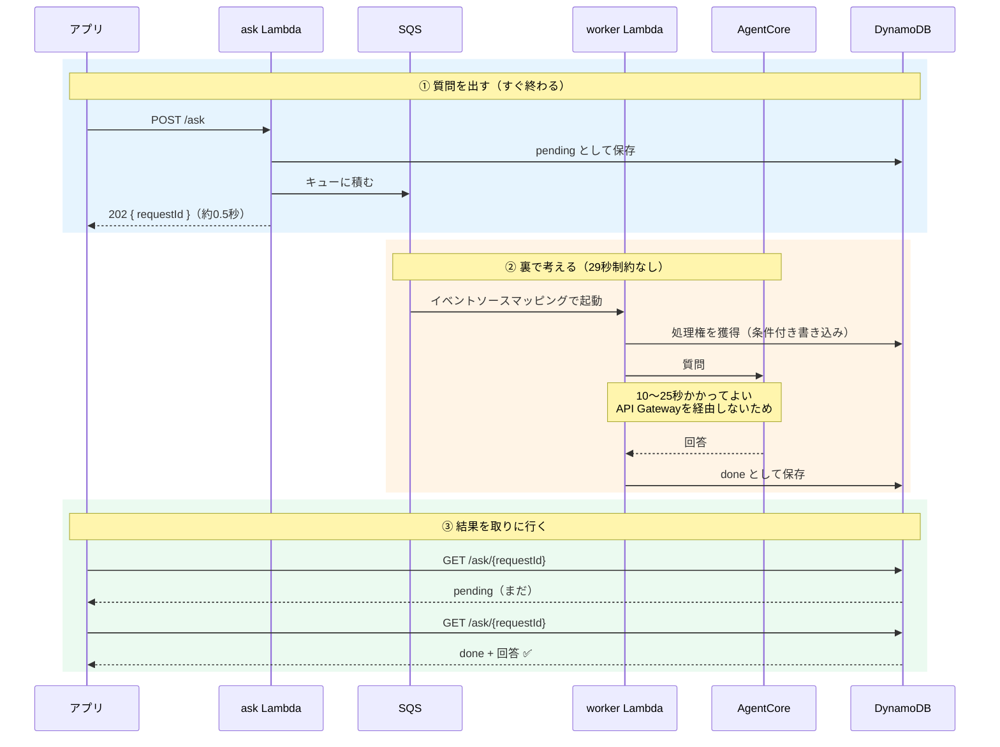
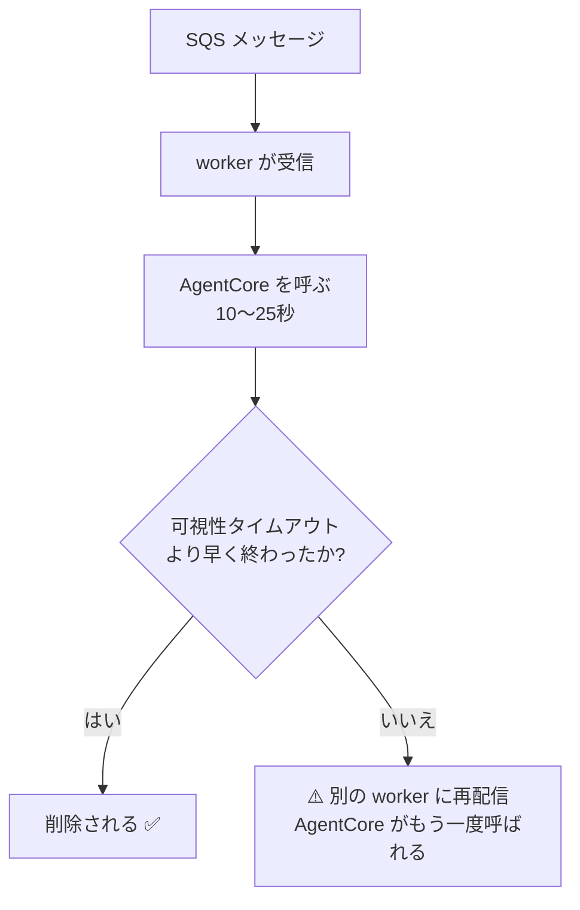
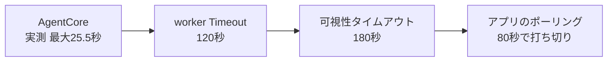
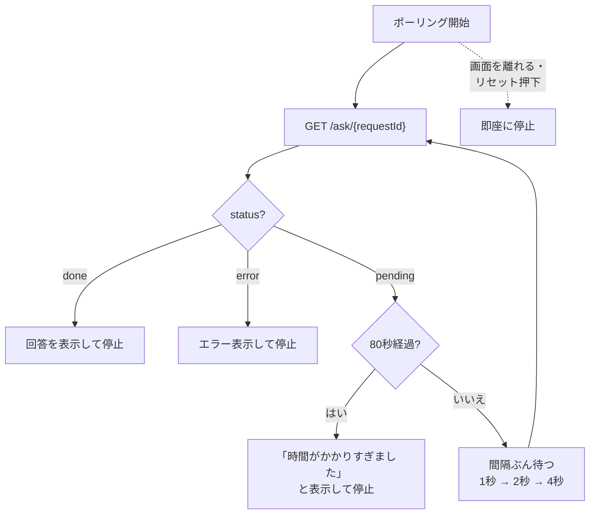

# 回答を非同期で受け取る（29秒制約の回避）

> [01_architecture.md](01_architecture.md) §5.6 の詳細。全体像はそちらを先に読む。
> データの持ち方は [03_dynamodb_table.md](03_dynamodb_table.md)、
> APIの形は [02_api_openapi.yaml](02_api_openapi.yaml)。

## 1. なぜ非同期にしたのか

**API Gateway は1リクエスト29秒で必ず切れる**（上限値であり、引き上げられない）。
一方エージェントの生成には時間がかかり、**最悪25.5秒を実測**した。余裕は3.5秒しかない。

さらに実測で分かったのは、**コールドスタートを除いても生成に約10秒かかる**こと:

| | geocode | エージェント応答開始 | 生成完了まで |
|---|---|---|---|
| 初回（コールド） | 609ms | 8.6秒 | 12.5秒 |
| 2回目（ウォーム） | 185ms | 0.27秒 | **10.2秒** |

「初回だけ遅い」なら我慢もできるが、**毎回10秒使っている**。
ここに音声化（STT/TTS）が乗れば29秒に届く。そこで**待つのをやめた**。

> ⚠️ **「動くこともあるが、たまに失敗する」が一番厄介。**
> 29秒はギリギリ足りていたので、放置すると
> 「長い回答のときだけ落ちる」という再現しにくい不具合になっていた。

## 2. 構成

**「質問を受ける係」と「実際に考える係」を分ける**のが要点。

> ③ の `GET` も実際には result Lambda を経由する
> （アプリが直接 DynamoDB を読むわけではない）。図では流れを追いやすくするため省略。

### なぜ Lambda を2つに分けるのか

「アプリから繰り返し取りに行く」だけでは、**誰がAgentCoreを呼ぶのか**が決まらない。

- ポーリングのたびに呼ぶ → **毎回ゼロからやり直し**になり、いつまでも終わらない
- 最初の1回で呼ぶ → **そのリクエストが29秒制約に当たる**（元の問題に戻る）

そこで「**呼びっぱなしにできる場所**」が要る。それが worker Lambda。
API Gateway を経由しないので、29秒ではなく **Lambda自体の上限（最大15分）** まで使える。

## 4. なぜ SQS を挟むのか

Lambda を別の Lambda から直接呼ばず、キューを介するのが一般的な作法。
呼び出し元と処理側が切り離され、流量の急増も吸収できる。

> 📌 **Lambda の非同期呼び出し（`InvocationType='Event'`）にもAWS内部のキューがある。**
> [公式](https://docs.aws.amazon.com/lambda/latest/dg/invocation-async.html) に
> "Lambda places the event in a queue and returns a success response" とあり、
> 単なる直呼びではない。
> ただし**そのキューは自分のものではない**ので、滞留の可視化や制御ができない。
> ここでは可視性の高い SQS を採る。
>
> ⚠️ アンチパターンとされるのは **同期呼び出し**（`RequestResponse`）で
> Lambda から Lambda を呼ぶこと。非同期呼び出しはそれとは別。

## 5. ⚠️ 二重処理を防ぐ（最重要）

**SQSは「少なくとも1回」配信**で、同じメッセージが2回届き得る。
[AWS公式](https://docs.aws.amazon.com/lambda/latest/dg/with-sqs.html) が
`Warning` として明記している:

> Lambda event source mappings process each event **at least once**, and duplicate
> processing of records can occur. ... **we strongly recommend that you make your
> function code idempotent.**

**このアプリでは二重処理＝AgentCoreの二重呼び出し＝二重課金**になる。実害がある。

### 二重処理が起きる経路

### 対策は2層

| 対策 | 内容 |
|---|---|
| **時間の大小関係** | worker の Timeout(120秒) **＜** キューの可視性タイムアウト(180秒) |
| **条件付き書き込み** | worker は `pending → processing` を `ConditionExpression` で行う。**2つ目は獲得に失敗し、AgentCoreを呼ばずに終わる** |

実装は `backend/src/lib/store.py` の `claim()`。
状態遷移は [03_dynamodb_table.md](03_dynamodb_table.md) §4。

### 守るべき順序

⚠️ **worker(120) < 可視性(180) が崩れると、処理中に再配信される。**
worker の Timeout を伸ばすときは、可視性タイムアウトも一緒に伸ばすこと。

## 6. アプリ側のポーリング

⚠️ **必ず止まるように作る**（無限に叩き続けない）。

| 経過 | 間隔 | 回数 |
|---|---|---|
| 0〜20秒 | 1秒 | 20回 |
| 20〜40秒 | 2秒 | 10回 |
| 40〜80秒 | 4秒 | 10回 |
| **80秒で打ち切り** | — | 合計 **40回** |

- 実測10〜13秒なので**大半は最初の帯で終わる**。
- **画面を離れた/会話をリセットしたら即座に停止**する。
- 通信が一時的に切れても、その1回は無視して打ち切り時間まで続ける
  （走行中は電波が不安定なため）。

## 7. 追加したAWSリソース

| リソース | 名前 | 要点 |
|---|---|---|
| SQSキュー | `sqs-trg-<env>-ask` | 可視性タイムアウト **180秒** |
| DLQ | `sqs-trg-<env>-ask-dlq` | 3回失敗で退避。14日保持 |
| DynamoDB | `dynamodb-trg-<env>-main` | [03](03_dynamodb_table.md) |
| worker Lambda | `lambda-trg-<env>-worker` | Timeout **120秒**、**バッチサイズ1** |
| result Lambda | `lambda-trg-<env>-result` | `GET /ask/{requestId}` |

⚠️ **バッチサイズは1にする。** 既定は10だが、1メッセージ=1質問で
それぞれ10〜25秒かかるため、まとめると Timeout を超える。

## 8. 実測

アプリが質問を出してから回答を得るまで:

| | 所要 | 回答 |
|---|---|---|
| 初回（コールドスタート込み） | **6.4秒** | 93文字 |
| 2回目以降 | **4.2秒** | 87文字 |

> ⚠️ **非同期化は「速くする」施策ではない。** タイムアウトしなくなるだけで、
> 待ち時間そのものは縮まらない。体感を縮めたいなら回答を短くするなど別の手が要る。

## 9. ⚠️ ハマりどころ

- **アプリで 403 が出たら、まずデプロイ漏れを疑う。**
  API Gateway は**未定義のパスに 404 ではなく 403 を返す**ので、
  エンドポイントを追加してデプロイしていないと認証エラーのように見える。
- **`max_tokens` が厳しすぎると、回答が短くなるのではなく失敗する。**
  途中で切れて `MaxTokensReachedException` になり、
  **壊れた部分応答が会話履歴に残る**（同じセッションで失敗が続く）。
