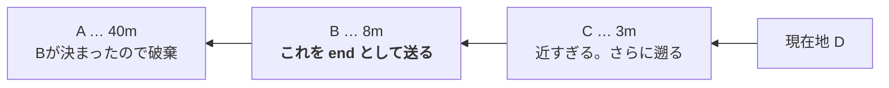

# 進行方位（「右手に見える山は？」に答えるために）

> [01_architecture.md](01_architecture.md) §4.2 の詳細。全体像はそちらを先に読む。
> APIの形は [02_api_openapi.yaml](02_api_openapi.yaml)（`AskRequest.start` / `end`）。

## 1. 方位はバックエンドで算出する

**アプリは2点の座標を送るだけ。** 方位の計算は Lambda が行う。

理由は座標→住所と同じで、**LLMに渡す前に事実を確定させる**ため
（[01_architecture.md](01_architecture.md) §4.1）。方位は三角関数で確定するので、
推測させる余地を残さない。

- 計算: `Backend/src/lib/geo.py`
- プロンプトへの反映: `Backend/src/handlers/ask.py`

### ⚠️ 2点を読む向き

`start` は**現在地**（住所解決にも使う）なので、`end` の方が**古い**。
方位は **`end` → `start`** の向きで計算する。

**逆に読むと方位が180度ずれ、ライダーの左右が入れ替わる。**
一見それらしい値が出るので気づきにくい。テストで固定してある。

## 2. 2点目はアプリが履歴から選ぶ

**直前の1点をそのまま使うのではない。** 低速だと直前の点は近すぎて方位が出せず、
逆に停車後は「最後に動いていた頃の点」が残り続けて古い方位を出してしまう。

そこでアプリは**直近の位置を履歴として持ち、新しい方から遡って
「5m以上離れた最初の点」を起点に選ぶ**。



| 定数 | 値 | 役割 |
|---|---|---|
| `MIN_DISTANCE_METERS` | 5m | これ未満はGPS誤差。起点にしない |
| `MAX_ORIGIN_AGE_MS` | 30秒 | これより古い点は「いまの向き」の根拠にしない |
| `MAX_HISTORY_AGE_MS` | 2分 | 履歴の保持上限 |

- **起点が決まったら、それより古い点は破棄する。** 用途が無く、残すと誤用の元になる。
- ⚠️ **距離で上限を切ってはいけない。** 速度で2点間の距離は大きく変わる
  （60km/h なら3秒で50m、100km/h なら83m）。距離を上限にすると**高速走行時に
  方位が出なくなる**。時間で切れば速度に依存しない。

> ⚠️ **停車中はGPSの更新が届かない。** `distanceInterval` を満たさないため
> コールバックが呼ばれず、位置の更新をきっかけにした判定では
> 「止まった」ことに気づけない。アプリは別途タイマーで判定し直している。

## 3. 方位を出さない場合がある（仕様）

次の場合は方位を付けずに質問だけを通す。**異常ではなく正常な動作。**

| 状況 | なぜ出さないか |
|---|---|
| 起動直後で履歴が足りない | 2点目が無い |
| 停車中・信号待ち（5m以上動いた点が無い） | GPS誤差でしかない |
| **方向転換の直後**（起点が30秒より古い） | 曲がっている最中の「右手」は数秒で変わる |

- ⚠️ **同一座標かどうかでは判定しない。** 停車中でもGPSは1〜2m揺れるため、
  2点が完全一致することはまずない。**距離のしきい値**で判定する。
- **誤った方位を渡すよりは、渡さない方がよい**
  （「右手の山」に左右が逆の答えを返すのが最悪）。
- 転回時の判定を専用に書く必要は無い。**「古い点を使わない」だけで自然に方位なしになり、
  直進が数秒続けば復活する。**

## 4. プロンプトへの渡し方

方位が出せるときは、**方角と左右を文章にして**渡す。

```
進行方向: 南西（真北から222度）
ライダーから見て右手は北西、左手は南東の方角
```

左右まで書いてあるのは、エージェントが
「方角や左右は、ユーザーから与えられた情報をそのまま使う。自分で計算し直さない」
という指示を受けているため。**エージェントに角度計算をさせない。**

## 5. 会話中は「どの時点の位置か」をAIが判断する

⚠️ **ここだけはAIに任せる。** 走行中は質問ごとに位置が変わるため、会話履歴には
複数の位置が並ぶ。「さっきの山」が**どの位置から見た山か**は、
**質問の意味からしか決まらない**（アルゴリズムでは判定できない）。

- 「いま右手に見える〜」→ 最新の位置・方位
- 「さっきの山」「あれの標高」→ **その話題が出たときの位置・方位**

そのための手がかりとして、Lambda は経過時間を添える
（`AskRequest.elapsedSeconds` → 「【この質問は、会話の最初の質問から約N分後のものです】」）。
時間が空いているほど移動しているので、指示語の解釈に効く。

> 📌 **方位の「計算」はAIにさせない**が、**「どの時点の方位を参照するか」の選択は
> AIに任せる**。この2つは別のこと。

- 現在日時も毎回添えている（[01](01_architecture.md) §4.3）。それでも**経過時間を明示する**のは、
  AIに時刻どうしの引き算をさせないため。
- 1分未満は差が無いので添えない（最初の質問にも付かない）。

## 6. 確認方法

アプリ画面に方位磁針を出している（矢印・16方位・左右）。
**サーバー側と同じ式をアプリでも計算しており、表示とAIの回答が食い違えば
どちらかがおかしいと分かる**（検算になる）。

送信するのは座標2点のみで、**方位そのものは送らない**。
