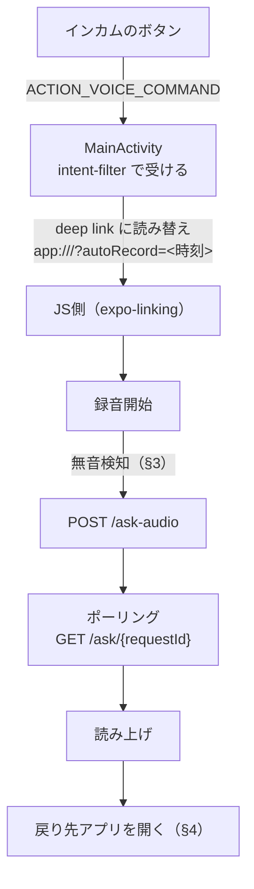

# アプリ（クライアント）側の設計

**アプリは「薄いクライアント」に徹する。** 録音・再生・位置の取得・画面遷移だけを持ち、
STT/TTS・住所解決・回答生成は**すべてAWS側**にある（[01](01_architecture.md) §2）。

> ⚠️ **走行中は画面を見られず手も使えない。** この章の設計は
> ほぼすべてがこの制約から来ている。

| | |
|---|---|
| 実装 | `App/src/`（画面 `src/app/`、ロジック `src/api/`） |
| ネイティブ | `App/plugins/withVoiceInteraction.js`（起動経路）／`App/modules/app-foreground/`（復帰） |
| なぜそう決めたか | [adr/006](../adr/006_handsfree_launch_mechanism.md)（起動）・[adr/007](../adr/007_return_to_map_after_answer.md)（復帰） |
| 実測値・検証 | [pre-research/handsfree/](../pre-research/handsfree/) |

## 1. ハンズフリーの一巡

**インカムのボタンひとつで、起動から復帰まで画面に触れずに完結する**（US-2.04）。



## 2. 起動：`ACTION_VOICE_COMMAND` を Activity で受ける

**インカムのボタンを押すと Android が `ACTION_VOICE_COMMAND` を発行する。**
これを `MainActivity` の intent-filter で受け取る。

```xml
<intent-filter>
  <action android:name="android.intent.action.VOICE_COMMAND" />
  <category android:name="android.intent.category.DEFAULT" />
</intent-filter>
```

📌 **端末の「デジタルアシスタント」は Google のままでよい。**
`ACTION_VOICE_COMMAND` は標準のIntentで、**アシスタントRoleを取らなくても受け取れる**。
⚠️ **`VoiceInteractionService` は使っていない**
（[adr/006](../adr/006_handsfree_launch_mechanism.md)）。
そのため **Google Assistant もマップの音声入力も失われない。**

### ⚠️ 初回だけ端末側の操作が要る

**Google App が `VOICE_COMMAND` の既定（`preferred activity`）として固定されている**と、
intent-filterを持っていても**常に無視される**（ボタンを押してもGoogleが開く）。

```
設定 > アプリ > Google > デフォルトをクリア
```

📌 **これはRoleの明け渡しとは別物。** Google Assistant 自体は既定のままでよく、
**「このIntentを常にGoogleで開く」という固定だけを外す。**

### ネイティブ → JS の受け渡しは deep link

`MainActivity` は Intent を `app:///?autoRecord=<時刻>` に読み替えてから
`super` に渡し、JS側は `expo-linking` の `useURL()` で受ける。

| 設計 | 理由 |
|---|---|
| **`onCreate` と `onNewIntent` の両方で拾う** | `launchMode="singleTask"` のため、**起動済みかどうかで呼ばれる側が変わる** |
| ⚠️ **URLに毎回異なる値（時刻）を入れる** | `useURL()` は**値が変わらないと再発火しない**。固定文字列だと**2回目以降のボタンが無視される** |
| **位置とAPIキーが揃うまで処理済みにしない** | どちらも非同期に届く。欠けたまま録音を始めても**エラーで無音に終わる**だけで、画面を見ないので気づけない |

⚠️ **`MainActivity.kt` は `withVoiceInteraction.js` が全文を生成する。**
`android/` を手で直しても `prebuild` で消える。

## 3. 録音の終了：無音検知（VAD）

**話し終えたら自動で送る。** 停止と送信は分けない（走行中に2回操作できない）。

判定は `src/api/voice.ts` の純粋関数に置き、画面から切り離してある。

| 設定値 | 既定 | 意味 |
|---|---|---|
| `thresholdDb` | **-40 dBFS** | これを下回ると無音とみなす |
| `durationMs` | 3,000ms | この長さ無音が続いたら送る |
| `graceMs` | 5,000ms | 録音開始からこの間は無音でも止めない |
| `maxRecordingMs` | 30,000ms | 上限。**一度も話さなかったときの唯一の出口** |
| `audioSource` | **`mic`** | 録音の用途（Androidの `MediaRecorder.AudioSource`）。⚠️ **端末側の音の加工が変わり、`metering` の見え方に効く** |

**設定値は3段階で解決し、後のものが優先される**（`src/api/vadSettings.ts`）:

```
コードの既定値  →  .env（EXPO_PUBLIC_SILENCE_*）  →  端末に保存された値（最優先）
```

⚠️ **端末で調整できることが要件。** 妥当な閾値は風切り音・エンジン音に左右され、
**走ってみないと決まらない。** `.env` だけだとMacに戻らないと直せない。
設定画面には**リアルタイム音量計**があり、その場で値を選べる。

⚠️ **エンジン始動中は `metering` が 0 dBFS に飽和し、この方式が成立しない。**
`MediaRecorder.maxAmplitude` がエンジン音でフルスケールに張り付くため、
**発話しても値が動かない**（録音ファイル自体には声が入っている）。
⚠️ **閾値の調整では直らない**（飽和した値は変化しないため）。
⚠️ **`audioSource`（録音の用途）を変えても回避できない**（4種を実機で測定）。
最良の `voice_communication` は**アイドリング中なら声と騒音を分離できる**が、
⚠️ **アクセルを開けると0dB付近に達する。**
📌 **設定画面から切り替えられるのは、ノイズ除去の効き方が変わるため**
（録音の品質には効く）。**終話判定の方式は別途決め直す。**

### 判定の設計（3つの分岐）

| 条件 | 振る舞い | なぜ |
|---|---|---|
| **音量が測れない**（`undefined`） | **止めない・捨てない** | 測れない端末で**一切送信できなくなる**のを防ぐ（安全側は「送る」） |
| **まだ一度も声が乗っていない** | 止めない | 無音検知は**発話があったこと**を条件にする |
| **猶予が明ける前に溜まった無音** | ⚠️ **数えない** | 数えると**短く言い淀んで考え込んだ場合に、猶予が明けた瞬間に送信される**（「えーと」だけが飛ぶ）。⚠️ **猶予を伸ばすほど悪化する** |
| **上限に達し、かつ一度も静かにならなかった** | ⚠️ **送らずに捨てる** | 騒音でマイクが埋まっており、送っても意味不明な回答が返るだけ（しかも課金される） |

⚠️ **`-160` は「無音」ではなく「測れなかった」を表す番兵**で、録音開始直後に必ず出る。
**1サンプルでは静かになったと認めない**（一定時間続いて初めて数える）。

⚠️ **捨てたときは黙らない。** 端末内蔵TTS（`expo-speech`）で知らせる（§5）。

## 4. 応答後にマップアプリへ戻る

**戻り先は設定画面で選んだアプリを LAUNCHER インテントで開く**
（[adr/007](../adr/007_return_to_map_after_answer.md)）。
ネイティブ側は自前のExpoモジュール `App/modules/app-foreground/`。

⚠️ **起動し直しではなく既存タスクの再開**なので、**案内中のルートは壊れない**。

| 設計 | 理由 |
|---|---|
| **戻り先を明示的に開く** | 「直前のアプリに戻る」という汎用の操作は通常のアプリに開かれていない（[adr/007](../adr/007_return_to_map_after_answer.md)） |
| **戻り先をパッケージ名で設定に持つ** | ⚠️ **どのマップアプリを使っているかはアプリ側から知り得ない**（他アプリの前面判定はAndroid 5以降塞がれている） |
| **未設定なら何もしない**（ただし画面に出す） | 勝手にどこかへ飛ばさない。⚠️ **黙って何もしないと「故障」に見える** |
| **回答が届いてから戻す** | ⚠️ **背面ではJSが凍結する**（§6） |

### ⚠️ 2つのフラグを使い分ける

| フラグ | 意味 | 倒れるとき |
|---|---|---|
| `launchedHandsFree` | **まだ戻していない** | **戻した時点**、および**一往復が失敗で終わったとき** |
| `wasHandsFree` | **この一往復がハンズフリーだった** | 一往復の終わり |

⚠️ **戻した後に起きる失敗の判定には `launchedHandsFree` を使えない**（既に倒れている）。
読み上げで知らせるべきか（§5）は `wasHandsFree` で判定する。

## 5. 画面に出しても見えない ＝ 音で知らせる

**背面に回った後の失敗は、端末内蔵TTS（`expo-speech`）で読み上げる。**

| 場面 | 読み上げる |
|---|---|
| 応答待ちの最中にボタンを押された | 「いま応答中です。少し待ってからもう一度お話しください。」 |
| 騒音で録音を捨てた（§3） | 「周囲の音が大きく、聞き取れませんでした。もう一度お話しください。」 |
| ポーリングが打ち切られた／中断された | 「回答を取得できませんでした。もう一度お話しください。」 |
| 送信中に例外 | 「送信に失敗しました。もう一度お話しください。」 |
| 回答は来たが**音声が無い**（合成失敗） | **回答の本文をそのまま読み上げる** |

⚠️ **黙って諦めない。** 走行中は画面を見ないので、無反応だと
**「押せていない」のか「壊れた」のか区別がつかない。**

## 6. ⚠️ 背面ではJSが凍結する

**Androidは背面のプロセスをキャッシュ化して凍結する**ので、
`setTimeout` が進まず**ポーリングが止まる**。
⚠️ **フォアグラウンドサービスを持たない限り、背面では待てない**
（採らなかった理由は [adr/007](../adr/007_return_to_map_after_answer.md)）。

- **回答を待ってから戻す**のはこのため（§4）。
- **新しい起動は前の質問のポーリングを捨てる。** ⚠️ 残すと**次の質問で前の答えが返る。**
  ⚠️ **捨てるのは録音が始まってから**（順序を逆にすると、応答待ち中に押したとき
  **前の回答だけが失われ、録音も始まらない**）。

## 7. 音声モードはプロセス全体で2つに固定する

⚠️ **`setAudioModeAsync` はプロセス全体に効く。** 画面ごとに値を書くと
**後から呼んだ画面が全体を上書きする。**
そのため**録音向き・再生向きの2つだけ**を `src/api/voice.ts` に置く。

| モード | 要点 |
|---|---|
| `AUDIO_MODE_RECORDING` | 録音中は他の音を止める（読み上げに自分の声が被らないように） |
| `AUDIO_MODE_PLAYBACK` | ⚠️ **`shouldPlayInBackground: true`**（無いと背面で読み上げが止まる）<br>⚠️ **`interruptionMode: "mixWithOthers"`**（フォーカスを要求しない） |

⚠️ **マップは案内音声のためオーディオフォーカスを取る。** 奪われると `expo-audio` は
**再生を一時停止する**ので、`mixWithOthers` でフォーカスを要求しないようにする。
ナビ音声と重なって鳴るが、**どちらも走行中に聞きたい情報**なのでそれでよい。

⚠️ **録音を捨てるときも音声モードを必ず戻す。** 録音向きのままだと
**以降の読み上げが鳴らなくなる。**

## 8. 実走行用のビルド（Metro無し）

⚠️ **通常の Development Build は起動時に Metro からJSを取りに行く**ので、
**Macから離れると起動しない。** 実走行には**JSを焼き込んだ release ビルド**を使う。

| | |
|---|---|
| 署名 | **debugと同じキーストア**（`android/app/build.gradle`）＝**上書きインストールで設定が消えない** |
| ログ | ✅ **`console.log` は release でも出る**（`[vad]` / `[handsfree]` を `adb logcat` で追える） |
| 手順 | [App/SETUP.md](../App/SETUP.md)「実走行用のビルド」 |

📌 **ストア公開・複数ユーザー対応はスコープ外**（[00](00_user_stories.md) §5）なので、
**独自の署名鍵は用意しない。**

## 9. 画面

**UIは動作確認に足る最小限**にとどめる（コア体験は「走りながら音声で会話」）。

| 画面 | 役割 |
|---|---|
| `src/app/index.tsx` | 質問と回答。押して話すボタン・方位磁針・音量計 |
| `src/app/settings.tsx` | APIキー・VADの閾値・**録音の用途**・戻り先アプリ・リアルタイム音量計 |

⚠️ **APIキーは `expo-secure-store`**（Androidでは Keystore で暗号化）。
VADの設定・戻り先は秘密ではないので **AsyncStorage**。
