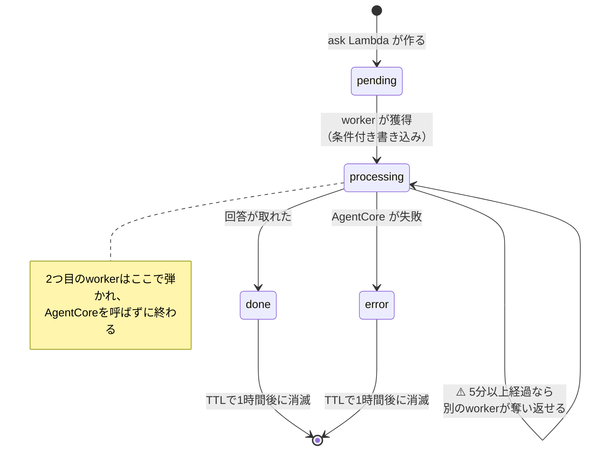

# DynamoDB テーブル定義

> このアプリが使う DynamoDB の**唯一のテーブル**を定義する。
> 上位に [00_user_stories.md](00_user_stories.md)（要件定義）、
> 全体像は [01_architecture.md](01_architecture.md)。

## 1. シングルテーブル設計にする

**このアプリの DynamoDB テーブルは1つだけ**にする。用途ごとにテーブルを増やさない。

DynamoDB では、RDB のように「エンティティごとにテーブルを作る」やり方は推奨されない。
理由:

- **JOIN が無い。** 複数テーブルに分けると、アプリ側で何度も問い合わせることになる。
- **1回のクエリで関連データをまとめて取れる**のがDynamoDBの強み。
  テーブルを分けるとこれが使えない。
- テーブルごとに容量設定・監視・IAM が増える。**運用の手間が単純に倍になる。**

> 📌 RDB の感覚だと違和感があるが、**DynamoDB では「1テーブルに複数種類のデータを混ぜる」のが普通**。
> 種類は後述の `PK` / `SK` の書き方で区別する。

## 2. テーブル

| 項目 | 値 |
|---|---|
| 論理名 | メインテーブル |
| 物理名 | `dynamodb-trg-<env>-main`（`<env>` は `dev` / `prod`） |
| パーティションキー (PK) | `pk`（文字列） |
| ソートキー (SK) | `sk`（文字列） |
| 課金モード | オンデマンド（PAY_PER_REQUEST） |
| TTL属性 | `expiresAt`（UNIX秒） |

- **命名は `<リソースタイプ>-trg-<env>-<識別子>`**（`CLAUDE.md` の規約）。
  単一のテーブルなので識別子は `main`。
- **オンデマンド**にするのは、ツーリング中の散発的な利用で
  読み書きが読めないため。事前にキャパシティを見積もる意味がない。

## 3. キーの設計

`pk` と `sk` の**先頭にデータの種類を書く**ことで、1つのテーブルに複数種類を同居させる。

| 種類 | `pk` | `sk` | 用途 |
|---|---|---|---|
| **質問の処理状況** | `ASK#<requestId>` | `STATUS` | 非同期ポーリング（下記 §4） |
| （将来）会話ログ | `SESSION#<sessionId>` | `MSG#<ISO8601>` | 走行後に会話を見返す |
| （将来）メモ | `MEMO#<userId>` | `MEMO#<ISO8601>` | US-X.01。**いまは作らない** |

- **`#` で区切る**のが慣習。`ASK#abc123` のように書けば、
  `pk` を見ただけで何のデータか分かる。
- 将来の行は**予定であって確定ではない**。実際に作るときに見直す。

> ⚠️ **いま実在するのは「質問の処理状況」だけ。** 残り2つは
> 「シングルテーブルなら後から足せる」ことを示すために書いてある。

## 4. 質問の処理状況（ASK）

`POST /ask` を非同期化したことで生まれたデータ（[01a_async_ask.md](01a_async_ask.md)）。
**アプリが結果を取りに来るまでの一時的な置き場**。

### 属性

| 属性 | 型 | 必須 | 説明 |
|---|---|---|---|
| `pk` | S | ✅ | `ASK#<requestId>` |
| `sk` | S | ✅ | `STATUS`（固定） |
| `status` | S | ✅ | `pending` / `processing` / `done` / `error` |
| `sessionId` | S | ✅ | 会話ID。回答と一緒にアプリへ返す |
| `answer` | S | | `done` のときだけ |
| `error` | S | | `error` のときだけ。**利用者に見せる文言**（内部情報は入れない） |
| `createdAt` | N | ✅ | 作成時刻（UNIX秒） |
| `claimedAt` | N | | worker が処理を始めた時刻。**取り残しの検出に使う**（下記） |
| `expiresAt` | N | ✅ | **TTL。`createdAt` + 1時間** |

### 状態遷移



### ⚠️ `processing` があるのは冪等性のため

SQSは**少なくとも1回**の配信なので、同じメッセージが2回届き得る
（[AWS公式](https://docs.aws.amazon.com/lambda/latest/dg/with-sqs.html) が
"we strongly recommend that you make your function code idempotent" と明記）。

**このアプリでは二重処理＝AgentCoreの二重呼び出し＝二重課金**になる。
そこで worker は処理開始時に**条件付き書き込み**で `pending → processing` を試み、
**失敗したら何もせず終了する**。

```python
# status が pending のときだけ processing にできる。
# 2つ目の worker はここで ConditionalCheckFailedException になり、
# AgentCore を呼ばずに終われる。
table.update_item(
    Key={"pk": f"ASK#{request_id}", "sk": "STATUS"},
    UpdateExpression="SET #s = :processing, claimedAt = :now",
    ConditionExpression="#s = :pending OR (#s = :processing AND claimedAt < :stale)",
    ...
)
```

### ⚠️ 取り残された `processing` を回収する

**worker が Lambda の Timeout で強制終了すると、`except` すら走らない。**
そのままだとレコードは `processing` のまま残り、アプリには**永久に「処理中」に見える**
（エラーとして伝わらないので、利用者は「ただ遅い」と感じたまま打ち切られる）。

そこで2段構えで回収する。

| 仕組み | 値 | 役割 |
|---|---|---|
| **claim の奪い返し** | `CLAIM_STALE_SECONDS` = 5分 | これより古い `processing` は**別のworkerが獲得できる**。⚠️ **可視性タイムアウト(180秒)より長くすること**（短いと、まだ動いているworkerから奪って二重呼び出しになる） |
| **諦めの判定** | `ABANDONED_AFTER_SECONDS` = 15分 | 再配信を使い切ってもなお `processing` なら、`GET /ask/{id}` が **error として返す** |

### ⚠️ TTLを1時間にする理由

**回答文には地名が入り得る**（「○○市の名物は…」）。これは**行動記録になり得る**ので、
必要以上に残さない。アプリのポーリングは最長80秒なので、1時間あれば十分すぎる。

⚠️ **座標と住所はCloudWatchのログにも残る**（Lambda・エージェントの2箇所）。
TTLはこのテーブルにしか効かないので、**保存期間の話をテーブルだけで完結させない。**

> ⚠️ **TTLの削除は即時ではない。** AWSの仕様上、期限切れから実際の削除まで
> 最大48時間ほどかかることがある。**「1時間で確実に消える」とは考えない。**
> 厳密な即時削除が必要になったら、明示的な `DeleteItem` を検討する。

## 5. インデックス

**現時点では GSI / LSI を作らない。**

いまのアクセスパターンは「`requestId` を指定して1件取る」だけで、
パーティションキーの完全一致で足りるため。

> 📌 DynamoDB では**アクセスパターンが先、インデックスは後**。
> 「後で使うかも」でGSIを作ると、書き込みコストと容量が無駄に増える。
> 会話ログやメモを実装するときに、必要なパターンを洗い出してから追加する。

## 6. アクセスパターン一覧

いま必要なものだけ。**増えたらここに追記する**（設計を見直す起点になる）。

| # | やりたいこと | 操作 | キー |
|---|---|---|---|
| 1 | 質問を受け付けて記録する | `PutItem` | `pk=ASK#<id>`, `sk=STATUS` |
| 2 | workerが処理権を獲得する | `UpdateItem`（条件付き） | 同上 |
| 3 | 回答／エラーを書き込む | `UpdateItem` | 同上 |
| 4 | アプリが結果を取りに来る | `GetItem` | 同上 |

**すべて単一アイテムへの操作**で、Query も Scan も使わない。

> ⚠️ **Scan は使わない。** テーブル全体を読むため、件数が増えると
> 遅く・高価になる。シングルテーブルでは特に「他の種類のデータまで読む」ことになる。
