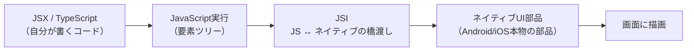

# React Native とは（Web / Vue 経験者向けの導入）

> 対象読者: Web開発（Vue・JS/TS）は分かるが、モバイルアプリ開発は初めての人。
> ねらい: 「Webの知識のどこが使えて、どこが違うのか」を掴む。

## 1. ひとことで言うと

**React Native（RN）は、JavaScript/TypeScript で書いて、スマホの"本物のネイティブUI"を動かす仕組み。**

- Webの React が「JSXを書くと**ブラウザのDOM**（`div`や`span`）を描画する」のに対し、
- React Native は「JSXを書くと**スマホのネイティブUI部品**（AndroidやiOSの本物のボタン等）を描画する」。

つまり **「Reactの考え方そのままで、出力先がブラウザではなくスマホになる」** と捉えるとよい。

## 2. Vue経験者のための対応表

RNの土台は「React」なので、まずは Vue と React の対応から入ると理解が速い。

| Vue の概念 | React / React Native の概念 | メモ |
|---|---|---|
| コンポーネント（`.vue`） | コンポーネント（関数） | 「UIを部品に分けて組む」思想は同じ |
| テンプレート（`<template>`） | **JSX**（JS内にタグを書く） | HTMLに似た記法をJSの中に直接書く |
| `data` / `ref` | **state**（`useState`） | 変わると再描画される値 |
| `props` | `props` | 親から子へ渡す値。ほぼ同じ概念 |
| `computed` | `useMemo` など | 派生値 |
| `methods` | ただの関数 | |
| `v-if` / `v-for` | JSの `&&`・三項演算子・`map()` | テンプレート構文ではなく素のJSで書く |
| `<style scoped>`（CSS） | **JSオブジェクトのスタイル**（後述） | CSSファイルではなくJSで書く |

**要点**: Vueの「リアクティブにUIを組む」感覚は活きる。書き方（テンプレート構文 → JSX、CSS → JSスタイル）が変わるだけ。

## 3. Web React との一番大きな違い：部品とスタイル

RNは「Reactだが、ブラウザではない」ため、**Webの部品やCSSがそのままは使えない**。

### 3.1 UI部品（コンポーネント）が違う

| Web（HTML） | React Native | 役割 |
|---|---|---|
| `<div>` | `<View>` | 箱・レイアウトの入れ物 |
| `<span>` / `<p>` | `<Text>` | 文字（RNでは文字は必ず `<Text>` の中に書く） |
| `` | `<Image>` | 画像 |
| `<button>` | `<Pressable>` / `<Button>` | タップできる要素 |
| `<input>` | `<TextInput>` | テキスト入力 |

> ポイント: **RNには `div` も `span` もない。** `View`（箱）と `Text`（文字）が基本部品。
> 「文字は必ず `<Text>` で囲む」はWeb出身者がよく忘れる点。

### 3.2 スタイルはCSSファイルではなくJSオブジェクト

```js
// Webの感覚（CSS）:  .box { padding: 16px; background: blue; }
// RNではJSオブジェクトで書く:
const styles = StyleSheet.create({
  box: { padding: 16, backgroundColor: "blue" },
});
// 使う側:  <View style={styles.box} />
```

- 単位は基本 `px` を書かず数値（`16`）。
- プロパティ名は **キャメルケース**（`background-color` → `backgroundColor`）。
- レイアウトは **Flexbox が標準**（Webのflexに近いが、RNではデフォルトが縦並び＝`flexDirection: "column"`）。
- **ブラウザのAPI（`window`・`document`・`localStorage` 等）は無い。** 代わりにRN/Expoが用意するAPIを使う。

## 4. ざっくりした仕組み（詳細は後で気にすればよい）

書いたJSがどうやってスマホのネイティブUIになるのか、大まかな流れ:



- 昔は「Bridge」という仕組みだったが、現在は **JSI（JavaScript Interface）** というより速い方式に進化している。
- **重要な学びポイント**: JSだけで完結しない機能（カメラ、GPS、そして本アプリの**ウェイクワード**や**バックグラウンド常駐**など）は、
  この「JS ↔ ネイティブの橋渡し」の先にある**ネイティブ機能**を使う。
  だから本アプリではどこかでネイティブ層に触れることになる（→ [技術選定 §6](../pre-research/02_tech_selection.md) で議論済み）。

## 5. 本アプリにとっての意味

- **Web/Vueの知識（コンポーネント・状態・props・JSXに近い考え方）はそのまま学習の足がかりになる。** これがRNを選んだ理由。
- ただし **UIの部品名・スタイルの書き方・ブラウザAPIが無い**点は新しく覚える必要がある。
- 本アプリはUIを凝らない方針（[プロジェクト方針 §2.1](../pre-research/00_project_policy.md)）なので、
  RNのUI部分は「`View`と`Text`と少しのボタン」程度に留め、**音声・位置・バックグラウンドのロジック**に学習を集中させればよい。

## 参考

- [Learn the Basics · React Native 公式](https://reactnative.dev/docs/tutorial)
- [What is React Native? Complete guide for 2026 (Hicron)](https://hicronsoftware.com/blog/what-is-react-native/)
- [React Native Architecture Explained (2026 Edition, Medium)](https://medium.com/@silverskytechnology/react-native-architecture-explained-2026-edition-0ca7e4048591)
