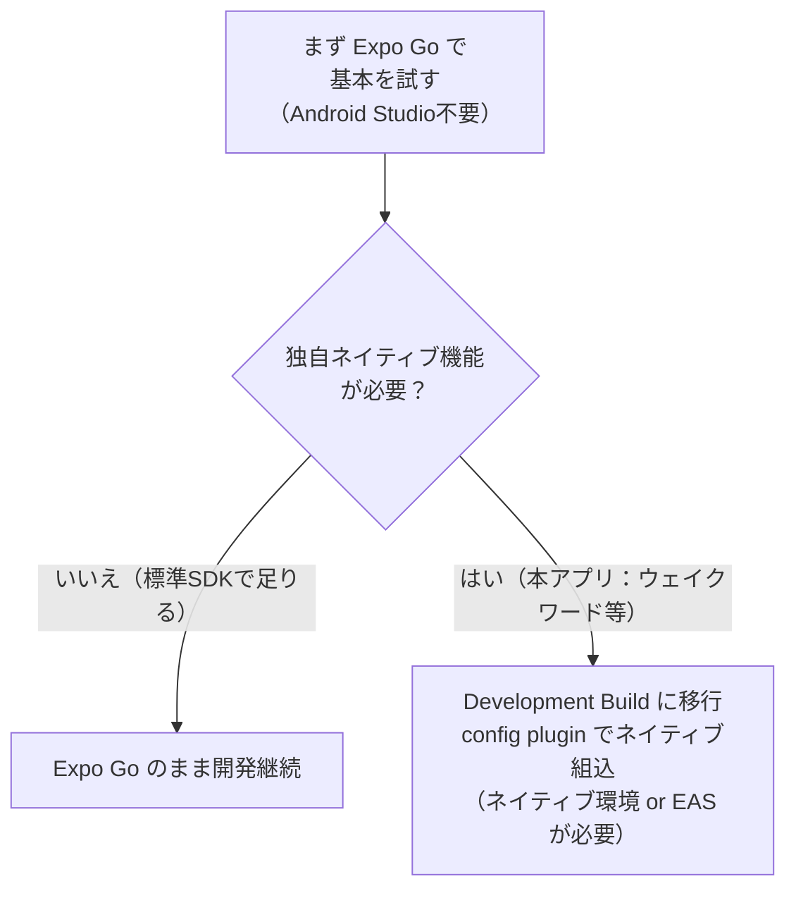

# Expo とは何か、なぜ使うのか

> 対象読者: React Native をこれから始める人。
> ねらい: 「Expoが何を楽にしてくれるのか」と「本アプリではどこまで恩恵を受けられるのか」を掴む。

## 1. ひとことで言うと

**Expo は、React Native 開発を楽にしてくれる"ツールキット＋クラウドサービス"。**

React Native 単体だと、開発環境の構築（ネイティブのビルド設定など）が面倒で、
初心者が最初につまずきやすい。Expoはその面倒な部分を肩代わりしてくれる。

**2026年時点で、React Native公式も「新規プロジェクトはExpoで始める」ことを推奨している。**

## 2. Web開発でたとえると

- React Native 単体で始める = **Webpackやビルド設定を全部自分で書く**ような大変さ。
- Expoで始める = **Vite や Nuxt のような"お膳立て済みの枠組み"に乗る**イメージ。
  環境構築・ビルド・実機確認の面倒を肩代わりしてくれる。

## 3. Expoが楽にしてくれること（初心者にうれしい点）

- **環境構築が軽い**: 最初は **Node.js と Expo CLI を入れるだけ**で始められる。
  （最初の段階では）Xcode や Android Studio のインストールが不要。
- **実機ですぐ確認できる**: スマホに「Expo Go」アプリを入れると、書いたコードをその場でプレビューできる。
- **ネイティブ機能のSDKが揃っている**: 位置情報・カメラ・通知など、よく使うネイティブ機能が Expo SDK として用意されている。
- **クラウドビルド（EAS）**: 後述。自分のPCでネイティブビルド環境を完全に整えなくても、クラウドでアプリをビルドできる。

## 4. 覚えておきたい用語

| 用語 | 何か |
|---|---|
| **Expo CLI** | Expoプロジェクトを作る・動かすコマンドツール（`npx create-expo-app` で新規作成） |
| **Expo Go** | スマホに入れる確認用アプリ。標準機能の範囲なら、これで即プレビューできる |
| **Expo SDK** | 位置情報・カメラ等のネイティブ機能をJSから使うためのライブラリ群 |
| **Managed Workflow** | ネイティブ設定をExpoに任せる、最も手軽なやり方 |
| **Development Build** | 独自のネイティブ機能を組み込みたいとき用の、自分専用の開発版アプリ（後述） |
| **EAS (Expo Application Services)** | クラウドでビルド・配布するサービス。Mac無しでiOSビルドも可能 |

## 5. 【本アプリで最重要】Expo Go の手軽さは"途中まで"

ここは本アプリの設計に直結する超重要ポイント。

**「Expo Go だけで完結し、Android Studio を一切触らない」のは、Expo標準SDKの範囲で作れるアプリの話。**

本アプリには、Expo標準SDKだけでは足りない**独自のネイティブ機能**がある:

- **ウェイクワード検知**（Picovoire Porcupine のネイティブSDK）
- **バックグラウンド常駐でのマイク**（Foreground Service）

これらを使うには、Expo Go ではなく **「Development Build」** が必要になる。

### Development Build とは

- **自分のアプリ専用の"開発版アプリ"を一度ビルドして端末に入れる**やり方。
- 「config plugin」という仕組みで、Expo Goには入っていないネイティブ機能（Porcupine等）を組み込める。
- その代わり、**この時点で Android のネイティブビルド環境（Android SDK など）に踏み込む**ことになる。
  - ただしローカルで全部揃えなくても、**EAS（クラウドビルド）**を使えば負担を軽くできる。

> つまり本アプリでは「**最初はExpo Goで学びの一歩を踏み、
> ウェイクワードやバックグラウンド常駐の段階で Development Build に移行する**」という流れになる見込み。
> これは Expo/RN の弱点ではなく、独自ネイティブ機能を使うアプリ共通の宿命（Flutter/Kotlinでも同様）。詳細は [技術選定 §6.3](../pre-research/02_tech_selection.md)。

## 6. 本アプリにとっての意味

- **入口はExpoで最も楽に始められる。** まずは Node + Expo CLI で環境を作り、Expo Go で基本を学ぶのがよい。
- **ウェイクワード／バックグラウンドの段階で Development Build（＋必要ならEAS）に進む**、と見通しを持っておく。
- モバイルは必要最低限方針（[プロジェクト方針 §2.1](../pre-research/00_project_policy.md)）なので、
  Expoの便利機能に乗って**環境まわりの手間を最小化**し、コア機能の実装に集中する。

## 参考

- [Get started · Expo Documentation](https://docs.expo.dev/)
- [React Native with Expo — A Developer's Tale (Medium)](https://medium.com/@farrukh.ssarwar/react-native-with-expo-a-developers-tale-7afcaa499bdb)
- [React Native CLI vs Expo vs EAS Build (abdulrafaystudio)](https://www.abdulrafaystudio.com/blog/react-native-cli-vs-expo-eas-build-production-apps/)
