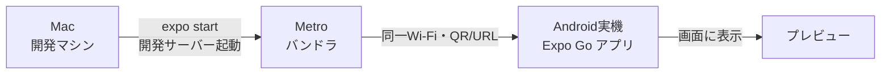

# 開発環境のセットアップ手順（Mac + Expo + 実機Android）

> 対象: 本プロジェクトを手元で動かすための最初のセットアップ手順。
> 前提環境: macOS / Homebrew が使えること / Node.js が入っていること。
> 確認方法: **実機のAndroid ＋ Expo Go アプリ**でプレビューする（Android Studio不要の最小構成）。

## 0. 全体像



- **Mac側で開発サーバー（Metro）を起動**し、**同じWi-FiにいるスマホのExpo Go**でそこに繋いでプレビューする、という仕組み。
- コードを保存すると自動でスマホの表示が更新される（ホットリロード）。

## 1. 必要なツール

この段階（実機 + Expo Go）で必要になるもの:

- **Node.js（LTS 相当の新しめのバージョン）/ npm** — Expo の実行に使う。`node --version` / `npm --version` で確認できる。
- **Homebrew** — macOS のパッケージ管理。watchman の導入に使う。
- **watchman** — ファイル変更監視ツール（後述でインストール）。
- （任意）VSCode などのエディタ。

**この段階では不要なもの**:

- Java / Android SDK → 実機 + Expo Go の段階では要らない。
  ウェイクワード等のネイティブ機能を組み込む **Development Build の段階で導入する**（→ [Expoの説明 §5](./02_expo.md)）。

## 2. watchman のインストール

watchman は「ファイルの変更を監視する」ツール。Expo/RNが安定して動くために推奨される。

```sh
brew install watchman
watchman --version   # 入ったか確認
```

## 3. Expo プロジェクトの作成

リポジトリ直下に `app/` サブディレクトリとして作成する（ドキュメント群とアプリコードを分離するため。[プロジェクト方針](../pre-research/00_project_policy.md) 参照）。

```sh
# リポジトリのルートで実行
npx create-expo-app@latest app
```

- テンプレートは `expo-template-default`（**TypeScript対応**、`expo-router` によるファイルベースのルーティング付き）。
- 途中で「既存のGitリポジトリ内だが新規git初期化をスキップするか？」と聞かれたら **Yes（スキップ）**。
  本リポジトリは既にgit管理下なので、`app/` 用に別のgitを作らない。
- `npm install` まで自動で走り、`app/node_modules/` に依存が入る。

### できたもの（主なもの）

| パス | 役割 |
|---|---|
| `app/src/app/` | 画面（ファイル名がそのままルートになる。`index.tsx` が最初の画面） |
| `app/src/components/` | 再利用するUI部品 |
| `app/package.json` | 依存とスクリプト（`start` / `android` / `ios` / `web`） |
| `app/app.json` | Expoアプリの設定 |
| `app/tsconfig.json` | TypeScript設定 |

## 4. 開発サーバーの起動とプレビュー（自分のターミナルで実行）

> Expoの `expo start` は **対話的な画面（QR表示・キー操作）** を持つため、
> **VSCodeのターミナル等で自分で実行する**のがよい（QRが自分の画面に出る）。

```sh
cd app
npx expo start
```

起動すると:

- ターミナルに **QRコード**と `exp://…` の**URL**が表示される。
- スマホに **Expo Go**（Google Playで入手）を入れ、アプリ内のQRスキャンでそのQRを読む。
  - Mac と スマホは **同じWi-Fi** に繋いでおくこと。
- 少し待つとスマホにアプリのプレビューが表示される。

### よく使うキー操作（`expo start` 実行中）

| キー | 動作 |
|---|---|
| `r` | リロード（表示を作り直す） |
| `j` | デバッガを開く |
| `m` | 開発メニューの切り替え |
| `?` | 使えるコマンド一覧 |
| `Ctrl + C` | サーバー停止 |

### うまく繋がらないとき

- Mac とスマホが**同じWi-Fi**か確認する。
- それでもダメなら `npx expo start --tunnel`（トンネル経由。初回は追加パッケージを入れる場合あり）。

## 5. この段階でのゴール

- スマホのExpo Goで、テンプレートの初期画面が表示されればOK。
- ここまでは **Android Studio も Java も不要**。
- **次の段階（ウェイクワード・バックグラウンド常駐）で Development Build に移行**する際に、
  はじめて Android SDK 等が必要になる（→ [Expoの説明 §5](./02_expo.md)）。その時にまた手順を記録する。

## 参考

- [Expo 公式ドキュメント（SDK 57）](https://docs.expo.dev/versions/v57.0.0/)
- [Create your first app · Expo](https://docs.expo.dev/tutorial/create-your-first-app/)
