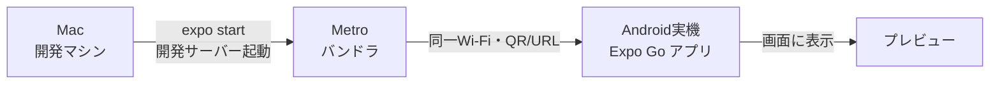

# 開発環境のセットアップ手順（Mac + Expo + 実機Android）

> 対象: 本プロジェクトを手元で動かすための最初のセットアップ手順。
> 前提環境: macOS / Homebrew が使えること / Node.js が入っていること。
> 確認方法: **実機のAndroid ＋ Expo Go アプリ**でプレビューする（Android Studio不要の最小構成）。

## 0. 全体像



- **Mac側で開発サーバー（Metro）を起動**し、**同じWi-FiにいるスマホのExpo Go**でそこに繋いでプレビューする、という仕組み。
- コードを保存すると自動でスマホの表示が更新される（ホットリロード）。

## 1. 必要なツール

この段階（実機 + Expo Go）で必要になるもの:

- **Node.js（LTS 相当の新しめのバージョン）/ npm** — Expo の実行に使う。`node --version` / `npm --version` で確認できる。
- **Homebrew** — macOS のパッケージ管理。watchman の導入に使う。
- **watchman** — ファイル変更監視ツール（後述でインストール）。
- （任意）VSCode などのエディタ。

**この段階では不要なもの**:

- Java / Android SDK → 実機 + Expo Go の段階では要らない。
  ウェイクワード等のネイティブ機能を組み込む **Development Build の段階で導入する**（→ [Expoの説明 §5](./02_expo.md)）。

## 2. watchman のインストール

watchman は「ファイルの変更を監視する」ツール。Expo/RNが安定して動くために推奨される。

```sh
brew install watchman
watchman --version   # 入ったか確認
```

## 3. Expo プロジェクトの作成

リポジトリ直下に `App/` サブディレクトリとして作成する（ドキュメント群とアプリコードを分離するため。[プロジェクト方針](../pre-research/00_project_policy.md) 参照）。

```sh
# リポジトリのルートで実行
npx create-expo-app@latest app
```

- テンプレートは `expo-template-default`（**TypeScript対応**、`expo-router` によるファイルベースのルーティング付き）。
- 途中で「既存のGitリポジトリ内だが新規git初期化をスキップするか？」と聞かれたら **Yes（スキップ）**。
  本リポジトリは既にgit管理下なので、`App/` 用に別のgitを作らない。
- `npm install` まで自動で走り、`App/node_modules/` に依存が入る。

### できたもの（主なもの）

| パス | 役割 |
|---|---|
| `App/src/app/` | 画面（ファイル名がそのままルートになる。`index.tsx` が最初の画面） |
| `App/src/components/` | 再利用するUI部品 |
| `App/package.json` | 依存とスクリプト（`start` / `android` / `ios` / `web`） |
| `App/app.json` | Expoアプリの設定 |
| `App/tsconfig.json` | TypeScript設定 |

## 4. 開発サーバーの起動とプレビュー（自分のターミナルで実行）

> Expoの `expo start` は **対話的な画面（QR表示・キー操作）** を持つため、
> **VSCodeのターミナル等で自分で実行する**のがよい（QRが自分の画面に出る）。

```sh
cd App
npx expo start
```

起動すると:

- ターミナルに **QRコード**と `exp://…` の**URL**が表示される。
- スマホに **Expo Go**（Google Playで入手）を入れ、アプリ内のQRスキャンでそのQRを読む。
  - Mac と スマホは **同じWi-Fi** に繋いでおくこと。
- 少し待つとスマホにアプリのプレビューが表示される。

### よく使うキー操作（`expo start` 実行中）

| キー | 動作 |
|---|---|
| `r` | リロード（表示を作り直す） |
| `j` | デバッガを開く |
| `m` | 開発メニューの切り替え |
| `?` | 使えるコマンド一覧 |
| `Ctrl + C` | サーバー停止 |

### うまく繋がらないとき

- Mac とスマホが**同じWi-Fi**か確認する。
- それでもダメなら `npx expo start --tunnel`（トンネル経由。初回は追加パッケージを入れる場合あり）。

### 「Project is incompatible with this version of Expo Go」が出るとき

QRを読んだ直後にこのエラーが出る場合、原因は **プロジェクトの Expo SDK バージョンと、スマホの Expo Go アプリが対応する SDK バージョンが食い違っている**こと。

- **典型例**: `create-expo-app@latest` で作ると最新SDK（例: SDK 57）になるが、Google Play/App Store の Expo Go がまだその最新SDKに対応していない（Expo Goの更新はSDKリリースに少し遅れる）。
- **Expo Go を入れたばかりでも起きる** — "Expo Goが古い"のではなく"プロジェクトが新しすぎる"ケースが多い。

**対処: 安定版SDK（例: SDK 54）にダウングレードする**（実機Expo Goで手軽に確認したい学習用途に最適）。

```sh
cd App

# 1. expo本体を安定版に下げる
npm install expo@^54.0.0

# 2. 依存を一旦クリーンにして入れ直す（SDK差が大きいと --fix だけでは競合が残るため）
rm -rf node_modules package-lock.json
npm install

# 3. SDKが要求する開発ツールのバージョンも揃える（差分が残ったら明示指定）
npx expo install --check   # 期待バージョンを確認
npm install --save-dev typescript@~5.9.2 @types/react@~19.1.10  # 例：差分を明示的に合わせる

# 4. 問題がないか検証（"18/18 checks passed" が目標）
npx expo-doctor

# 5. キャッシュをクリアして再起動
npx expo start -c
```

> ポイント: `package.json` のバージョンは `expo install --fix` で正しく書き換わっても、
> `node_modules` に古い実体が残ると `expo-doctor` が差分を検出することがある。
> その場合は `node_modules` を消してクリーンインストールするか、期待バージョンを明示的に `npm install` する。

> なお SDK 57 のような最新SDKをどうしても使いたい場合は、Expo Go ではなく **Development Build**（→ [Expoの説明 §5](./02_expo.md)）を使う道もあるが、本プロジェクトでは学習段階では安定版＋Expo Goで進める。

## 5. この段階でのゴール

- スマホのExpo Goで、`index.tsx` に書いた画面が表示されればOK（反映の確認方法は §5.2）。
- ここまでは **Android Studio も Java も不要**。
- **次の段階（ウェイクワード・バックグラウンド常駐）で Development Build に移行**する際に、
  はじめて Android SDK 等が必要になる（→ [Expoの説明 §5](./02_expo.md)）。その時にまた手順を記録する。

## 5.1 テンプレートのコード自体がSDK差で動かないこともある

SDKをダウングレードすると、`package.json` の依存を合わせても、
**テンプレートが生成したコード（`_layout.tsx` 等）が新しいSDK向けに書かれていて動かない**ことがある。

- 実例: SDK 57テンプレートの `_layout.tsx` は `import { ThemeProvider } from 'expo-router'` と書いていたが、
  `ThemeProvider` は SDK 57で追加されたもので **SDK 54の `expo-router` には存在しない** → `undefined` になり
  `Element type is invalid ... got: undefined` というレンダリングエラーになった。
- **対処**: 凝ったテンプレート画面は捨てて、**最小構成にリセット**するのが手っ取り早い。
  ```sh
  npm run reset-project   # 既存 src/ を最小の index.tsx + _layout.tsx に作り直す（削除 or example/へ退避を選べる）
  ```
  リセット後の `_layout.tsx` は `import { Stack } from "expo-router"` だけのシンプルな形になり、SDK差の影響を受けにくい。
  本プロジェクトは「モバイルは必要最低限」方針なので、そもそも凝った初期画面は不要。

## 5.2 「繋がっているか分からない画面」の切り分け方

実機で読み込んだとき、**アプリのアイコン＋アプリ名（例:「app」）が表示されたまま止まって見える**ことがある。

- これは多くの場合 **Expo Go の"接続待ち／スプラッシュ画面"** であり、**異常ではない**。
  （SDK 52以降、Expo Go はスプラッシュ画像の代わりに**アプリアイコン**を出す仕様。）
- 「繋がっているのに待っているだけ」なのか「本当に繋がっていない」のか分からないときは、
  **`index.tsx` を一目で分かる派手な画面に書き換える**のが最も確実な切り分け。
  ```tsx
  // 例: 背景を派手な色にして大きな文字を出す
  <View style={{ flex: 1, alignItems: "center", justifyContent: "center", backgroundColor: "#FF6B35" }}>
    <Text style={{ fontSize: 32, color: "#fff" }}>つながった！</Text>
  </View>
  ```
  - 派手な画面に変われば → **接続・反映ともに成功**（それまでの画面は単なるスプラッシュだった）。
  - 変わらなければ → 接続の問題。同一Wi-Fiか確認し、ダメなら `npx expo start --tunnel`（ファイアウォールやWi-Fiの端末間遮断を迂回）。
- 判断材料として、**開発サーバーのターミナルに `Android Bundled ...` のログが流れるか**も見る。
  流れる＝JSが端末に届いている、流れない＝そもそも繋がっていない、の目安になる。

## 5.3 コードを変えたのに反映されないとき（キャッシュ）

コードや `.env` を変更したのに、スマホの画面が古いまま変わらないことがある。
**Expo Go が古いバンドル（JS）をキャッシュしている**のが原因のことが多い。

反映を強制する手段（軽い順に試す）:

1. **開発サーバーのターミナルで `r` キー** → リロード。
2. **スマホをシェイク（振る）**（or 画面長押し）で開発メニュー → **Reload**。
3. **サーバーを `npx expo start -c`（キャッシュクリア）で再起動** → QRを読み直す。
4. **Expo Go でプロジェクトを一度閉じて開き直す**（アプリ自体を再起動）。
   ↑ 3 をやっても直らないとき、これで直ることがある（実際に遭遇したケース）。

> `.env`（環境変数）を変えたときは特にキャッシュが残りやすい。`-c` での再起動＋Expo Goの開き直しをセットで。

## 参考

- [Expo 公式ドキュメント](https://docs.expo.dev/)
- [Create your first app · Expo](https://docs.expo.dev/tutorial/create-your-first-App/)
- [Expo App Stuck on Splash Screen | Fix (HeyVish)](https://heyvish.com/blog/expo-go-app-stuck-on-splash-screen)
