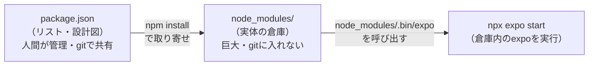

# npx / package.json / node_modules / npm install の関係

> 対象読者: Node.js エコシステムの「なんとなく使っているが仕組みが曖昧」な部分を整理したい人。
> ねらい: `npx expo start` の裏で何が起きているのかを理解する。
> 補足: これは **モバイル特有の話ではなく Node.js 共通**の仕組み。Vue/Web での経験がそのまま活きる。

## 1. 4つの登場人物

| もの | 役割 | たとえ | git |
|---|---|---|---|
| **package.json** | 使うライブラリと**バージョンのリスト** | 買い物リスト・設計図 | **コミットする**（共有する） |
| **node_modules/** | リストに従って**実際に入った実体** | 品物が届いた倉庫 | **コミットしない**（`.gitignore`） |
| **npm install** | リストを読んで実体を倉庫に**取り寄せる**コマンド | 買い物を実行する | — |
| **npx** | コマンド（実行ファイル）を**探して実行する**ツール | 品物を使う | — |



## 2. よくある誤解：「npx = 一時的」は半分だけ正しい

`npx` の本当の役割は「**コマンドを探して実行する。探す場所に優先順位がある**」。

`npx expo start` を打つと、`expo` コマンドをこの順で探す:

1. **まず `./node_modules/.bin/` の中**（＝このプロジェクトにインストール済みの `expo`）← 通常はここ
2. なければグローバルインストールの `expo`
3. それも無ければ **その場でダウンロードして一時実行**（これが「一時的」のイメージの正体）

つまり:

```
npx create-expo-app app   ← プロジェクトを"作る"ツール。node_modulesに無い → 一時ダウンロードして実行（使い捨て）
npx expo start            ← 作った後の"実行"。node_modulesにある → それを呼ぶだけ（ダウンロードしない）
```

**同じ `npx` でも、中身が既にあるか無いかで挙動が変わる。** `expo` は既にあるので一時ダウンロードはしていない。

## 3. node_modules が巨大な理由・gitに入れない理由

- 自分が書いた依存（十数個）が、さらにそれぞれ依存を持ち…と**芋づる式**に数百〜千個入る（このプロジェクトも一時700個超だった）。
- だから **`package.json` さえあれば `npm install` でいつでも再現できる** → 倉庫（node_modules）はgitに入れず、毎回作り直す。
- 他人のリポジトリを `git clone` してきたら `node_modules` は無い。**自分で `npm install` して倉庫を作る**。

## 4. 「npm install はいつ走るのか」（このプロジェクトでの実例）

明示的に打たなくても、実は何度も走っていた:

| タイミング | 誰が実行したか |
|---|---|
| `npx create-expo-app app` | create-expo-app が**自動で**最後に `npm install` を実行（だから作成直後から node_modules がある） |
| SDK 54 へのダウングレード | `npm install expo@^54` や `rm -rf node_modules && npm install` を**手動で**実行 |
| `npx expo install ...` | `expo install` は**内部で** `npm install` を呼ぶ（SDKに合うバージョンを選ぶ機能を足したラッパー） |

→ `npm install` を自分で打つ主な場面は2つ:
1. **プロジェクトを新規作成したとき**（ツールが自動でやることが多い）
2. **他人のプロジェクトを clone して、自分の手元に node_modules を作るとき**（手動）

## 5. 実践的に一番大事なルール

> **`package.json` を変更したら、`npm install` で `node_modules` に反映する必要がある。**

- 今回まさにこれで詰まった: `expo install --fix` が `package.json` のバージョンを書き換えても、
  `node_modules` の実体が古いままだと `expo-doctor` が「不一致」と怒った。
- **リスト（package.json）を変えたら、倉庫（node_modules）も更新**、という対応関係を意識するとハマりにくい。

## 6. Webとの対応（既存の知識で理解する）

Vue/Web と**完全に同じ構造**。モバイル特有の新しい概念ではない。

| Web/Vue | React Native (Expo) | 役割 |
|---|---|---|
| `package.json` | `package.json` | 同じ（依存リスト） |
| `node_modules/` | `node_modules/` | 同じ（実体の倉庫） |
| `npm create vue@latest` | `npx create-expo-app` | プロジェクト作成（作成時に install が走る） |
| `npm run dev`（Vite起動） | `npx expo start`（Metro起動） | 開発サーバー起動。`node_modules` 内のツールを実行 |
| `vite` | `expo`（CLI）/ Metro | 開発サーバー／バンドラのポジション |

→ ここは **既存のWeb知識がそのまま使える領域**。RNだから新しく覚えることは（この話に関しては）ほぼ無い。
