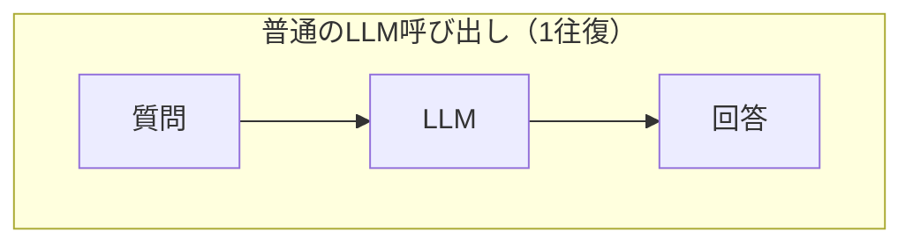
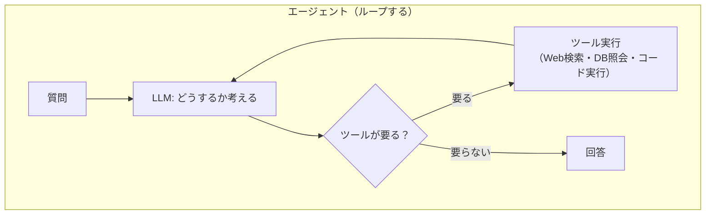
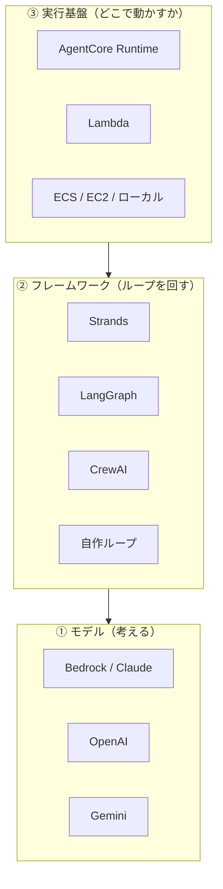
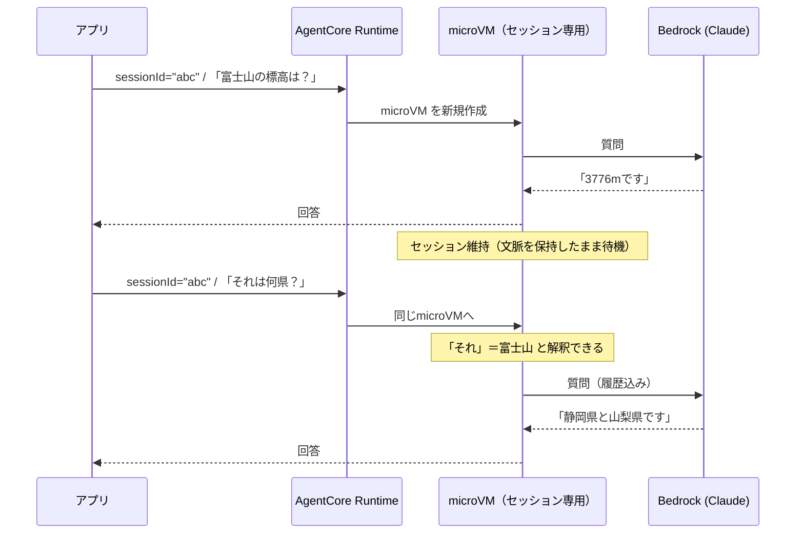

# AIエージェントと Amazon Bedrock AgentCore（Lambda経験者向け）

> 対象読者: AWS（Lambda・API Gateway・SAM）は分かるが、**AIエージェントは初めて**の人。
> ねらい: 「エージェントとは何か」「なぜ Lambda ではなく AgentCore なのか」を、既知のサーバーレス知識との対応づけで掴む。
> 前提: [07. API連携](./07_api_integration.md) を読んでいること（バックエンドと通信する流れ）。

## 1. まず用語の交通整理：Bedrock と AgentCore は別物

ここが最初の混乱ポイント。名前が似ているが**役割が違う**。

| | Amazon Bedrock | Amazon Bedrock **AgentCore** |
|---|---|---|
| 提供するもの | **AIモデルそのもの**（Claude等） | **エージェントを動かす実行環境** |
| 例えると | 「賢い人」 | 「その人が働くオフィス」 |
| 自分が書くもの | プロンプト | **エージェントのコード全体** |
| APIの呼び方 | `converse()` を叩く | 自分のコードをデプロイして呼ぶ |

> ⚠️ **AgentCore を使っても、Claude を呼ぶのは結局 Bedrock。**
> AgentCore は Bedrock の代替ではなく、**「Bedrockを呼ぶコードを、状態を持って動かす器」**。

## 2. そもそも「AIエージェント」とは何か

**LLMが、自分で判断してツールを使いながら、目的を達成するまでループする仕組み。**

普通のLLM呼び出しとの違いは「ループするかどうか」に尽きる。





具体例で言うと:

| | 普通のLLM | エージェント |
|---|---|---|
| 「東京の明日の天気は？」 | 学習データから推測（**最新は知らない**） | **天気APIを呼んで**答える |
| 「この山は何？」 | 一般知識で答える | **Web検索して**裏を取って答える |

**このループを誰が回すか**が、実装方式の分かれ目になる（次節）。

## 3. エージェントフレームワークとは（Strands / LangGraph 等）

### 3.1 なぜフレームワークが要るのか

§2 のループを**自分で書くと、こうなる**。

```python
# フレームワークなしで書いた場合（擬似コード）
messages = [{"role": "user", "content": question}]

while True:
    response = bedrock.converse(messages=messages, toolConfig=tools)

    if response["stopReason"] != "tool_use":
        break                                   # ツール不要 → 完成

    # LLMが「このツールを使いたい」と言ってきた
    for block in response["output"]["message"]["content"]:
        if "toolUse" in block:
            name = block["toolUse"]["name"]
            args = block["toolUse"]["input"]
            result = my_tools[name](**args)     # ← 自分でディスパッチ
            messages.append(...)                # ← 結果を履歴に詰める
    # ループの先頭に戻ってLLMに再度聞く
```

動くが、**本質的でない仕事が多い**:

| 自分で書く羽目になるもの | 例 |
|---|---|
| ループ制御 | 何回まで回すか、無限ループの防止 |
| ツールのディスパッチ | 名前から関数を探して引数を渡す |
| 履歴の組み立て | `toolUse` / `toolResult` の対応付け |
| 履歴が長くなった時の処理 | 古い会話を捨てる・要約する |
| ツールのスキーマ定義 | LLMに渡すJSON Schemaを手書き |
| ストリーミング | チャンクを繋ぎ合わせる |
| エラー処理・リトライ | ツールが落ちた時にどう伝えるか |

**エージェントフレームワークは、この定型部分を肩代わりしてくれるライブラリ。**

### 3.2 Strands で書くとこうなる

```python
from strands import Agent, tool

@tool                                   # ← デコレータを付けるだけでツールになる
def get_weather(city: str) -> str:
    """指定した都市の天気を返す"""      # ← docstringがLLMへの説明になる
    return call_weather_api(city)

agent = Agent(model=..., tools=[get_weather])
result = agent("東京の天気は？")        # ← ループは全部やってくれる
```

**§3.1 の `while True:` が丸ごと消える。** 関数の型ヒントと docstring から
JSON Schema も自動生成される（手書き不要）。

> Web開発で例えるなら、**素の Node.js `http` サーバー vs Express**。
> どちらでもHTTPサーバーは書けるが、ルーティングやミドルウェアを毎回自作したくない。

### 3.3 フレームワークと AgentCore は「層」が違う

ここが混乱しやすい。**両者は競合ではなく、積み重なる関係**。



| 層 | 役割 | 選択肢 |
|---|---|---|
| ① モデル | 考える | Bedrock(Claude)、OpenAI、Gemini … |
| ② **フレームワーク** | **ループを回す** | **Strands**、LangGraph、CrewAI、自作 |
| ③ 実行基盤 | 動かす場所 | **AgentCore**、Lambda、ECS、ローカル |

**それぞれ独立に選べる。** 本プロジェクトは ① Bedrock(Claude) ＋ ② Strands ＋ ③ AgentCore。

| 組み合わせ | 成立する？ |
|---|---|
| Strands + Lambda | ✅ できる（会話継続は自作） |
| 自作ループ + AgentCore | ✅ できる（`/invocations` さえ実装すれば何でもよい） |
| LangGraph + AgentCore | ✅ できる（AgentCoreはフレームワーク非依存） |

> AgentCore の公式説明も **"works with any open-source framework such as CrewAI, LangGraph,
> LlamaIndex, and Strands Agents"** と明言している。**囲い込まれない**のが利点。

### 3.4 主なフレームワーク

| フレームワーク | 特徴 | 備考 |
|---|---|---|
| **Strands Agents** | AWS製。シンプルで学習コストが低い | 本プロジェクトで採用。AgentCore CLIの既定 |
| **LangGraph** | LangChain系。グラフで複雑なフローを表現 | 分岐や状態遷移が複雑な場合に強い |
| **CrewAI** | 複数エージェントの協調に特化 | 「役割」を持つエージェントを組ませる |
| **LlamaIndex** | RAG（文書検索＋生成）に強い | 社内文書検索などが主用途 |

**迷ったら Strands** でよい。本アプリの用途（質問に答える）にはこれで十分で、
必要になれば AgentCore はフレームワークを問わないので後から差し替えられる。

### 3.5 なぜ Strands を選んだか（本プロジェクトの判断）

- **AgentCore CLI の既定**（`agentcore create` の選択肢の筆頭）で、公式サンプルが揃っている
- **AWS製**なのでBedrockとの相性がよい（モデル指定が `BedrockModel` 一発）
- 本アプリのループは単純（質問→必要ならWeb検索→回答）で、LangGraphのグラフ表現は過剰
- 学習教材を兼ねるため、**まず一番素直なものから入る**

## 4. Lambda と AgentCore Runtime の対応づけ

AWS経験者にとって、一番効く対応表がこれ。

| | AWS Lambda | AgentCore Runtime |
|---|---|---|
| 実行単位 | 関数（1リクエストで起動・終了） | **microVM**（セッション単位で最長8時間生存） |
| 状態 | **ステートレス**（毎回まっさら） | **セッション内は状態を保持** |
| デプロイ形式 | .zip / コンテナ | **.zip（S3ソース）/ コンテナ（ECR）** ← 同じ2択 |
| 課金 | 実行時間のみ | **アイドル中も課金**（後述・重要） |
| 入口 | API Gateway 等 | **それ自体がエンドポイントを持つ** |
| タイムアウト | 最大15分 | 最大8時間 |

**「Lambdaが会話を覚えられるようになったもの」**と捉えると近い。

### エージェントソース＝コードの梱包方法

コンソールで「S3ソース」と「ECRコンテナ」を選ばされるが、これは **Lambda の .zip とコンテナの2択と全く同じ**。

| Lambda | AgentCore | Docker |
|---|---|---|
| .zip アップロード | **S3ソース**（direct code deployment） | **不要** |
| コンテナイメージ | ECRコンテナ | 必要 |

| 観点 | S3ソース(.zip) | ECRコンテナ |
|---|---|---|
| パッケージ上限 | 250MB | 2GB |
| 更新の速さ | **速い** | 遅い |
| ランタイムのパッチ | **AWSが自動適用** | 自分で再ビルド |
| セッション作成レート | 25/秒 | 1.6/秒 |

→ **小さいコードなら S3ソースで十分**。本プロジェクトもこちら。

## 5. なぜ Lambda ではなく AgentCore なのか

「Lambda + Bedrock」でもエージェントは作れる。ではなぜ AgentCore か。

### 理由1: 会話の継続（これが決定的）

**Bedrock の Converse API はステートレス**で、`sessionId` に相当するパラメータが**存在しない**。
続きの質問をするには、**毎回それまでの全会話を送り直す**必要がある。

```python
# 3ターン目のリクエストはこうなる
messages=[
  {"role": "user", "content": "富士山の標高は？"},        # 1ターン目
  {"role": "assistant", "content": "3776mです"},
  {"role": "user", "content": "それは何県にある？"},       # 2ターン目
  {"role": "assistant", "content": "静岡県と山梨県です"},
  {"role": "user", "content": "近くの温泉は？"},           # ← 今回の質問
]
```

Lambdaはステートレスなので、この履歴を**どこかに保存して復元する仕組みを自作**することになる
（DynamoDBに入れる等）。AgentCore なら**同じセッションIDで呼ぶだけ**で文脈が繋がる。

### 理由2: ツール実行のループ

§2 のループを Lambda で回すと、「LLMが『ツールを使いたい』と言う → 実行 → 結果を返す → また聞く」
という制御を自分で書くことになる。エージェントフレームワーク（Strands等）＋AgentCore ならこれが組み込み。

### とはいえ Lambda でもできる

**Converse APIには `toolConfig` があり、ツール利用自体は Lambda でも可能。**
「AgentCoreでなければ不可能」なわけではなく、**自分で書く量が違う**という話。

## 6. セッションと会話継続の仕組み



- `sessionId` は**アプリ側が発行**する任意の文字列
- 同じIDで呼べば同じmicroVMに繋がり、**文脈が保持される**
- IDを変えれば新しい会話として始まる

### セッションが終わる3つの条件

| 条件 | デフォルト |
|---|---|
| **アイドルタイムアウト** | 15分（60秒〜8時間で設定可） |
| **最大ライフタイム** | 8時間 |
| `StopRuntimeSession` API | 明示的に停止 |

終了すると microVM は破棄され、**文脈は消える**（同じIDで呼んでも新しい環境になる）。

## 7. ⚠️ コスト構造：アイドル中も課金される

**Lambdaとの最大の違い。** ここを理解しないと想定外の請求になる。

```
質問1 ──[アイドル：文脈保持のためmicroVMが生存]── 質問2
       ↑ Lambdaなら課金ゼロ / AgentCoreは課金対象
```

公式ドキュメントの記述:
> **Idle** — Not processing any requests but **maintaining context** while waiting for next interaction

「文脈を保持したまま待機」＝ microVMが生きている＝リソース消費。

### 対策

| 対策 | 効果 |
|---|---|
| `idleRuntimeSessionTimeout` を短くする（最小60秒） | 待機時間を短縮 |
| 会話終了時に `StopRuntimeSession` を呼ぶ | 即座に解放 |
| **使わないRuntimeは削除する** | 消し忘れ防止 |

> 散発的に質問する用途（本アプリのツーリングなど）では、
> **質問の合間もずっと課金される**可能性がある点に注意。

## 8. 実装：最低限のエージェントの形

AgentCore Runtime に載せるコードは、**2つのHTTPエンドポイントを持つWebサーバー**であればよい。

| パス | メソッド | 役割 |
|---|---|---|
| `/invocations` | POST | **本体**。質問を受けて回答を返す |
| `/ping` | GET | **ヘルスチェック**。`{"status":"Healthy"}` を返す |

> ⚠️ **`/health` ではなく `/ping`。** 紛らわしいので注意。

#### `/ping` と、自分で作る `/health` は別物（統一しなくてよい）

「本アプリのAPIにも `GET /health` がある。どちらかに揃えるべきでは？」と考えたくなるが、
**この2つは層が違う別物**なので、名前が違うままでよい。

| | 自分で定義する `/health` | AgentCore の `/ping` |
|---|---|---|
| 誰が定義したか | **自分**（OpenAPI等で決める） | **AWS**（サービス契約で固定） |
| 誰が呼ぶか | 自分・監視ツール | **AgentCore Runtime が自動で** |
| どこから叩けるか | 公開エンドポイント | **microVM内部のみ**。外部からは叩けない |
| 変更できるか | ✅ 自由 | ❌ 仕様固定 |
| 返す内容 | 任意（例 `{"status":"ok"}`） | `{"status":"Healthy"｜"HealthyBusy"}` |
| 目的 | 「APIは生きているか」 | 「**このセッションを維持すべきか**」 |

要点は3つ:

1. **並列に存在しない。** `/ping` はAgentCoreが**コンテナの内側に**叩くもので、
   アプリから `https://.../ping` を呼ぶことはできない。「どちらかに寄せる」対象ではない。
2. **意味が違う。** `/ping` の `HealthyBusy` は「まだ処理中だからセッションを殺さないで」という
   **ライフサイクル（＝課金）の制御信号**であり、単なる死活監視ではない。
3. **名前が違うことがシグナル。** 両方 `/ping` にすると「どちらのpingの話か」が読めなくなる。

> つまり検討すべきは「`/health` を `/ping` に改名するか」ではなく、
> **「そもそも自前のAPI層（Lambda等）を残すのか」**という構成の判断。
> それが決まれば `/health` の要否も自動的に決まる。

### SDKを使えばこの2つは自動で用意される

```python
from bedrock_agentcore.runtime import BedrockAgentCoreApp
from strands import Agent

app = BedrockAgentCoreApp()          # /ping は自動で生える

@app.entrypoint                       # ← これが /invocations になる
async def invoke(payload, context):
    session_id = context.session_id   # ← 同じIDなら同じ会話
    agent = get_or_create_agent(session_id)
    async for event in agent.stream_async(payload["prompt"]):
        yield event

if __name__ == "__main__":
    app.run()
```

### ⚠️ `/ping` を自前実装するときの落とし穴

`time_of_last_update` を**毎回現在時刻にしてはいけない**。
「ステータスが変わり続けている」と見なされ、**アイドルタイムアウトが永久に発火しなくなる**
（＝8時間ずっと課金される）。

公式の警告:
> A timestamp that advances on every ping signals a continuous status change,
> **which prevents the idle session timeout from ever firing**

→ **SDKを使えば自動で正しく処理される**ので、素直にSDKを使うのが安全。

## 9. 開発の流れ（CLI）

```sh
npm install -g @aws/agentcore     # CLI導入

agentcore create                  # プロジェクト雛形を作る
agentcore dev --no-browser        # ローカルで起動（対話型TUI）
agentcore deploy                  # AWSへデプロイ
agentcore invoke "質問"            # デプロイ済みエージェントを叩く
agentcore logs                    # ログを見る
```

### ローカル確認の実務メモ

`agentcore dev` は**対話型TUI**なので、スクリプトやAIのバックグラウンド実行には向かない。
その場合は Python を直接起動すればよい:

```sh
cd app/<agent-name>
.venv/bin/python main.py          # 8080番で起動

# 別ターミナルから
curl http://localhost:8080/ping
curl -X POST http://localhost:8080/invocations \
  -H "Content-Type: application/json" \
  -H "X-Amzn-Bedrock-AgentCore-Runtime-Session-Id: my-session-1" \
  -d '{"prompt":"こんにちは"}'
```

**セッションIDはHTTPヘッダ `X-Amzn-Bedrock-AgentCore-Runtime-Session-Id` で渡す。**
同じIDで2回叩けば、2回目は前の会話を覚えている。

## 10. 関連サービス（必要になったら読む）

AgentCore は**モジュール式**で、必要なものだけ使えばよい。

| サービス | 何をするか | 本アプリで要る？ |
|---|---|---|
| **Runtime** | エージェントを動かす基盤 | ✅ 使う |
| **Memory** | セッションを越えた永続記憶 | △ 検討中 |
| **Gateway** | 既存API/LambdaをMCPツール化 | △ 将来 |
| **Identity** | エージェントの認証・認可 | △ 将来 |
| **Browser** | エージェントがWebを操作 | ✗ |
| **Code Interpreter** | コード実行サンドボックス | ✗ |
| **Observability** | トレース・デバッグ | ◯ 入れたい |

## 11. まとめ

| 覚えること | 要点 |
|---|---|
| Bedrock ≠ AgentCore | 前者は「モデル」、後者は「実行環境」 |
| エージェント | LLMがツールを使ってループする仕組み |
| **3つの層** | **モデル / フレームワーク / 実行基盤は独立に選べる** |
| フレームワーク | ループの定型処理を肩代わり（Strands・LangGraph等） |
| Lambda との違い | **状態を持てる**が、**アイドル中も課金** |
| エージェントソース | .zip か コンテナか。**Lambdaと同じ2択** |
| セッション | 同じIDで呼べば文脈が繋がる |
| エンドポイント | `/invocations` と **`/ping`**（自前の `/health` とは別物） |
| 落とし穴 | `/ping` の `time_of_last_update` でタイムアウトが効かなくなる |

## 参考

- [AgentCore とは](https://docs.aws.amazon.com/bedrock-agentcore/latest/devguide/what-is-bedrock-agentcore.html)
- [Runtime の仕組み](https://docs.aws.amazon.com/bedrock-agentcore/latest/devguide/runtime-how-it-works.html)
- [HTTPプロトコル契約（/invocations, /ping の仕様）](https://docs.aws.amazon.com/bedrock-agentcore/latest/devguide/runtime-http-protocol-contract.html)
- [直接コードデプロイ（S3ソース）](https://docs.aws.amazon.com/bedrock-agentcore/latest/devguide/runtime-get-started-code-deploy.html)
- [Strands Agents SDK](https://strandsagents.com/latest/)
- 本プロジェクトでの調査記録: [pre-research/agentcore/](../pre-research/agentcore/)
