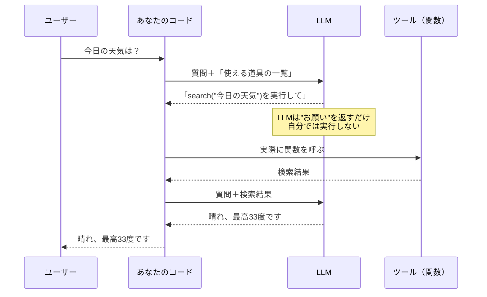
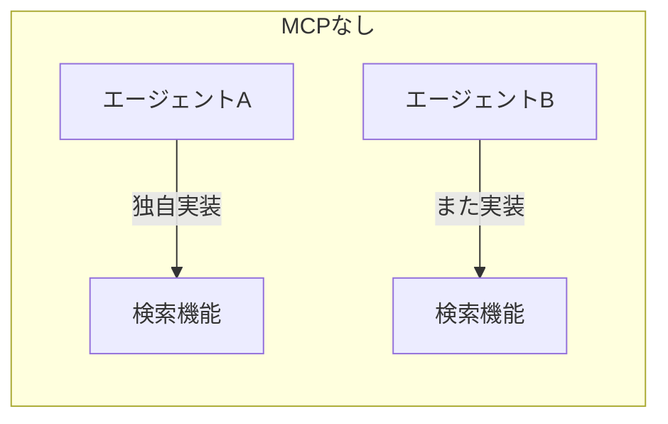
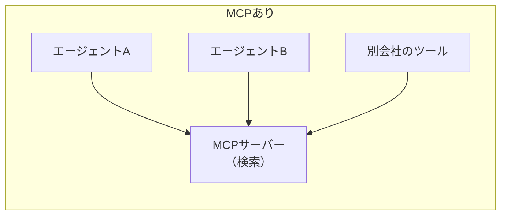
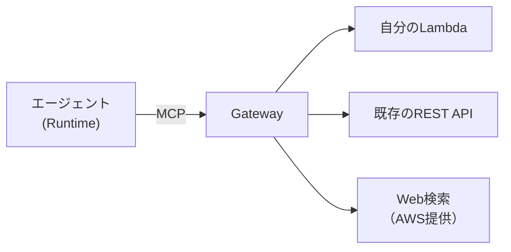

# MCP とツール利用（エージェントに「できること」を足す）

> 対象読者: [51. AIエージェントと AgentCore](./51_ai_agent_and_agentcore.md) を読んだ人。
> ねらい: エージェントに**外部の能力**（Web検索・DB照会・社内API）を持たせる方法と、
> その標準規格である **MCP** が何を解決するのかを掴む。

## 1. なぜツールが要るのか

LLMは**学習した時点の知識**しか持たない。だから、こういう質問には原理的に答えられない。

| 質問 | LLM単体 |
|---|---|
| 富士山の標高は？ | ✅ 答えられる（変わらない知識） |
| 今日の天気は？ | ❌ **学習後の出来事は知らない** |
| このユーザーの注文履歴は？ | ❌ **そもそもDBを見られない** |

答えられないとき、LLMは正直に「分かりません」と言うか、**もっと悪いと作り話をする**（ハルシネーション）。

**ツールは、この「知らない」を「調べに行ける」に変える仕組み。**

## 2. ツールの正体は「関数の説明書」

不思議に思えるが、**LLMが自分で関数を実行するわけではない**。実際はこう動く。



**ポイントは「LLMは実行をお願いするだけ」**という点。実際に動かすのは自分のコード（かフレームワーク）。
だからこそ、危険な操作をさせない制御が自分の側でできる。

### LLMに渡す「説明書」の中身

LLMはコードを読めないので、**自然言語の説明とJSON Schema**で道具を伝える。

```python
@tool
def get_weather(city: str) -> str:
    """指定した都市の今日の天気を返す"""   # ← これがLLMへの説明になる
    ...
```

> ⚠️ **docstringと引数名は、LLMにとっての取扱説明書。**
> ここが曖昧だと、LLMは道具を**使うべき場面で使わない**か、**変な引数**を渡してくる。
> 「コメントは書かなくても動く」世界ではないので、丁寧に書く。

## 3. MCP とは：ツールを「外部サービス化」する規格

`@tool` は自分のコードの中に道具を書く方式。これは手軽だが、限界がある。

| | `@tool`（コード内） | MCP（外部サーバー） |
|---|---|---|
| 置き場所 | エージェントのコードの中 | **別プロセス・別サービス** |
| 再利用 | そのエージェント専用 | **複数のエージェントで共有** |
| 言語 | エージェントと同じ言語 | **何語で書いてもよい** |
| 更新 | エージェントを再デプロイ | **ツール側だけ更新できる** |

**MCP（Model Context Protocol）は「ツールをどう公開し、どう呼ぶか」を決めた共通規格。**

例えると、`@tool` が「自分で作った道具」、MCPが「**規格化されたコンセント**」。
コンセントの形が決まっているから、どのメーカーの家電でも挿さる。





### MCPの通信は2ステップ

規格といっても、やることは単純。

| 手順 | 意味 |
|---|---|
| `tools/list` | 「どんな道具がありますか？」＝一覧と使い方をもらう |
| `tools/call` | 「この道具を、この引数で使ってください」＝実行 |

エージェントは起動時に `tools/list` して、LLMに「使える道具の一覧」として渡す。
LLMが「使いたい」と言ったら `tools/call` する。それだけ。

## 4. AgentCore Gateway：AWSでのMCPの置き場所

AgentCore で MCP サーバーを扱う入口が **Gateway**。役割は2つある。

| 役割 | 意味 |
|---|---|
| **既存資産のツール化** | 手持ちのLambda・REST APIを、MCPツールとして見せる |
| **マネージドコネクタ** | AWSが用意済みのツール（Web検索など）を、作らずに使う |



### 認証は「呼ぶ側」に権限が要る

ここが直感に反しやすい。

> ⚠️ Gateway を呼ぶ権限（`bedrock-agentcore:InvokeGateway`）は、
> **呼び出す側＝エージェントの実行ロール**に要る。
> Gateway自身が持つ実行ロール（Gatewayがバックエンドを叩くための権限）とは**別物**。

| ロール | 誰のものか | 何のため |
|---|---|---|
| エージェントの実行ロール | Runtime | **Gatewayを呼ぶ**ため |
| Gatewayの実行ロール | Gateway | Gatewayが**Lambda等を叩く**ため |

混同すると `AccessDenied` が出る。「誰が誰を呼ぶか」を figure に描いて確かめるとよい。

## 5. 実装：Strands から MCP を使う

Strands では、MCPクライアントを作って `Agent` に渡すだけ。

```python
from mcp_proxy_for_aws.client import aws_iam_streamablehttp_client
from strands.tools.mcp import MCPClient

# AWSのMCPサーバーはSigV4署名が要る。このライブラリが署名を代行してくれる
client = MCPClient(lambda: aws_iam_streamablehttp_client(
    endpoint="https://....gateway.bedrock-agentcore.us-east-1.amazonaws.com/mcp",
    aws_region="us-east-1",
    aws_service="bedrock-agentcore",
))

agent = Agent(model=..., tools=[client])   # ← クライアントごと渡せる
```

> 📌 `tools=[client]` のように**クライアントを直接渡す**と、接続の開始・終了を
> フレームワークが面倒みてくれる。自分で `with client:` を書くと、
> 非同期の入口をまたいで接続を保つ必要が出て面倒になる。

## 6. ⚠️ つまずきポイント

実際に繋いだときに引っかかった点。**どれも知らないと原因が分かりにくい。**

### 6.1 ツールが1つとは限らない

`tools/list` の**先頭を決め打ちで取ってはいけない**。
Gateway は自分自身のツール検索機能なども公開するので、**名前で選ぶ**。

```python
# ❌ 危ない：先頭が目当てのツールとは限らない
tool = tools[0]

# ✅ 名前で選ぶ
tool = next(t for t in tools if t.endswith("WebSearch"))
```

### 6.2 レスポンスがJSONとは限らない

MCP over HTTP は、**Server-Sent Events（`text/event-stream`）**で返ってくることがある。
`response.json()` だけ書いていると、そこで落ちる。

```
data: {"jsonrpc":"2.0","id":2,"result":{...}}   ← 行頭の "data:" を剥がす必要がある
```

### 6.3 結果が二重にJSONになっている

ツールの返り値は「テキストブロックの中にJSON文字列が入っている」形をとることがある。
一度パースしただけでは中身に届かない。

```python
text = result["content"][0]["text"]   # まだ文字列
data = json.loads(text)               # ここで初めて中身が見える
```

### 6.4 ツールを持たせても、使うかはLLM次第

**ツールを渡す＝必ず使う、ではない。** 使うかどうかはLLMの判断に委ねられる。

だから「必ず調べてほしい」場合は、**システムプロンプトで明示する**必要がある。

```
- 天気・営業時間など、その日その時の情報は必ず検索する。
- 逆に、変わらない知識は検索せずに答える。
```

> 💡 **本当に使われたかはログで確かめる。** 回答文だけ見ても、
> 検索したのか元々知っていたのかは区別できない。
> AgentCore なら Observability（トレース）に `tools/call` が残る。

## 7. まとめ

| 用語 | ひとことで |
|---|---|
| **ツール** | LLMに渡す「関数の説明書」。実行するのは自分のコード |
| **MCP** | ツールを外部サービスとして公開・呼び出しするための共通規格 |
| **`tools/list` / `tools/call`** | 「何がある？」と「これ使って」の2つだけ |
| **Gateway** | AWSにおけるMCPの置き場所。既存Lambda/APIのツール化もできる |
| **マネージドコネクタ** | AWSが用意済みのツール。自分で作らなくてよい |

**設計の勘所**: ツールを増やすほどLLMは迷う。
「このエージェントに本当に要る道具か」を都度問い直すのが、精度とコストの両面で効く。

## 参考

- [Model Context Protocol 公式](https://modelcontextprotocol.io/)
- [AgentCore Gateway](https://docs.aws.amazon.com/bedrock-agentcore/latest/devguide/gateway.html)
- [Strands: MCP Tools](https://strandsagents.com/latest/documentation/docs/user-guide/concepts/tools/mcp-tools/)
