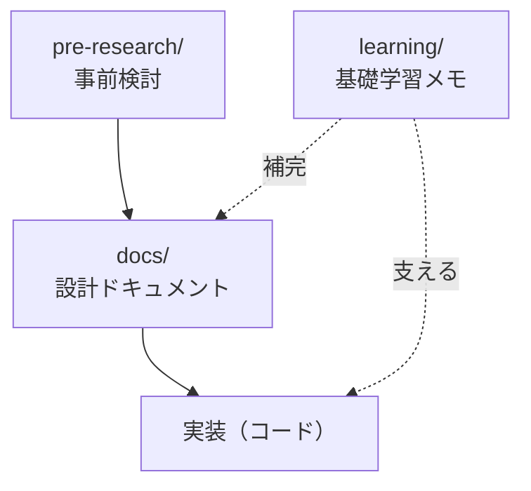

# プロジェクト方針

## 1. このプロジェクトの位置づけ

本リポジトリは、**ツーリングAI会話アプリの開発**であると同時に、
**React Native / モバイルアプリ開発を学ぶための学習教材**としての意味合いを持つ。

開発者はWeb開発（AWS・Vue・Lambda・JS/TS）の知見は豊富だが、
モバイルアプリ（React Native・Androidネイティブ）は未経験。
そのため **「開発を進めながら学習する」** ことを基本方針とし、
学習の過程・設計判断・つまずきと解決を、後から振り返れる形でドキュメントに残していく。

## 2. 基本方針

- **開発と学習を同時に進める。** 完成を急がず、各ステップで「なぜそうするのか」を理解しながら進む。
- **判断の過程を残す。** 技術選定や設計の意思決定は、結論だけでなく「なぜその結論に至ったか」を記録する（例: [技術選定ドキュメント](./02_tech_selection.md) は検討の経緯・却下案・誤りの訂正まで残している）。
- **初心者目線を保つ。** 設計ドキュメントは、モバイル開発初心者が読んでも理解できる粒度で書く。
- **既存のWeb知識を足がかりにする。** 「Webでいうと○○に相当する」といった対応づけを積極的に使い、既知から未知へ橋渡しする。

## 2.1 実装の重心：バックエンドは作り込み、モバイルは必要最低限

実装のリソースは以下のように配分する。この方針は今後の設計判断すべてに優先する。

- **AWS側（Lambda / Bedrock / Transcribe / Polly など）は作り込んでよい。**
  開発者の得意領域であり、アプリの価値の中核（現在地文脈での応答生成）もここに宿るため、ここは本格的に設計・実装する。
- **モバイルアプリ（React Native側）は必要最低限にとどめる。**
  未経験かつ学習中の領域であり、凝ったUIや過剰な作り込みは目的ではない。
  RN側の責務は「**音声で会話できる**」というコア体験に必要な最小限に絞る。具体的には:
  - ウェイクワード検知 → 録音 → AWSへ送信 → 応答音声の再生、という**音声パイプラインの導線**
  - 位置情報・進行方位の取得と送信
  - バックグラウンド常駐（Foreground Service）
  - 画面・UIは**動作確認に足る最小限**（見た目の作り込み・複雑な画面遷移は避ける）

> 判断に迷ったら「その作り込みはコア体験（走りながら音声で会話）に必要か？」を基準にする。
> RN側は"薄いクライアント"、ロジックの重心はAWS側、と考える。

## 3. 採用技術（確定事項）

詳細と判断根拠は [技術選定ドキュメント](./02_tech_selection.md) を参照。

| レイヤ | 採用 | 補足 |
|---|---|---|
| フロント（アプリ） | **React Native** | 既存のWeb開発知識（JS/TS・React的思想）を最も活かせるため確定 |
| ウェイクワード | Picovoice Porcupine（第一候補） | オンデバイス・個人利用は無料枠内 |
| バックエンド | AWS Lambda + Amazon Bedrock | STT: Transcribe、TTS: Polly を想定 |
| 対象OS | Android（当面は自分の端末のみ） | iOS対応は当面スコープ外 |

> 唯一の技術的リスクは「RNでのバックグラウンド常駐＋ウェイクワードの安定性」。
> PoCで検証し、破綻時のみ Kotlinネイティブへの切り替えを再検討する（§技術選定 参照）。

## 4. ドキュメント体系

本リポジトリのドキュメントは、役割ごとに以下のディレクトリで管理する。

| ディレクトリ | 役割 | 書き方の方針 |
|---|---|---|
| **`pre-research/`** | 事前検討（構想・技術選定・本方針）。プロジェクトの出発点。 | 判断の経緯・却下案・訂正も含めて残す |
| **`learning/`** | 基礎的な学習内容。React Native / JS-TS / Androidの概念など、**プロジェクト横断で使える汎用知識**を体系的にメモする。 | 「基礎」を丁寧に。既存Web知識との対応づけを重視 |
| **`docs/`** | **設計ドキュメント**。アーキテクチャ・各機能の設計・データフローなど、本アプリ固有の設計。 | **初心者でもわかるように書く**。設計判断の理由と、必要な前提知識への橋渡しを添える |

### 各ディレクトリの使い分けの目安

- 「React Nativeのコンポーネントとは？」「Expoとは？」のような **一般的な基礎知識** → `learning/`
- 「本アプリの音声処理パイプラインの設計」「ウェイクワード検知後の状態遷移」のような **このアプリ固有の設計** → `docs/`（ただし初心者が読める粒度で）
- 迷ったら: **「他のRNプロジェクトでも通用する話」なら `learning/`、「このアプリ特有の話」なら `docs/`**。

## 5. 現在の進捗と次のステップ

### 完了
- [x] 構想の整理（[01_overview.md](./01_overview.md)）
- [x] 技術選定：Web却下・React Native採用の確定（[02_tech_selection.md](./02_tech_selection.md)）
- [x] プロジェクト方針の策定（本ドキュメント）

### 次にやること（候補）
- [ ] `learning/` の初期整備：React Native / Expo の基礎、Web開発との対応づけ
- [ ] `docs/` にアーキテクチャ設計ドキュメントを作成（アプリ → API Gateway → Lambda → Bedrock/Transcribe/Polly）
- [ ] 開発環境のセットアップ（Node / Expo / Android SDK 等）と、その手順の記録
- [ ] PoC：最優先リスク（バックグラウンド常駐＋ウェイクワード）の実機検証
