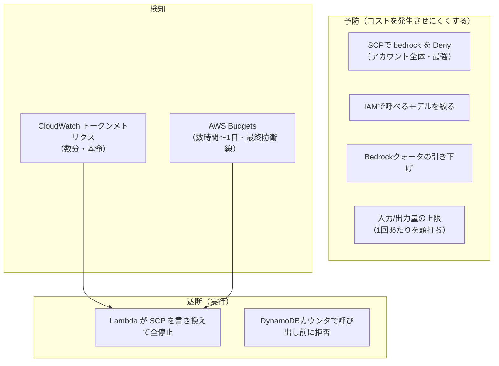
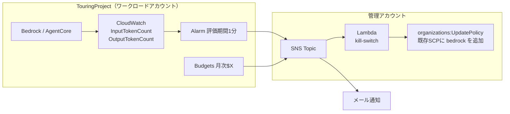

# アカウント全体のAIコストガード調査

> 実施日: 2026-07-25 / 対象アカウント: AWSプロファイル `touring` / リージョン: ap-northeast-1
> **目的**: 開発中のAI不正利用・コスト暴走に対し、**Bedrockのコストが一定以上になったら即完全停止**する仕組みを設計する。
> **関連**: [../bedrock/](../bedrock/)（モデル調査）、[../agentcore/](../agentcore/)（会話継続の基盤）、[../../docs/01_architecture.md](../../docs/01_architecture.md) §7（多層防御の設計）

## 0. この調査に至った経緯

docs/01 §7 で「予算超過で自動遮断」を方針として定義済みだったが、**実装手段が未調査**だった。
開発を進めるにあたり「AIの不正利用を警戒し、アカウント全体でガードしたい」という要件が明確化したため、
実現手段を洗い出し、実際のアカウント構成を確認した。

要件は次の2つ。

1. **Bedrockを完全に停止させたい**（部分的な制限では不十分）
2. **タイムラグは極力短くしたい**

## 1. 最初に押さえるべき前提：AWSに「金額で自動停止」する標準機能は無い

ここが最大の誤解ポイント。

| よくある想定 | 実際 |
|---|---|
| AWS Budgets で上限を設ければ止まる | **Budgetsは監視・通知のみ。それ自体はAPIを止めない** |
| Bedrockに「月$Xで打ち止め」設定がある | **無い** |
| Bedrockのクォータが金額上限になる | クォータは **TPM/RPM（1分あたりのトークン数・リクエスト数）**。金額ではない |

→ **「金額で完全停止」は、検知（Budgets/CloudWatch）＋ 遮断（自分で書いた処理）を自分で組む以外に方法がない。**

## 2. 手段の全体像



### 手段ごとの評価

| 手段 | 「完全停止」を満たすか | ラグ | 採否 |
|---|---|---|---|
| **SCP で `bedrock:*` を Deny** | ✅ **満たす**（rootユーザーすら縛る） | 即時 | ✅ **中核** |
| CloudWatch トークンアラーム | 検知手段 | **2〜5分** | ✅ 主検知 |
| AWS Budgets | 検知手段 | 数時間〜1日 | ✅ 最終防衛線 |
| 呼び出し前カウンタ（DynamoDB） | ⚠️ アプリ経由のみ | **0** | ✅ 併用推奨 |
| IAM実行ロールに Deny | ⚠️ 管理者権限で回避可能 | 即時 | △ SCPがあれば不要 |
| IAMでモデルARN限定 | ⚠️ 単価の上限のみ | — | ✅ 予防として有効 |
| Bedrockクォータ引き下げ | ⚠️ 出血速度の制限のみ | — | ✅ 予防として有効 |

> **なぜSCPが「完全停止」の答えなのか**
> SCPは AWS Organizations の機能で、**そのアカウント内の全IAMプリンシパル（rootユーザー含む）を上から縛る**。
> IAMポリシーで許可されていてもSCPでDenyされていれば通らない。
> 「IAMロールにDenyを付ける」方式は、別の管理者ユーザーから回避できるため**完全停止にはならない**。

## 3. 実際のアカウント構成（実測）

> ⚠️ **このリポジトリは公開しているため、実IDは記載しない。**
> 実際の値は `check_guard.sh` を実行して手元で確認する（§8）。

```
組織 <ORG_ID>  (FeatureSet: ALL, SCP: ENABLED)
└── Root <ROOT_ID>          ※OUは未作成。全アカウントがフラット配置
    ├── <MGMT_ACCOUNT_ID>      管理アカウント（SCPが効かない）
    ├── <WORKLOAD_ACCOUNT_ID>  TouringProject ← 本プロジェクト。profile `touring`
    └── （他プロジェクト用アカウントが4つ。いずれもRoot直下）
```

| 確認項目 | 結果 |
|---|---|
| 組織ID | 非公開（`describe-organization` で確認） |
| FeatureSet | **`ALL`**（SCP利用の前提条件クリア） |
| SCP有効化 | Root で **ENABLED** |
| TouringProjectアカウント | メンバーアカウント（作成日 2026-07-25） |
| 管理アカウント | **別アカウントとして分離済み**（重要: §5.2参照） |

**→ SCPによるキルスイッチの前提は完全に揃っている。**

### 3.1 既にアタッチ済みのSCPがある（重要な前提）

TouringProjectアカウントには、**マイニング等に悪用され得る計算リソースを Deny する自作SCPが既にアタッチ済み**。
（ポリシー名・ID・Deny対象の具体は非公開。`check_guard.sh` で手元から確認できる。）

**この既存ポリシーがあることの利点:**
- 遮断は**新規アタッチではなく `organizations:UpdatePolicy` で内容を書き換えるだけ**で済む。
- SCPのアタッチ数上限（1アカウント5ポリシー）を消費しない。
- 遮断処理がAPI 1回で完結し、失敗要因が少ない。

## 4. 「ラグ極小」の検討結果

### 4.1 Budgetsは遅い（要注意）

**AWS Budgets（Cost Explorer由来のコストデータ）は反映が数時間〜最大1日遅れる。**
「$10超えたら止める」をBudgetsだけで組むと、**気づいた時には$100使われている**可能性がある。
開発中の警戒という目的に対してこれは致命的。

### 4.2 CloudWatchのトークンメトリクスが本命

`AWS/Bedrock` 名前空間に**トークン数のメトリクスが存在することを実測で確認した**。

確認できたメトリクス名:

| メトリクス | 用途 |
|---|---|
| **`InputTokenCount`** | 入力トークン数。**コスト換算の主軸** |
| **`OutputTokenCount`** | 出力トークン数。単価が高いので特に重要 |
| `Invocations` | 呼び出し回数 |
| `InvocationLatency` | レイテンシ |
| `InvocationClientErrors` | クライアントエラー |
| `EstimatedTPMQuotaUsage` | TPMクォータ消費率 |

`ModelId` ディメンションで実際に記録されていたモデル:

```
global.anthropic.claude-sonnet-4-6
jp.anthropic.claude-sonnet-4-6
jp.anthropic.claude-sonnet-4-5-20250929-v1:0
jp.anthropic.claude-haiku-4-5-20251001-v1:0
apac.anthropic.claude-sonnet-4-20250514-v1:0
```

→ **トークン数 × 単価で概算コストに換算できるため、実質的なリアルタイムコスト監視になる。**

> ⚠️ `AWS/BedrockAgentCore` 名前空間は現時点でメトリクス0件だった。
> AgentCoreをまだデプロイしていないためと考えられるが、**AgentCore導入後に再確認が必要**。

### 4.3 達成できるラグ

| 経路 | ラグ | 内訳 |
|---|---|---|
| **呼び出し前カウンタ**（アプリ内） | **0** | そもそもBedrockを呼ばない |
| **CloudWatchトークンアラーム → SCP更新** | **約2〜5分** | メトリクス反映1〜3分 ＋ アラーム評価1分 ＋ Lambda数秒 |
| Budgets → SCP更新 | 数時間〜1日 | 最終防衛線 |

**2〜5分がAWSの仕組み上の実質的な下限。** それより短くするにはアプリ側の事前カウンタ（ラグ0）が必須。

**ただし両方が必要。** 事前カウンタだけでは「認証情報が漏れて直接Bedrockを叩かれる」経路を守れず、
SCPキルスイッチだけではラグが残る。

## 5. 設計案



### 5.1 遮断時に追加するステートメント

既存SCPの `Statement` 配列に、以下を**追記**する（既存のステートメントはそのまま残す）。

```json
{
  "Sid": "killswitchAI",
  "Effect": "Deny",
  "Action": ["bedrock:*", "bedrock-agentcore:*"],
  "Resource": ["*"]
}
```

### 5.2 設計上の要点

| 要点 | 理由 |
|---|---|
| **`bedrock-agentcore:*` も Deny する** | AgentCore採用方針のため。`bedrock:*` だけではAgentCoreランタイムの起動・呼び出しを止め切れない可能性がある |
| **キルスイッチLambdaは管理アカウントに置く** | `organizations:UpdatePolicy` は**管理アカウントでしか実行できない**。TouringProject側のアラーム → クロスアカウントSNS → 管理アカウントのLambda という構成になる |
| **既存SCPを書き換える**（新規アタッチしない） | §3.1の通り、API 1回で完結し確実 |
| **復旧は手動** | 自動復旧は暴走の再開リスクがある。`killswitchAI` ステートメントを手で削除する運用 |
| **SCPは TouringProject に直接アタッチ** | OUが無くフラット構成のため、Rootに付けると他プロジェクトにも波及してしまう |

### 5.3 開発中に特に効く、地味だが重要な策

開発中は「不正利用」より**自分のミスによる暴走**のほうが確率が高い。

| 対策 | 効果 |
|---|---|
| **Lambdaのリトライ回数を0にする** | 自動リトライによる意図しない多重呼び出しを防ぐ |
| **Lambdaの同時実行数（reserved concurrency）を1〜2に制限** | 無料で即できて効果大 |
| **AgentCoreランタイムの消し忘れ防止** | ⚠️ **AgentCoreはアイドル中も課金対象**。使い終わったら削除する運用ルール |
| **IAMでモデルARNを限定** | ワイルドカードだと鍵漏洩時に最も高いモデルを叩かれる |

> ⚠️ **AgentCore採用時の注意**: AgentCore経由の呼び出しは**AgentCoreの実行ロール**がBedrockを呼ぶ。
> Lambdaの実行ロールを絞っても意味がないため、絞る対象を間違えないこと。

## 6. 推奨する優先順位

| 優先 | 手段 | 手間 | 効果 |
|---|---|---|---|
| **1** | Lambdaのリトライ0＋同時実行数制限、AgentCore消し忘れ運用 | ほぼゼロ | 自分のミスによる暴走を封じる（実は最頻） |
| **2** | CloudWatchトークンアラーム → SNS通知（まず通知だけ） | 小 | **数分で異常検知**。通知だけでも価値大 |
| **3** | キルスイッチLambda（SCP書き換え）を接続 | 中 | **完全停止の中核** |
| **4** | Budgets（月次$X）を最終防衛線として追加 | 小 | 金額ベースの保証 |
| **5** | IAMでモデルARN限定 | 小 | 単価の天井 |
| **6** | Bedrockクォータ引き下げ申請 | 小（申請待ち） | 出血速度の物理的制限 |
| **7** | 呼び出し前カウンタ（DynamoDB） | 中 | **ラグ0**。アプリ経由の消費を確実に止める |

## 7. 未決定事項（次に決めるべきこと）

- [ ] **閾値** — 何を基準にするか。例:「5分間で50,000トークン」＋「1日$5相当」。開発中なので低めから始める
- [ ] **通知先** — メール／スマホプッシュ等
- [ ] **実装順** — キルスイッチ（SCP＋アラーム＋Lambda）を先に作るか、呼び出し前カウンタも同時に入れるか
- [ ] **IaCの置き場** — TouringProject側リソースは `Backend/template.yaml` に入れられるが、
      **管理アカウント側のLambda/SCPは別スタックが必要**（デプロイ先アカウントが違う）。構成をどう分けるか

## 8. 検証に使ったコマンド

再実行可能な形で [check_guard.sh](check_guard.sh) にまとめた（読み取り専用。ポリシーは変更しない）。

```bash
cd pre-research/account-cost-guard
AWS_PROFILE=touring MGMT_PROFILE=default ./check_guard.sh
```

⚠️ **Organizations系のAPIは管理アカウントの認証情報が必要**なため、
ワークロード側（`touring`）とは別に `MGMT_PROFILE` で管理アカウントのプロファイルを指定する。
指定しないと §1・§2 が `unknown` / `none listed` になる。

実行すると以下を確認できる。

| 節 | 確認内容 |
|---|---|
| 0 | 呼び出し元アカウント |
| 1 | FeatureSet / 管理アカウントとの分離 / SCP有効化 |
| 2 | アタッチ済みSCP一覧 ＋ **キルスイッチが現在作動中か** |
| 3 | Bedrockトークンメトリクスの有無、AgentCoreメトリクスの有無 |
| 4 | Budgets設定の有無 |

> ⚠️ **実行結果をそのまま公開場所に貼らないこと。**
> アカウントID・ポリシーID・ポリシー名が出力に含まれる。
> Issue・PR・チャット等に貼る場合はマスクする。

## 9. 参考

- SCPは管理アカウントには適用されない（AWS仕様）
- SCPのアタッチ数上限: 1アカウントあたり5ポリシー
- `organizations:UpdatePolicy` は管理アカウント限定の操作
- AWS Budgets Actions を使えばLambdaを書かずにポリシーのアタッチを自動化できるが、**Budgetsの遅延は解消しない**
