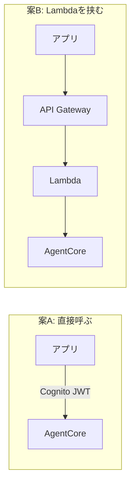

# 認証と構成の調査（API Gatewayは要るのか）

> 実施日: 2026-07-30 / 前提: [README.md](README.md)（AgentCore採用の経緯）、[../../docs/00_user_stories.md](../../docs/00_user_stories.md)（要件）
> **問い**: AgentCore が自前のエンドポイントを持つなら、**API Gateway + Lambda は不要ではないか**。

## 結論（先に要点）

**当面は API Gateway + Lambda を残す。** ただし理由は「必要だから」ではなく **「今それを判断する必要がないから」**。

| 論点 | 結論 |
|---|---|
| アプリから AgentCore を直接呼べるか | ✅ **呼べる**（Cognito + JWT で。IAM認証情報の埋め込み不要） |
| ユーザー単位の流量制限 | ❌ **AgentCore単体では見当たらない**（アカウント単位のクォータのみ） |
| メモ機能等の将来拡張 | ✅ **どちらの構成でも可能**（エージェントに `@tool` を足す） |
| **MVPに必要か** | **どちらでも US-1〜3 は満たせる** |

## 1. AgentCore の認証方式は2つ

| 方式 | 仕組み | アプリから使えるか |
|---|---|---|
| **IAM SigV4**（既定） | AWS APIと同じ署名 | ⚠️ アプリにIAM認証情報が要る → **避けたい** |
| **JWT Bearer Token** | OIDC準拠のIdPが発行したJWT | ✅ **Cognitoと組み合わせて使える** |

### JWT 方式なら Cognito が使える

Runtime作成時に `authorizerConfiguration` を渡すと、JWTを受け付けるようになる。

- IdPの **OpenID Connect discovery URL** を指定
- 許可する audience / client / scope を指定
- **IdPは何でもよい**（Cognito, Auth0, Okta…）。AWSは Cognito の設定例を公式提供

```
アプリ → Cognito でログイン → JWT取得 → AgentCore に Bearer で投げる
```

**これなら docs/01 §6 の大原則「APIキーをアプリにハードコードしない」を満たせる。**
むしろ Cognito の方が、当初のAPIキー方式より筋がよい（キーの手入力が不要になる）。

> ⚠️ `X-Amzn-Bedrock-AgentCore-Runtime-User-Id` ヘッダという簡易な方法もあるが、
> **AgentCoreはこの値を検証しない**（呼び出し側を信頼する）。公式も本番ではJWTを推奨。

## 2. ⚠️ 流量制限が最大の争点

docs/01 §7 では **API Gateway の Usage Plan** で「レート上限・1日あたりクォータ」を設計していた。

**AgentCore にこれに相当する機能は見当たらない。** あるのはアカウント単位のサービスクォータのみで、
「このユーザーは1日N回まで」という制御ではない。

| | API Gateway Usage Plan | AgentCore |
|---|---|---|
| ユーザー単位のレート制限 | ✅ ある | ❌ 見当たらない |
| 1日あたりクォータ | ✅ ある | ❌ 見当たらない |
| アカウント単位のクォータ | — | ✅ ある |

### ただし現時点では重大ではない

- **当面のユーザーは開発者本人のみ**（[00_user_stories.md](../../docs/00_user_stories.md) §5「複数ユーザー対応はやらない」）
- 悪用対策の**本命は [../account-cost-guard/](../account-cost-guard/) のキルスイッチ**（SCPでBedrockを完全停止）
- Usage Plan は「日常的な使いすぎ」を防ぐ層であって、最終防衛線ではない

→ **US-11（他の人にも使ってもらう）が現実になったときに、改めて判断すればよい。**

## 3. 構成の選択肢



| | 案A（直接） | 案B（Lambda経由） |
|---|---|---|
| 構成の単純さ | ✅ 層が少ない | ⚠️ 一層多い |
| 認証 | Cognito + JWT | APIキー or Cognito |
| **流量制限** | ❌ なし | ✅ **Usage Plan が使える** |
| 入力量の検証（§7.1） | エージェント内で実装 | ✅ **Lambdaで手前で弾ける** |
| レイテンシ | ✅ 短い | ⚠️ 1ホップ増える |
| コスト | ✅ 少ない | ⚠️ わずかに増える |
| 既存資産 | `backend/` が不要になる | ✅ 活かせる |

## 4. 判断：当面は案B（Lambdaを残す）

**理由は「今それを判断する必要がないから」。**

| 観点 | 判断 |
|---|---|
| MVP（US-1〜3）に必要か | **どちらでも満たせる** → 判断材料にならない |
| 流量制限 | 案Bなら**既に設計済みの手段が使える**。案Aだと再設計が要る |
| 入力量の上限（docs/01 §7.1） | Lambdaで手前で弾く設計になっている |
| 既存の `backend/` | すでに動いている。捨てる積極的理由がない |
| **後戻りのしやすさ** | **案B→案Aは容易**（Lambdaを外すだけ）。逆は再設計 |

**決め手は最後の行。** 迷ったら**後から外せる方**を選ぶ。
Lambdaを挟んでおけば、不要と分かった時点で外せる。逆に、外した後で流量制限が必要になると作り直しになる。

> ⚠️ ただし **Lambdaを「Bedrockを呼ぶ司令塔」としては使わない**。
> それは AgentCore の仕事になった。Lambdaの役割は**入口の門番**（認証・流量制限・入力検証）に変わる。

### docs/01 からの変更点

| | 当初（docs/01） | 変更後 |
|---|---|---|
| Lambdaの役割 | **司令塔**（STT→LLM→TTSを順に呼ぶ） | **門番**（検証してAgentCoreに渡す） |
| 会話の組み立て | Lambda | **AgentCore** |
| 認証 | APIキー | APIキー（当面）。**Cognitoも選択肢** |

## 5. メモ機能（US-9）は将来どう足すか

**どちらの構成でも、エージェントに `@tool` を足すだけ。** 入口の議論とは独立。

```python
@tool
def save_memo(text: str) -> str:
    """ライダーのメモを保存する"""
    boto3.client("lambda").invoke(FunctionName="lambda-trg-dev-memo", ...)
    # または DynamoDB に直接書く
```

### 選択肢

| 方式 | 実装 | 向く場面 |
|---|---|---|
| **`@tool` から直接** | boto3でLambda/DynamoDBを呼ぶ | ✅ **自分のリソースを数個呼ぶだけ。本命** |
| **AgentCore Gateway** | Lambda/APIをMCPツールに自動変換 | 多数のSaaS連携、複雑な認証。**本プロジェクトには過剰** |

> Gateway は Salesforce/Slack/Jira 等との連携が主眼。メモ1機能のために持ち込む必要はない。

**→ 今やるべきは「後からツールを足せる状態を保つ」ことだけ。** それは既に満たしている。

## 6. 未決事項

- [ ] 認証を **APIキー のままにするか Cognito にするか**（MVPではどちらでも動く。US-11が来たら要判断）
- [ ] Lambda → AgentCore の呼び出しに必要なIAM権限の整理
- [ ] `backend/` の `POST /ask` を AgentCore 呼び出しに置き換える実装
- [ ] 案Aに寄せる判断をする条件（レイテンシが問題になった場合など）

## 参考

- [Inbound/Outbound Auth（JWT・Cognito）](https://docs.aws.amazon.com/bedrock-agentcore/latest/devguide/runtime-oauth.html)
- [inbound JWT authorizer](https://docs.aws.amazon.com/bedrock-agentcore/latest/devguide/inbound-jwt-authorizer.html)
- [AgentCore Gateway](https://docs.aws.amazon.com/bedrock-agentcore/latest/devguide/gateway.html)
- [IAM Permissions for AgentCore Runtime](https://docs.aws.amazon.com/bedrock-agentcore/latest/devguide/runtime-permissions.html)
