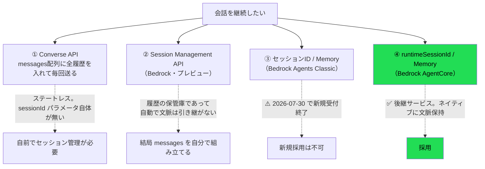
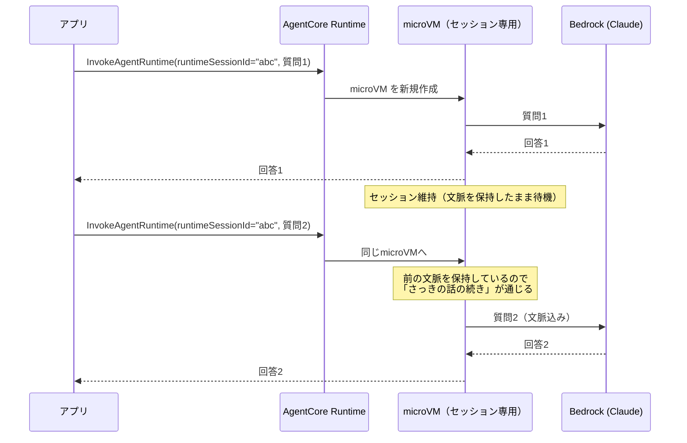
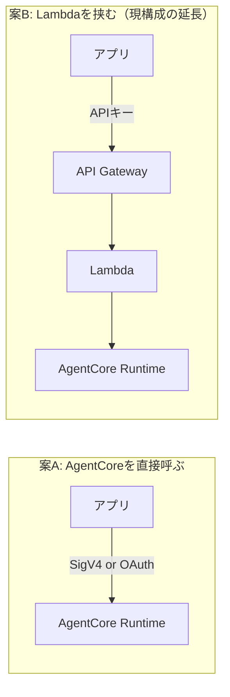

# Amazon Bedrock AgentCore 調査

> 実施日: 2026-07-25 / 対象アカウント: AWSプロファイル `touring` / リージョン: ap-northeast-1
> **目的**: 「1問1答で終わらず、続けて質問できる」会話継続を実現する。あわせて将来の拡張（WebSearch等のツール利用）に備える。
> **前提**: Bedrockモデル自体の調査は [../bedrock/](../bedrock/) を参照。

## 0. この調査に至った経緯

当初は Converse API に会話履歴を毎回送る方式を想定していたが、
「Bedrockにセッション機能はないのか」という指摘から調査したところ、
**Bedrock には会話継続の手段が複数あり、それぞれ別のサービス層の機能**であることが判明した。



**結論: AgentCore を採用する。** 理由は §3。

## 1. AgentCore とは何か

**エージェント（AIが自律的にツールを使って動くプログラム）を動かすためのマネージド実行基盤。**
Bedrock が「AIモデルそのもの」を提供するのに対し、AgentCore は「エージェントのコードを動かす場所」を提供する。

| | Bedrock (Converse API) | AgentCore Runtime |
|---|---|---|
| 提供するもの | **AIモデル** | **エージェントの実行環境** |
| 自分が書くもの | プロンプト | **エージェントのコード全体** |
| 状態 | ステートレス | **セッションごとに文脈を保持** |
| 実行単位 | API呼び出し1回 | microVM（最長8時間常駐） |

> ⚠️ 混同注意: AgentCore を使っても、**Claudeを呼ぶのは結局 Bedrock**。
> AgentCore は「Bedrockを呼ぶコードを、状態を持って動かす器」であり、Bedrockの代替ではない。

### 主要コンポーネント

| 用語 | 意味 |
|---|---|
| **AgentCore Runtime** | エージェントのコードをホストする基盤本体 |
| **Agent Runtime（リソース）** | デプロイした自分のエージェント1つ分。バージョン管理される |
| **Endpoint** | Runtimeの特定バージョンへのアクセス点。`DEFAULT` が自動作成される |
| **Session** | 1つの会話。`runtimeSessionId` で識別。専用microVMが割り当てられる |
| **AgentCore Memory** | セッションを越えて残る永続記憶（短期・長期） |

## 2. 「エージェントソース」とは（コンソールの2択の意味）

マネジメントコンソールで **S3ソース** と **ECRコンテナ** を選べるのは、
**「自分が書いたエージェントのコードをどう梱包して渡すか」の違い**。どちらも「自分のコードを動かす」点は同じ。

Lambda と全く同じ構図:

| Lambda | AgentCore | 中身 |
|---|---|---|
| .zip アップロード | **S3ソース**（direct code deployment） | コードとライブラリをzipで固める |
| コンテナイメージ | **ECRコンテナ** | Dockerイメージをビルドしてpush |

### 2方式の比較（公式記載）

| 観点 | **S3ソース（.zip）** | ECRコンテナ |
|---|---|---|
| パッケージ上限 | 250MB | 2GB |
| 更新の速さ | **大幅に速い** | 遅い |
| セッション作成レート | **25 /秒** | 1.6 /秒 |
| ランタイムのパッチ | **AWSが自動適用** | **自分で再ビルド・再デプロイ** |
| Docker | **不要** | 必要 |
| 責任分界 | **Lambdaと同様の共有責任モデル** | OSカーネルのみAWS |

### → 本プロジェクトは **S3ソース（.zip）** を採用

公式ガイダンスがそのまま当てはまる:

> If the size of the deployment package is small, the code and package is not complex to build and uses
> common frameworks and languages, and **you need rapid prototyping and iteration, then direct code
> deployment** would be the better option.

- Bedrockを呼ぶだけの小さなコードで、250MB上限は余裕
- **学習しながら反復する**ため、更新が速いことが効く
- **セキュリティパッチをAWSが自動適用**（コンテナだと自分で再ビルドし続ける必要がある）
- **Dockerを新たに学ぶ必要がない**（本プロジェクトの「モバイルは最小限、AWSに集中」方針にも合う）

> 将来、依存が250MBを超えたりCI/CDが整ってきたらコンテナへ移行できる。後戻りは小さい。

## 3. なぜ AgentCore を選んだか

| 候補 | 判定 | 理由 |
|---|---|---|
| Converse + 自前セッション管理 | 見送り | 動くが、ツール実行のループを自前で書く必要がある |
| Bedrock Agents Classic | **不可** | **2026-07-30 で新規受付終了**（調査時点で残り5日） |
| Session Management API | 見送り | プレビュー。かつ「保管庫」であって文脈の自動引き継ぎではない |
| **AgentCore** | ✅ **採用** | セッション・Memory・ツール実行がネイティブ。**将来のWebSearch等の拡張が本命** |

**決め手**: 本プロジェクトは学習教材も兼ねており、かつ将来的にAIがWebSearch等のツールを使う構想がある。
Agents Classic が新規終了する以上、**新規に学ぶなら後継のAgentCoreが妥当**。

## 4. セッションと会話継続の仕組み



- `runtimeSessionId` は**アプリ側が発行**する任意のID（AgentCoreが自動発行も可）
- 同じIDで呼べば同じmicroVMに繋がり、**文脈が保持される**
- IDを変えれば新しい会話として始まる

> ⚠️ **AgentCore はユーザーとセッションの紐付けを管理しない**。公式に明記あり:
> "AgentCore does not enforce session-to-user mappings - your client backend should maintain the relationship"
> → 誰のセッションかの管理は**こちらの責任**。

### セッションの寿命

| 状態 | 意味 |
|---|---|
| **Active** | リクエスト処理中、またはバックグラウンドタスク実行中 |
| **Idle** | 処理はしていないが、**文脈を保持したまま待機中** |
| **Terminated** | microVM破棄。以降同じIDで呼ぶと新しい環境が作られる（文脈は消える） |

終了する条件は3つ:
1. **アイドルタイムアウト**（デフォルト15分）
2. **最大ライフタイム**（デフォルト8時間）
3. `StopRuntimeSession` API での明示的な停止

## 5. タイムアウト設定（要望との関係）

当初の要望は「**一定時間以内なら続き。その時間をアプリで変更できるようにしたい**」だった。

AgentCore では `LifecycleConfiguration` で設定する:

| 属性 | 範囲 | デフォルト | 意味 |
|---|---|---|---|
| `idleRuntimeSessionTimeout` | 60〜28800秒 | **900秒（15分）** | この時間アイドルだとセッション終了 |
| `maxLifetime` | 60〜28800秒 | **28800秒（8時間）** | 最大寿命 |

```python
client.create_agent_runtime(
    lifecycleConfiguration={
        'idleRuntimeSessionTimeout': 1800,  # 30分
        'maxLifetime': 14400                # 4時間
    },
    ...)
```

### ⚠️ これは「アプリの設定値」ではなく「AWS側のリソース設定」

変更するには `UpdateAgentRuntime` の呼び出し（＝AWS権限が必要な操作）が要る。
**アプリの設定画面から自由に変えられる値ではない。**

→ 「アプリでタイムアウトを変更したい」は必須要件ではないと確認済みだが、
もし必要なら**アプリ側で別途セッションID発行のロジックを持つ**ことで実現できる:

```
アプリが「前回から N 分以上経った」と判断 → 新しい runtimeSessionId を発行
  → AgentCore側のタイムアウトより短い任意の時間で会話を切れる
```

つまり**AgentCoreのタイムアウトを長め（例:30分）に設定しておき、実際の区切りはアプリ側のID発行で制御**すれば、
アプリから可変にする要件も満たせる。→ 検証で確認したい（§8）。

## 6. コスト構造（重要）

**従量課金（consumption-based）だが、"consumption" に「アイドル時間」が含まれる。**

```
質問1 ──[アイドル：セッション維持＝microVM生存]── 質問2
       ↑ Lambdaなら課金ゼロ / AgentCoreは課金対象
```

公式の記述:
> **Idle** — Not processing any requests but **maintaining context** while waiting for next interaction

「文脈を保持したまま待機」＝ microVMが生きている ＝ リソース消費。

### ツーリング用途での懸念

走行中は**散発的に質問する**（質問 → 数分〜数十分走る → また質問）使い方になる。
デフォルト15分のアイドルタイムアウトだと、**質問の合間もセッションが生き続けて課金される**可能性がある。

| | Lambda | AgentCore |
|---|---|---|
| 質問の合間 | 課金ゼロ | **課金対象** |

> ⚠️ **正確な単価は未確認**（AWS料金ページ参照が必要）。
> 「アイドル中も課金対象」という構造は確認済みだが、**実額の試算は未了**。→ §8で実測したい。

### 対策の方向性（要検証）

- `idleRuntimeSessionTimeout` を**短めに設定**する（最小60秒）
- 会話が終わったら `StopRuntimeSession` で**明示的に停止**する
- アプリ側で「もう聞かない」と判断したら停止APIを叩く

## 7. 通信プロトコルと認証

AgentCore Runtime は4つのプロトコルをサポート。本プロジェクトは **HTTP** を想定。

| プロトコル | ポート | パス | 用途 |
|---|---|---|---|
| **HTTP** | 8080 | `/invocations`, `/ws` | **通常のリクエスト/レスポンス。これを使う** |
| MCP | 8000 | `/mcp` | ツールサーバー |
| A2A | 9000 | `/` | エージェント間通信 |
| AG-UI | 8080 | `/invocations` | UI連携 |

**認証は SigV4 または OAuth 2.0**。

### → これが「Lambdaが要るかどうか」に直結する（未決）

現在の構成は `アプリ → API Gateway → Lambda → Bedrock`。
AgentCore は**それ自体がエンドポイントを持つ**ため、Lambdaが不要になる可能性がある。



| | 案A（直接） | 案B（Lambda経由） |
|---|---|---|
| 構成 | シンプル | 一層多い |
| 認証 | **SigV4/OAuth をアプリが扱う必要** | APIキー方式（docs/01 §6の既定路線）を維持できる |
| 流量制限 | AgentCore側の制御に依存 | **API Gateway Usage Plan が使える**（docs/01 §7） |
| 入力量の検証 | エージェント内で実施 | Lambdaで事前に弾ける |

> **docs/01 §6 でAPIキー方式、§7で Usage Plan による流量制限を設計している。**
> 案Aだとこれらの前提が崩れるため、**案Bが有力**だが、AgentCoreの認証・流量制御の実力次第。→ §8で検証。

## 8. 会話継続の実証（実測・ローカル）

**結論: 同じ `runtimeSessionId` を渡せば会話は継続する。実測で確認済み。**

再現スクリプト: [`try_session.sh`](try_session.sh)

### 8.1 検証方法

指示語（「それ」）だけを含む質問を投げる。**前のターンを覚えていなければ答えられない**質問なので、
正しく答えられれば文脈が保持されている証拠になる。

まぐれ当たりを排除するため、**対照実験**として同じ質問を新しいセッションIDでも投げる。

### 8.2 結果

| | 同一セッションID | 別セッションID（対照） |
|---|---|---|
| Q「それは何県にありますか？」 | ✅ 「富士山は静岡県と山梨県の2県にまたがっています」 | ✅ 「**『それ』が何を指しているか判断できません**」 |

対照群が**正しく失敗している**点が重要。文脈が本当にセッション単位で分離されている。

### 8.3 3ターン以上でも遡れる

```
Q1: 静岡県の名物を1つ教えて
A1: 静岡おでんが有名です。…

Q2: それはいくらくらい？
A2: 1串あたり100円前後が相場で…        ← 1ターン前を参照

Q3: 最初に聞いたのは何県だった？
A3: 静岡県です。                        ← 2ターン前まで遡れる
```

直前だけでなく**会話全体の履歴**が保持されている。

### 8.4 ログで見るセッション分離

```
NEW creating agent for session: continuity-...-a
    session=continuity-...-a turns_before=0
    session=continuity-...-a turns_before=2     ← 履歴が積み上がる
NEW creating agent for session: continuity-...-b
    session=continuity-...-b turns_before=0     ← 対照群は常に0
NEW creating agent for session: multi-...
    session=multi-... turns_before=0
    session=multi-... turns_before=2
    session=multi-... turns_before=4            ← 3ターン分
```

`turns_before` は1往復ごとに2ずつ増える（user + assistant）。**IDごとに独立**しており混線しない。

### 8.5 ⚠️ この履歴は「プロセス内メモリ」である

CLIが生成するコードのコメントに明記されている通り、履歴は **in-process**。

- microVMが生きている間だけ保持される
- **アイドルタイムアウト（既定15分）や再起動で消える**
- 消えた後に同じIDで呼んでも、**新しい会話として始まる**（エラーにはならない）

→ 「30分前の会話の続き」を実現したいなら **AgentCore Memory**（永続記憶）が要る。§9の課題。

## 9. AWSへのデプロイ（実施済み）

**結論: デプロイ成功。クラウド上でも会話継続を確認。** 再現スクリプト: [`try_deployed.sh`](try_deployed.sh)

### 9.1 CDK bootstrap の方針（重要）

他プロジェクト（FinanceDashboard）と同じく、**qualifier を分けて同一アカウントで複数CDKを共存**させる。

```sh
cdk bootstrap \
  --toolkit-stack-name CDKToolkit-trg-dev \
  --qualifier trg-dev \
  --cloudformation-execution-policies "arn:aws:iam::aws:policy/PowerUserAccess,arn:aws:iam::aws:policy/IAMFullAccess"
```

| 項目 | 値 | 理由 |
|---|---|---|
| qualifier | `trg-dev` | **ハイフン可**（実測確認）。プロジェクト+環境で衝突を避ける |
| toolkitスタック名 | `CDKToolkit-trg-dev` | デフォルトの `CDKToolkit` と分離 |
| 実行ポリシー | PowerUser + IAMFullAccess | **AdministratorAccess を避ける**。まず広めに通し、後で絞る段階的方針 |

> ⚠️ デフォルトの `cdk bootstrap` は qualifier が `hnb659fds` 固定で **AdministratorAccess** が付く。これを避けるのが目的。

### 9.2 qualifier は `cdk.json` の context で渡す

```json
{ "context": { "@aws-cdk/core:bootstrapQualifier": "trg-dev" } }
```

**`agentcore deploy` もこれを尊重する**（生成された `cdk.out` に `/cdk-bootstrap/trg-dev/version` が出ることを確認）。
CLIを捨てて `cdk deploy` を直接叩く必要はない。

### 9.3 ⚠️ ハマった点：CLIがデフォルト名でbootstrapしようとする

`agentcore deploy` は **synth では qualifier を尊重するが、bootstrap チェックではデフォルトの `CDKToolkit` を見に行く**。

```
[STEP] Check bootstrap status
Bootstrap needed, auto-confirming...     ← 勝手にデフォルト名でbootstrapを試行
  └─ CDKToolkit
     🛑 The resources [StagingBucket] already exist ...
```

[aws-cdk#26588](https://github.com/aws/aws-cdk/issues/26588) と同種の既知問題。

**対処**: デフォルト qualifier のリソース（S3バケット等）を**完全に消してから**デプロイする。
スタックを削除しても **S3バケットは `Retain` 属性で残る**ので、バケットも明示的に削除する必要がある。
結果としてCLIがデフォルト `CDKToolkit` を作り直すが、**実際のデプロイには `cdk-trg-dev-cfn-exec-role` が使われる**ので実害はない。

### 9.4 実測結果（デプロイ済みRuntime）

| | 同一セッションID | 別セッションID（対照） |
|---|---|---|
| Q「それは何県にありますか？」 | ✅ 「**先ほどお伝えしたとおり**、静岡県と山梨県の2県に…」 | ✅ 「『それ』が何を指しているか判断できません」 |

**「先ほどお伝えしたとおり」** という表現が、前ターンを認識している決定的証拠。ローカルと同じ挙動。

### 9.5 その他の実務メモ

- `agentcore deploy` は数分かかる。**タイムアウトしてもCloudFormation側は進行し続ける**ので、
  `aws cloudformation wait stack-create-complete` で待つ。失敗と誤認しないこと。
- 上記でCLIを中断すると `agentcore/.cli/deployed-state.json` が更新されず、
  **`agentcore invoke` が "No deployed targets found" になる**。Runtime自体は動いているので、
  boto3の `invoke_agent_runtime` で直接叩ける（[`try_deployed.sh`](try_deployed.sh) がその方式）。
- **`runtimeSessionId` は33文字以上必要**（短いと ValidationException）。

## 10. 未検証・次にやること

### 最優先（設計判断に直結）

- [x] ~~`runtimeSessionId` で会話が継続することを実証~~ → **§8で完了（ローカル）**
- [x] ~~AWSへデプロイし、クラウド上でも通ることを確認~~ → **§9で完了**
- [x] ~~IaCの方針衝突~~ → **CDK併用を容認。docs/01 §8 を更新済み**（qualifier `trg-dev` で他CDKと分離）
- [ ] **Lambdaを挟むか否か**（§7の案A/案B）— 認証方式と流量制限の実現性を確認
- [ ] **アイドル課金の実額**（質問間隔を空けた場合のコスト挙動を実測）
- [ ] **セッション断（タイムアウト・再起動）時の挙動と、AgentCore Memory の要否**

### その次

- [ ] `idleRuntimeSessionTimeout` を短くした場合の挙動（最小60秒。会話が切れる体感）
- [ ] アプリ側のセッションID発行でタイムアウトを可変にできるか（§5の方式）
- [ ] `StopRuntimeSession` による明示的停止でコストを抑えられるか
- [ ] **AgentCore Memory**（セッションを越えた記憶）が本アプリに要るか
- [ ] ツール実行（WebSearch等）の実装方法 — 本命の拡張要件
- [ ] 最小権限ポリシーへの絞り込み（現在は PowerUser + IAMFullAccess。CloudTrailで実使用権限を確認して絞る）
- [ ] 既存の `backend/`（SAM）と `touringAgent/`（CDK）の連携方法（相互参照が要る場合）

## 11. 現時点の暫定方針

| 項目 | 暫定 | 確度 |
|---|---|---|
| セッション管理 | **AgentCore Runtime** | ✅ 確定 |
| エージェントソース | **S3ソース（.zip）** | ◯ 高い（要件に合致） |
| モデル | `jp.anthropic.claude-sonnet-4-6` | ✅ 確定（[../bedrock/](../bedrock/)） |
| IaC | **CDK**（qualifier `trg-dev`）。backend/ はSAMのまま | ✅ 確定 |
| Lambdaの要否 | **未決** | ✗ 調査次第 |
| タイムアウト値 | 未決 | ✗ 実測次第 |

## 参考

- [AgentCore とは](https://docs.aws.amazon.com/bedrock-agentcore/latest/devguide/what-is-bedrock-agentcore.html)
- [Runtime の仕組み](https://docs.aws.amazon.com/bedrock-agentcore/latest/devguide/runtime-how-it-works.html)
- [セッション管理](https://docs.aws.amazon.com/bedrock-agentcore/latest/devguide/runtime-sessions.html)
- [ライフサイクル設定](https://docs.aws.amazon.com/bedrock-agentcore/latest/devguide/runtime-lifecycle-settings.html)
- [直接コードデプロイ（S3ソース）](https://docs.aws.amazon.com/bedrock-agentcore/latest/devguide/runtime-get-started-code-deploy.html)
- [サービスコントラクト（プロトコル）](https://docs.aws.amazon.com/bedrock-agentcore/latest/devguide/runtime-service-contract.html)
- [Agents Classic メンテナンスモード](https://docs.aws.amazon.com/bedrock/latest/userguide/agents-classic-maintenance-mode.html)
