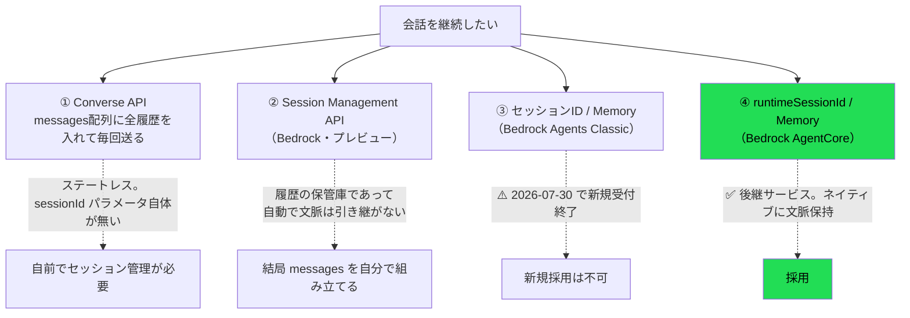
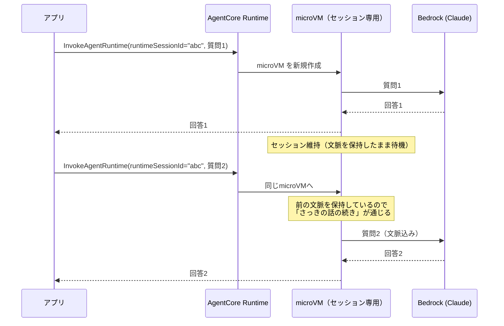
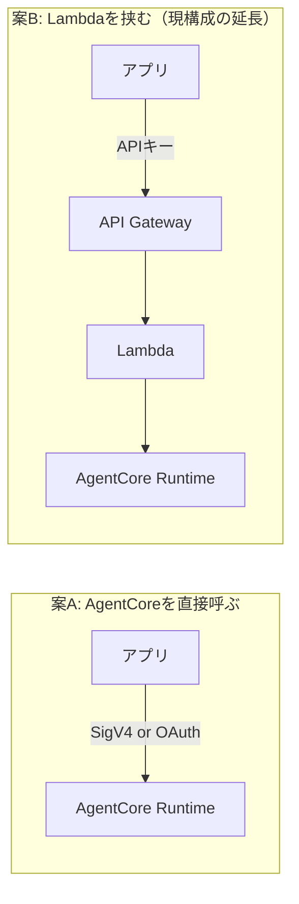

# Amazon Bedrock AgentCore 調査

> 実施日: 2026-07-25〜29 / 対象アカウント: AWSプロファイル `touring` / リージョン: ap-northeast-1
> **目的**: 「1問1答で終わらず、続けて質問できる」会話継続を実現する。あわせて将来の拡張（WebSearch等のツール利用）に備える。
> **前提**: Bedrockモデル自体の調査は [../bedrock/](../bedrock/) を参照。

## このディレクトリの構成

| ファイル | 役割 | こんなとき |
|---|---|---|
| **README.md**（本書） | **なぜそうしたか**（設計判断・技術選定・概念） | 判断の経緯を知りたい |
| [SETUP.md](SETUP.md) | **どう作るか**（コマンド手順・ハマりどころ） | ゼロから再現したい |
| [FINDINGS.md](FINDINGS.md) | **何が分かったか**（実測ログ・検証設計） | 根拠となる生データを見たい |
| [check_agentcore.sh](check_agentcore.sh) | 環境確認（読み取り専用） | AgentCoreが使えるか調べる |
| [try_session.sh](try_session.sh) | 会話継続の検証（ローカル） | 手元で再現する |
| [try_deployed.sh](try_deployed.sh) | 会話継続の検証（デプロイ済み） | AWS上で再現する |

> 基礎知識（そもそもエージェントとは何か）は [learning/51](../../learning/51_ai_agent_and_agentcore.md) にある。
> ここは**本プロジェクト固有の調査記録**に徹する。

## 0. この調査に至った経緯

当初は Converse API に会話履歴を毎回送る方式を想定していたが、
「Bedrockにセッション機能はないのか」という指摘から調査したところ、
**Bedrock には会話継続の手段が複数あり、それぞれ別のサービス層の機能**であることが判明した。



**結論: AgentCore を採用する。** 理由は §3。

## 1. AgentCore とは何か

**エージェント（AIが自律的にツールを使って動くプログラム）を動かすためのマネージド実行基盤。**
Bedrock が「AIモデルそのもの」を提供するのに対し、AgentCore は「エージェントのコードを動かす場所」を提供する。

| | Bedrock (Converse API) | AgentCore Runtime |
|---|---|---|
| 提供するもの | **AIモデル** | **エージェントの実行環境** |
| 自分が書くもの | プロンプト | **エージェントのコード全体** |
| 状態 | ステートレス | **セッションごとに文脈を保持** |
| 実行単位 | API呼び出し1回 | microVM（最長8時間常駐） |

> ⚠️ 混同注意: AgentCore を使っても、**Claudeを呼ぶのは結局 Bedrock**。
> AgentCore は「Bedrockを呼ぶコードを、状態を持って動かす器」であり、Bedrockの代替ではない。

### 主要コンポーネント

| 用語 | 意味 |
|---|---|
| **AgentCore Runtime** | エージェントのコードをホストする基盤本体 |
| **Agent Runtime（リソース）** | デプロイした自分のエージェント1つ分。バージョン管理される |
| **Endpoint** | Runtimeの特定バージョンへのアクセス点。`DEFAULT` が自動作成される |
| **Session** | 1つの会話。`runtimeSessionId` で識別。専用microVMが割り当てられる |
| **AgentCore Memory** | セッションを越えて残る永続記憶（短期・長期） |

## 2. 「エージェントソース」とは（コンソールの2択の意味）

マネジメントコンソールで **S3ソース** と **ECRコンテナ** を選べるのは、
**「自分が書いたエージェントのコードをどう梱包して渡すか」の違い**。どちらも「自分のコードを動かす」点は同じ。

Lambda と全く同じ構図:

| Lambda | AgentCore | 中身 |
|---|---|---|
| .zip アップロード | **S3ソース**（direct code deployment） | コードとライブラリをzipで固める |
| コンテナイメージ | **ECRコンテナ** | Dockerイメージをビルドしてpush |

### 2方式の比較（公式記載）

| 観点 | **S3ソース（.zip）** | ECRコンテナ |
|---|---|---|
| パッケージ上限 | 250MB | 2GB |
| 更新の速さ | **大幅に速い** | 遅い |
| セッション作成レート | **25 /秒** | 1.6 /秒 |
| ランタイムのパッチ | **AWSが自動適用** | **自分で再ビルド・再デプロイ** |
| Docker | **不要** | 必要 |
| 責任分界 | **Lambdaと同様の共有責任モデル** | OSカーネルのみAWS |

### → 本プロジェクトは **S3ソース（.zip）** を採用

公式ガイダンスがそのまま当てはまる:

> If the size of the deployment package is small, the code and package is not complex to build and uses
> common frameworks and languages, and **you need rapid prototyping and iteration, then direct code
> deployment** would be the better option.

- Bedrockを呼ぶだけの小さなコードで、250MB上限は余裕
- **学習しながら反復する**ため、更新が速いことが効く
- **セキュリティパッチをAWSが自動適用**（コンテナだと自分で再ビルドし続ける必要がある）
- **Dockerを新たに学ぶ必要がない**（本プロジェクトの「モバイルは最小限、AWSに集中」方針にも合う）

> 将来、依存が250MBを超えたりCI/CDが整ってきたらコンテナへ移行できる。後戻りは小さい。

## 3. なぜ AgentCore を選んだか

| 候補 | 判定 | 理由 |
|---|---|---|
| Converse + 自前セッション管理 | 見送り | 動くが、ツール実行のループを自前で書く必要がある |
| Bedrock Agents Classic | **不可** | **2026-07-30 で新規受付終了**（調査時点で残り5日） |
| Session Management API | 見送り | プレビュー。かつ「保管庫」であって文脈の自動引き継ぎではない |
| **AgentCore** | ✅ **採用** | セッション・Memory・ツール実行がネイティブ。**将来のWebSearch等の拡張が本命** |

**決め手**: 本プロジェクトは学習教材も兼ねており、かつ将来的にAIがWebSearch等のツールを使う構想がある。
Agents Classic が新規終了する以上、**新規に学ぶなら後継のAgentCoreが妥当**。

## 4. セッションと会話継続の仕組み



- `runtimeSessionId` は**アプリ側が発行**する任意のID（AgentCoreが自動発行も可）
- 同じIDで呼べば同じmicroVMに繋がり、**文脈が保持される**
- IDを変えれば新しい会話として始まる

> ⚠️ **AgentCore はユーザーとセッションの紐付けを管理しない**。公式に明記あり:
> "AgentCore does not enforce session-to-user mappings - your client backend should maintain the relationship"
> → 誰のセッションかの管理は**こちらの責任**。

### セッションの寿命

| 状態 | 意味 |
|---|---|
| **Active** | リクエスト処理中、またはバックグラウンドタスク実行中 |
| **Idle** | 処理はしていないが、**文脈を保持したまま待機中** |
| **Terminated** | microVM破棄。以降同じIDで呼ぶと新しい環境が作られる（文脈は消える） |

終了する条件は3つ:
1. **アイドルタイムアウト**（デフォルト15分）
2. **最大ライフタイム**（デフォルト8時間）
3. `StopRuntimeSession` API での明示的な停止

## 5. タイムアウト設定（要望との関係）

当初の要望は「**一定時間以内なら続き。その時間をアプリで変更できるようにしたい**」だった。

AgentCore では `LifecycleConfiguration` で設定する:

| 属性 | 範囲 | デフォルト | 意味 |
|---|---|---|---|
| `idleRuntimeSessionTimeout` | 60〜28800秒 | **900秒（15分）** | この時間アイドルだとセッション終了 |
| `maxLifetime` | 60〜28800秒 | **28800秒（8時間）** | 最大寿命 |

```python
client.create_agent_runtime(
    lifecycleConfiguration={
        'idleRuntimeSessionTimeout': 1800,  # 30分
        'maxLifetime': 14400                # 4時間
    },
    ...)
```

### ⚠️ これは「アプリの設定値」ではなく「AWS側のリソース設定」

変更するには `UpdateAgentRuntime` の呼び出し（＝AWS権限が必要な操作）が要る。
**アプリの設定画面から自由に変えられる値ではない。**

→ 「アプリでタイムアウトを変更したい」は必須要件ではないと確認済みだが、
もし必要なら**アプリ側で別途セッションID発行のロジックを持つ**ことで実現できる:

```
アプリが「前回から N 分以上経った」と判断 → 新しい runtimeSessionId を発行
  → AgentCore側のタイムアウトより短い任意の時間で会話を切れる
```

つまり**AgentCoreのタイムアウトを長め（例:30分）に設定しておき、実際の区切りはアプリ側のID発行で制御**すれば、
アプリから可変にする要件も満たせる。→ 未検証（§10）。

## 6. コスト構造（重要）

**従量課金（consumption-based）だが、"consumption" に「アイドル時間」が含まれる。**

```
質問1 ──[アイドル：セッション維持＝microVM生存]── 質問2
       ↑ Lambdaなら課金ゼロ / AgentCoreは課金対象
```

公式の記述:
> **Idle** — Not processing any requests but **maintaining context** while waiting for next interaction

「文脈を保持したまま待機」＝ microVMが生きている ＝ リソース消費。

### ツーリング用途での懸念

走行中は**散発的に質問する**（質問 → 数分〜数十分走る → また質問）使い方になる。
デフォルト15分のアイドルタイムアウトだと、**質問の合間もセッションが生き続けて課金される**可能性がある。

| | Lambda | AgentCore |
|---|---|---|
| 質問の合間 | 課金ゼロ | **課金対象** |

> ⚠️ **正確な単価は未確認**（AWS料金ページ参照が必要）。
> 「アイドル中も課金対象」という構造は確認済みだが、**実額の試算は未了**。→ [FINDINGS.md](FINDINGS.md) §6 の未検証項目。

### 対策の方向性（要検証）

- `idleRuntimeSessionTimeout` を**短めに設定**する（最小60秒）
- 会話が終わったら `StopRuntimeSession` で**明示的に停止**する
- アプリ側で「もう聞かない」と判断したら停止APIを叩く

## 7. 通信プロトコルと認証

AgentCore Runtime は4つのプロトコルをサポート。本プロジェクトは **HTTP** を想定。

| プロトコル | ポート | パス | 用途 |
|---|---|---|---|
| **HTTP** | 8080 | `/invocations`, `/ws` | **通常のリクエスト/レスポンス。これを使う** |
| MCP | 8000 | `/mcp` | ツールサーバー |
| A2A | 9000 | `/` | エージェント間通信 |
| AG-UI | 8080 | `/invocations` | UI連携 |

**認証は SigV4 または OAuth 2.0**。

### → これが「Lambdaが要るかどうか」に直結する（未決）

現在の構成は `アプリ → API Gateway → Lambda → Bedrock`。
AgentCore は**それ自体がエンドポイントを持つ**ため、Lambdaが不要になる可能性がある。



| | 案A（直接） | 案B（Lambda経由） |
|---|---|---|
| 構成 | シンプル | 一層多い |
| 認証 | **SigV4/OAuth をアプリが扱う必要** | APIキー方式（docs/01 §6の既定路線）を維持できる |
| 流量制限 | AgentCore側の制御に依存 | **API Gateway Usage Plan が使える**（docs/01 §7） |
| 入力量の検証 | エージェント内で実施 | Lambdaで事前に弾ける |

> **docs/01 §6 でAPIキー方式、§7で Usage Plan による流量制限を設計している。**
> 案Aだとこれらの前提が崩れるため、**案Bが有力**だが、AgentCoreの認証・流量制御の実力次第。→ §10 の未決事項。

## 8. 実証結果（要約）

**同じ `runtimeSessionId` を渡せば会話は継続する。ローカル・デプロイ済みの両方で確認済み。**

| 検証項目 | 結果 |
|---|---|
| 同一セッションIDで文脈が継続するか | ✅ する |
| 別セッションIDで文脈が漏れないか | ✅ 漏れない（対照実験で確認） |
| 3ターン以上遡れるか | ✅ 遡れる |
| 履歴の永続性 | ❌ **プロセス内メモリのみ**（タイムアウト・再起動で消える） |

> ⚠️ 履歴が消えた後に同じIDで呼んでも**エラーにならず、黙って新しい会話として始まる**。

**ただしこの制約は本プロジェクトでは問題にならない。**
要件は「一問一答＋α」で、**連続して聞くときに文脈が繋がればよい**。
15分以上あけて前の会話の続きを求める使い方は想定しないため、
**AgentCore Memory（セッションを越えた永続記憶）は採用しない。**

> 将来「走行ログを残す」等が要件化したら、それは**会話の記憶ではなくDB連携**の課題。
> AgentCore Memory とは別物として設計する。

**→ 実測ログ・検証設計の詳細は [FINDINGS.md](FINDINGS.md)。**

## 9. デプロイ（要約）

AWSへのデプロイ済み。Runtime `touringAgent_agentcore_trg_dev_ask` が `READY`。

| 項目 | 値 |
|---|---|
| CDK qualifier | **`trg-dev`**（他CDKと共存させるため分離） |
| toolkitスタック | `CDKToolkit-trg-dev` |
| 実行ポリシー | PowerUser + IAMFullAccess（**Adminを避ける**。後で絞る） |
| qualifierの渡し方 | `cdk.json` の `@aws-cdk/core:bootstrapQualifier` |

`agentcore deploy` は synth では qualifier を尊重するが、**bootstrapチェックはデフォルト名を見に行く**
（[aws-cdk#26588](https://github.com/aws/aws-cdk/issues/26588) と同種）。ハマりどころ。

**→ 手順・トラブルシューティングは [SETUP.md](SETUP.md)。**

## 10. 未検証・次にやること

### 最優先（設計判断に直結）

- [x] ~~`runtimeSessionId` で会話が継続することを実証~~ → **完了（[FINDINGS.md](FINDINGS.md)）**
- [x] ~~AWSへデプロイし、クラウド上でも通ることを確認~~ → **完了（[SETUP.md](SETUP.md) §6）**
- [x] ~~IaCの方針衝突~~ → **CDK併用を容認。docs/01 §8 を更新済み**（qualifier `trg-dev` で他CDKと分離）
- [ ] **Lambdaを挟むか否か**（§7の案A/案B）— 認証方式と流量制限の実現性を確認
- [ ] **アイドル課金の実額**（質問間隔を空けた場合のコスト挙動を実測）

### その次

- [ ] `idleRuntimeSessionTimeout` を短くした場合の挙動（最小60秒。会話が切れる体感）
- [ ] アプリ側のセッションID発行でタイムアウトを可変にできるか（§5の方式）
- [ ] `StopRuntimeSession` による明示的停止でコストを抑えられるか
- [x] ツール実行（WebSearch等）の実装方法 — **解決済み**。AgentCore Gateway の組み込みコネクタを
      MCP経由で使う形で US-1.04 を実装した（[../websearch/](../websearch/)）
- [ ] 最小権限ポリシーへの絞り込み（現在は PowerUser + IAMFullAccess。CloudTrailで実使用権限を確認して絞る）
- [ ] 既存の `backend/`（SAM）と `touringAgent/`（CDK）の連携方法（相互参照が要る場合）

## 11. 現時点の暫定方針

| 項目 | 暫定 | 確度 |
|---|---|---|
| セッション管理 | **AgentCore Runtime** | ✅ 確定 |
| エージェントソース | **S3ソース（.zip）** | ◯ 高い（要件に合致） |
| モデル | ~~`jp.anthropic.claude-sonnet-4-6`~~ → **`us.anthropic.claude-sonnet-4-6`** | ✅ 確定。US-1.04で us-east-1 へ移設したため `us.` 系に変更（[../websearch/](../websearch/)） |
| IaC | **CDK**（qualifier `trg-dev`）。backend/ はSAMのまま | ✅ 確定 |
| 会話の記憶 | **セッション内のみ**（AgentCore Memory は使わない） | ✅ 確定（要件が「一問一答＋α」のため） |
| Lambdaの要否 | **未決** | ✗ 調査次第 |
| タイムアウト値 | 未決 | ✗ 実測次第 |

## 参考

- [AgentCore とは](https://docs.aws.amazon.com/bedrock-agentcore/latest/devguide/what-is-bedrock-agentcore.html)
- [Runtime の仕組み](https://docs.aws.amazon.com/bedrock-agentcore/latest/devguide/runtime-how-it-works.html)
- [セッション管理](https://docs.aws.amazon.com/bedrock-agentcore/latest/devguide/runtime-sessions.html)
- [ライフサイクル設定](https://docs.aws.amazon.com/bedrock-agentcore/latest/devguide/runtime-lifecycle-settings.html)
- [直接コードデプロイ（S3ソース）](https://docs.aws.amazon.com/bedrock-agentcore/latest/devguide/runtime-get-started-code-deploy.html)
- [サービスコントラクト（プロトコル）](https://docs.aws.amazon.com/bedrock-agentcore/latest/devguide/runtime-service-contract.html)
- [Agents Classic メンテナンスモード](https://docs.aws.amazon.com/bedrock/latest/userguide/agents-classic-maintenance-mode.html)
