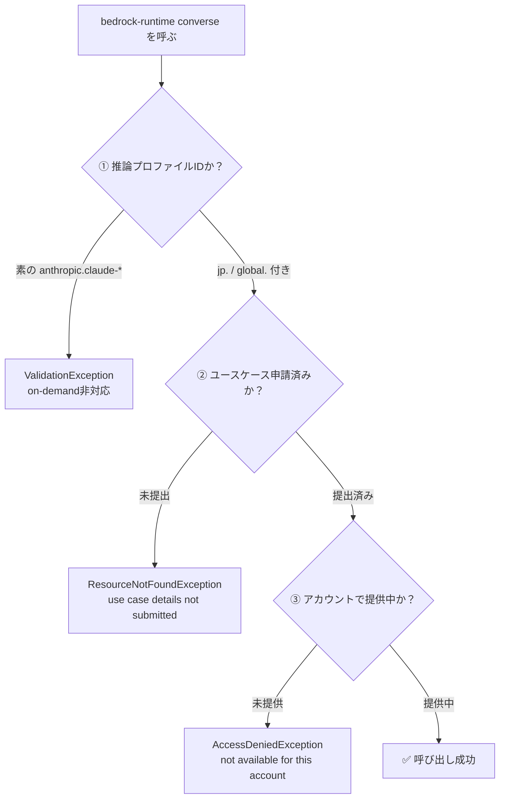

# Bedrock 事前調査（ap-northeast-1 / 東京）

> 実施日: 2026-07-25 / 対象アカウント: AWSプロファイル `touring`
> 目的: `POST /ask` に Bedrock を組み込む前に、**東京リージョンでどのClaudeモデルが実際に呼べるか**を確認する。
> 検証は AWS CLI（`bedrock` / `bedrock-runtime`）で実施。再現用スクリプトは [`check_models.sh`](check_models.sh)。

## 結論（先に要点）

| 項目 | 結果 |
|---|---|
| **採用モデル** | `jp.anthropic.claude-sonnet-4-6` |
| **呼び出しAPI** | Converse API（`bedrock-runtime converse`） |
| **SDK** | **boto3のみ**（Lambdaランタイム標準搭載。追加レイヤー不要） |
| **実測レイテンシ** | 約3.4秒（maxTokens=300、実用的な質問1件） |
| **前提作業** | **Anthropicユースケース申請フォームの提出が必須**（済） |

---

## 1. 最大のハマりどころ：3つの前提条件

東京リージョンでClaudeを呼ぶには、**3つの条件をすべて満たす必要がある**。
どれが欠けてもエラーになるが、**エラーメッセージが条件ごとに異なる**ため切り分けが要る。



### ① 推論プロファイル経由でしか呼べない

東京リージョンのAnthropicモデルは**すべて `INFERENCE_PROFILE` 型**。
`list-foundation-models` が返す素のモデルID（例 `anthropic.claude-sonnet-4-6`）を
そのまま `modelId` に渡しても**呼べない**。プレフィックス付きの推論プロファイルIDが必要。

| プレフィックス | 意味 | 本プロジェクトでの採否 |
|---|---|---|
| `jp.` | 日本国内リージョンで推論 | ✅ **採用**（データが国内に留まる） |
| `global.` | グローバル（国外にルーティングされ得る） | ❌ |
| `apac.` | アジア太平洋 | ❌（古いモデルのみ） |

```sh
# ❌ 呼べない
--model-id "anthropic.claude-sonnet-4-6"

# ✅ 呼べる
--model-id "jp.anthropic.claude-sonnet-4-6"
```

### ② Anthropicユースケース申請フォームの提出が必須

未提出の状態では、モデルアクセスを有効化していても以下のエラーになる:

```
ResourceNotFoundException:
Model use case details have not been submitted for this account.
Fill out the Anthropic use case details form before using the model.
If you have already filled out the form, try again in 15 minutes.
```

**対処**: AWSコンソール → Bedrock（東京） → 「モデルアクセス」 → ユースケース詳細フォームを提出。
個人開発でも可。反映まで最大15分程度。**本調査では提出後すぐに反映を確認できた。**

> ⚠️ `AccessDeniedException` と紛らわしいが**別物**。
> こちらは「申請すれば通る」、後者は「そもそもアカウントに提供されていない」。

### ③ アカウントで提供されているか

申請提出後も、モデルによっては `AccessDeniedException` が返る。

---

## 2. モデル別の可否（実測）

申請提出後に実際に `converse` を叩いた結果。

| モデル | 推論プロファイルID | 可否 |
|---|---|---|
| **Claude Sonnet 4.6** | `jp.anthropic.claude-sonnet-4-6` | ✅ **採用** |
| Claude Sonnet 4.5 | `jp.anthropic.claude-sonnet-4-5-20250929-v1:0` | ✅ |
| Claude Haiku 4.5 | `jp.anthropic.claude-haiku-4-5-20251001-v1:0` | ✅ |
| Claude Sonnet 5 | `global.anthropic.claude-sonnet-5` | ❌ 未提供 |
| Claude Opus 5 | `global.anthropic.claude-opus-5` | ❌ 未提供 |
| Claude Fable 5 | `global.anthropic.claude-fable-5` | ❌ 未提供 |
| Claude Opus 4.8 | `jp.anthropic.claude-opus-4-8` | ❌ 未提供 |
| Claude Opus 4.7 | `jp.anthropic.claude-opus-4-7` | ❌ 未提供 |

> **Claude 5系（Sonnet 5 / Opus 5 / Fable 5）は本アカウントでは未提供。**
> `list-inference-profiles` には `ACTIVE` として出てくるが、実際に呼ぶと `AccessDeniedException`。
> **一覧に出る ≠ 使える** ので、必ず実呼び出しで確認すること。
> 将来Sonnet 5が使えるようになったら、環境変数 `BEDROCK_MODEL_ID` を変えるだけで切り替わる設計にしてある。

### なぜ Sonnet 4.6 を選んだか

- **現時点で最新かつ実際に呼べる**Sonnetティア（Sonnet 5は未提供）
- `jp.` プロファイルがある＝**データが日本国内に留まる**
- Haiku 4.5 との実測比較（下記）で、**回答品質に決定的な差**があった

#### Sonnet 4.6 vs Haiku 4.5（同一プロンプトでの実測）

質問「右手に見える山は何ですか？」（富士市・北北東に進行）に対して:

| | Sonnet 4.6 | Haiku 4.5 |
|---|---|---|
| **回答** | 「愛鷹山（あしたかやま）だと思われます。富士山の南東に位置する火山で、標高1504メートル…」 | 「…具体的に特定することはできません。…地元の方に聞くか、地図アプリで確認されることをお勧めします」 |
| **レイテンシ** | 2507 ms | 1498 ms |
| **出力トークン** | 90 | 118 |
| **評価** | ✅ **具体的に答えた** | ❌ **回答を回避した** |

Haiku は約1秒速いものの、**知識を要する質問に答えず「地図アプリで確認を」と突き放す**。
走行中に画面を見られないライダーにとって、この回答は無価値。
コストが問題になった場合も、**Haikuへのダウングレードは体験を大きく損なう**ため慎重に判断する。

---

## 3. SDK選定：boto3 Converse API

| 選択肢 | 採否 | 理由 |
|---|---|---|
| **boto3 `converse`** | ✅ **採用** | Lambdaランタイムに**標準搭載**。追加依存ゼロでデプロイが軽い。後段のTranscribe/Pollyも同じboto3で統一できる |
| Anthropic公式SDK (`AnthropicBedrockMantle`) | ❌ | `requirements.txt` に `anthropic[bedrock]` が必要でパッケージサイズ増。本プロジェクトの規模では利点が薄い |

### Converse API を選ぶ理由（`invoke_model` ではなく）

- リクエスト/レスポンス形式が**プロバイダ非依存**。モデル差し替えがしやすい
- `system` / `messages` / `inferenceConfig` が構造化されており、JSON手組みが不要
- `usage`（トークン数）や `metrics.latencyMs` が標準で返る＝コスト監視に直結

---

## 4. レスポンス構造（実測）

```json
{
  "output": {
    "message": {
      "role": "assistant",
      "content": [ { "text": "回答テキスト" } ]
    }
  },
  "stopReason": "end_turn",
  "usage": {
    "inputTokens": 74,
    "outputTokens": 138,
    "totalTokens": 212,
    "cacheReadInputTokens": 0,
    "cacheWriteInputTokens": 0
  },
  "metrics": { "latencyMs": 3374 }
}
```

実装上の要点:

- 回答テキストは `output.message.content[0].text`
- ただし `content` は**複数ブロックが返り得る**（thinking等）。`text` キーを持つものだけを連結するのが安全
- `usage` はコスト監視・ログに使う（docs/01 §7）
- `metrics.latencyMs` で体感速度を計測できる

---

## 5. 実測でわかった設計上の知見

### ⚠️ 方位・左右の判定をLLMに任せてはいけない

実際に「静岡県富士市・進行方向は北北東、右手に見える山は？」と聞いたところ、
モデルは**富士山を「右手」と答えた**。富士市から北北東に進む場合、富士山は**左手**であり誤り。
（回答内でも「右手（東〜南東方向）」と言いながら「右手（西側）」と書くなど、自己矛盾していた。）

**対処**: 方位角の算出と左右の判定は**Lambda側で三角関数を使って厳密に行い**、
「右手は◯◯の方角」まで確定させてプロンプトに渡す。LLMには計算させない。
→ `Backend/src/lib/geo.py` として実装。

これは docs/01 の「2点から進行方位を算出する」設計の妥当性を裏付ける結果でもある。

### ⚠️ Markdown装飾が混ざる

システムプロンプトなしでは、回答に `**強調**` や見出し、箇条書き記号が入る。
**音声読み上げ（Polly）では記号がそのまま読まれて不自然**になる。

**対処**: システムプロンプトで明示的に禁止する。
→ `Backend/src/lib/bedrock.py` の `_SYSTEM_PROMPT` に記載。

### システムプロンプト適用後の実測（改善確認）

上記2点への対処を入れた `_SYSTEM_PROMPT` で再測定したところ、いずれも解消した:

```
質問: 右手に見える山は何ですか？（富士市・北北東に進行、右手＝東南東と明示）

回答: 富士市から北北東に進んでいて右手、つまり東南東方向に見える山は、
      愛鷹山（あしたかやま）だと思われます。富士山の南東に位置する火山で、
      標高1504メートルの愛鷹山塊の主峰です。

tokens: in=308 out=90 / latency: 2507 ms
```

| 観点 | 結果 |
|---|---|
| Markdown装飾 | ✅ なし（そのまま読み上げ可能） |
| 簡潔さ | ✅ 2文 |
| **左右の判定** | ✅ **正しい**（渡した方位情報をそのまま使用） |
| 不確実性の表明 | ✅ 「〜だと思われます」 |

**方位をLambda側で確定して渡す設計が有効であることを実証できた。**

### レイテンシは2.5〜3.4秒

maxTokens=300 で `latencyMs` は 2507〜3374 ms。
走行中の体験としては許容範囲だが、STT・TTSが前後に加わると合計はさらに伸びる。
将来的にストリーミング（`converse_stream`）や `maxTokens` 削減で短縮の余地あり。

---

## 6. Lambdaに必要なIAM権限

推論プロファイル経由の呼び出しでは、**プロファイル自体とその背後のモデル両方**に権限が要る。

```yaml
- Effect: Allow
  Action:
    - bedrock:InvokeModel
    - bedrock:InvokeModelWithResponseStream
  Resource:
    # 推論プロファイル本体
    - arn:aws:bedrock:ap-northeast-1:<account>:inference-profile/jp.anthropic.claude-sonnet-4-6
    # プロファイルがルーティングし得るリージョンのfoundation model
    - arn:aws:bedrock:*::foundation-model/anthropic.claude-sonnet-4-6
```

> `jp.` プロファイルは日本国内の複数リージョンにルーティングし得るため、
> foundation-model 側のリージョンは `*` にしておく必要がある。

---

## 7. 再現方法

```sh
# 全モデルの可否を一括チェック
./pre-research/bedrock/check_models.sh

# プロファイルを変える場合
AWS_PROFILE=your-profile ./pre-research/bedrock/check_models.sh
```

詳細は [`check_models.sh`](check_models.sh) を参照。

---

## 8. 会話の継続について（重要・別途調査）

**Converse API はステートレス**で、会話を継続するには**毎回リクエストに全履歴（`messages` 配列）を含めて送る**必要がある。
`converse` のパラメータに `sessionId` に相当するものは存在しない（実測で確認）:

```
modelId, messages, system, inferenceConfig, toolConfig, guardrailConfig,
additionalModelRequestFields, promptVariables,
additionalModelResponseFieldPaths, requestMetadata,
performanceConfig, serviceTier, outputConfig
```

ただし **Bedrock 全体で見ればセッション機能は複数存在する**。混同しやすいので整理:

| 機能 | 属するサービス | 位置づけ |
|---|---|---|
| `messages` 配列 | Converse API | Converseで会話継続する唯一の方法 |
| Session Management API | Bedrock（プレビュー） | 履歴の**保管庫**。自動では文脈を引き継がない |
| セッションID / Memory | **Bedrock Agents Classic** | ⚠️ 2026-07-30 で新規受付終了 |
| `runtimeSessionId` / Memory | **Bedrock AgentCore** | ✅ 後継。**本プロジェクトはこれを採用** |

→ 詳細と設計方針は **[pre-research/agentcore/](../agentcore/)** を参照。

## 9. 未確定・今後の課題

- [ ] Claude 5系が使えるようになったら切り替えるか（`BEDROCK_MODEL_ID` の変更のみで可能）
- [ ] コストが問題になった場合の Haiku 4.5 へのダウングレード判断基準
- [ ] `converse_stream` によるレイテンシ改善（音声再生を先行開始できるか）
- [ ] プロンプトキャッシュの活用（`cacheReadInputTokens` が返ることは確認済み）
- [ ] Transcribe / Polly も東京リージョンで同様の事前確認が必要
- [ ] AgentCore 採用に伴い、本調査の Converse 直接呼び出しをどこまで使うか（[agentcore/](../agentcore/) の結論次第）

## 参考

- [Amazon Bedrock 推論プロファイル](https://docs.aws.amazon.com/bedrock/latest/userguide/inference-profiles-support.html)
- [Converse API リファレンス](https://docs.aws.amazon.com/bedrock/latest/APIReference/API_runtime_Converse.html)
- [docs/01_architecture.md](../../docs/01_architecture.md) — 全体設計（§7 コスト対策）
