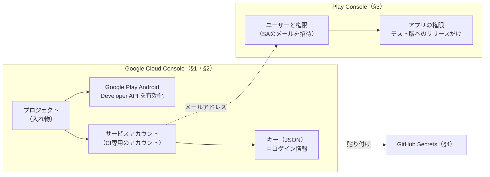

# 共通して必要になる準備

> 📌 **ここに書くのは「どの案を選んでも要るもの」**。
> 📌 **Google Cloud を触ったことが無くても進められるよう、画面の操作順に書く。**
> ⚠️ **画面の文言は日本語表示のもの。** 英語表示だったり、画面が改修されたりすると名前が変わることがある。

## 0. 全体像（何を作って、どうつながるか）

**やることは「CI専用のアカウントを作り、Playでそのアカウントに権限を与え、鍵をGitHubに預ける」。**
⚠️ **作る場所（Google Cloud）と、権限を与える場所（Play Console）が別**なのが分かりにくいところ。



| 用語 | 何か | AWSでいうと |
|---|---|---|
| **プロジェクト** | Google Cloud の**入れ物**。サービスアカウントもAPIの有効/無効もプロジェクト単位 | **AWSアカウント**に近い（1人で複数持てる） |
| **APIの有効化** | ⚠️ **Google Cloud のAPIは既定で無効。** 使うものだけプロジェクトごとにオンにする | ⚠️ **相当するものが無い**（AWSのサービスは最初から使える） |
| **サービスアカウント** | **プログラム用のアカウント。** 人ではないのでパスワードも2段階認証も無い | **プログラム用のIAMユーザー** |
| **キー（JSON）** | ⚠️ **サービスアカウントのログイン情報。** 期限が無く、持っていれば誰でもなりすませる | ⚠️ **IAMユーザーのアクセスキー** |
| **Play Console の「ユーザーと権限」** | **Playのデベロッパーアカウントに誰を入れて、何をさせるか** | — |

### ⚠️ 権限は Play Console 側で与える（Google Cloud 側ではない）

⚠️ **Google Cloud にも権限の仕組み（IAMのロール）があるが、今回は使わない。**
📌 **PlayのAPIは「Play Console でそのアカウントに何が許されているか」を見る**ため。

| 権限の場所 | 今回 |
|---|---|
| **Google Cloud の IAM ロール**（「オーナー」「編集者」等） | ❌ **付けない。** 付けても Play の操作は許されず、⚠️ **漏れたときに Google Cloud 側の被害が増えるだけ** |
| **Play Console の「アプリの権限」** | ✅ **ここで絞って与える**（§3） |

## ⚠️ 先に知っておくこと

⚠️ **サービスアカウントは作ってすぐには動かない。**
**Google側での有効化に最大24時間かかることがある。**
📌 **着手するなら、実際に使う日の前日までに作っておくとよい。**

## 1. Google Cloud のプロジェクト

⚠️ **Play Console とは別のサービス。** Googleアカウントは同じでよい。
📌 **Play Console とプロジェクトを「リンク」する操作は要らない**（公式ドキュメントで不要と明記）。
⚠️ **古い記事にある「Play Console →『API アクセス』でプロジェクトをリンク」という手順は飛ばしてよい。**

### 1-1. プロジェクトを作る

1. [Google Cloud Console](https://console.cloud.google.com/) を開く（初回は利用規約への同意を求められる）
2. **画面上部のプロジェクト選択欄 →「新しいプロジェクト」**
3. **プロジェクト名**を入れる（例: `touring-play`）。**「場所」は「組織なし」のままでよい**
   - 📌 **プロジェクトID**が名前から自動で付く。⚠️ **世界で一意で、後から変えられない。**
     ⚠️ **サービスアカウントのメールアドレスに入る**ので、変な名前にしないことだけ気にすればよい
4. **「作成」**
5. ⚠️ **上部の選択欄が新しいプロジェクトに切り替わっているか確認する**
   （⚠️ **別のプロジェクトのまま次へ進むのが典型的な間違い**）

### 1-2. API を有効化する

1. 左上の **≡（ナビゲーションメニュー）→「APIとサービス」→「ライブラリ」**
2. 検索欄に **`Google Play Android Developer API`** と入れて選ぶ
   - 📌 公式ドキュメントでは「Google Play Developer API」と呼んでいる。**同じもの**
3. **「有効にする」**

📌 **課金は発生しない**（このAPIの利用自体は無料）。

## 2. サービスアカウント

### 2-1. 作る

1. **≡ →「IAMと管理」→「サービスアカウント」→「サービスアカウントを作成」**
2. **サービスアカウント名**を入れる（例: `github-actions-play`）。IDは自動で入る
3. **「作成して続行」**
4. ⚠️ **「このサービスアカウントにプロジェクトへのアクセスを許可」（ロールの選択）は空のまま「続行」**
   （§0 のとおり、**Google Cloud 側の権限は要らない**）
5. **「ユーザーにこのサービスアカウントへのアクセスを許可」も空のまま「完了」**

📌 **一覧にメールアドレスが出る**:
`<サービスアカウント名>@<プロジェクトID>.iam.gserviceaccount.com`
⚠️ **これを §3 で Play Console に招待する。**

### 2-2. キー（JSON）を作る

1. 一覧で**サービスアカウントのメールアドレスをクリック**
2. **「キー」タブ →「鍵を追加」→「新しい鍵を作成」**
3. **キーのタイプは「JSON」→「作成」**
4. ⚠️ **JSONファイルが自動でダウンロードされる**（ふつうは `~/Downloads/`）

⚠️ **このファイルは二度とダウンロードできない。** 失くしたら**そのキーを削除して作り直す**
（同じ「キー」タブから。**サービスアカウント自体は作り直さなくてよい**）。

⚠️ **キーの作成が拒否された場合**は、組織のポリシー（`iam.disableServiceAccountKeyCreation`）が原因。
**2024-05-03 以降に作られた組織では既定で有効になっている。**
📌 **個人のGoogleアカウントで「組織なし」のプロジェクトなら、この制約は掛からない。**

### 2-3. ⚠️ JSON の扱い

⚠️ **このJSONは「Playにアプリを公開できる権限」そのもの。**
中には**秘密鍵（`private_key`）**と、どのアカウントか（`client_email`）が入っている。

| | |
|---|---|
| ❌ **コミットしない** | ⚠️ **`.gitignore` 済みの場所にも置かないほうがよい** |
| ✅ **GitHub Secrets に入れたら手元からは消す** | ⚠️ **ダウンロードフォルダに残りがち** |
| 📌 **漏れたら** | **Google Cloud でそのキーを削除する**（それで無効になる）。作り直して Secrets を差し替える |

**Secrets への貼り付けと削除**（ファイル名は実際のものに置き換える）:

```sh
pbcopy < ~/Downloads/<ダウンロードされたファイル>.json   # クリップボードへ
# → GitHub で PLAY_SERVICE_ACCOUNT_JSON に貼り付けてから
rm ~/Downloads/<ダウンロードされたファイル>.json
pbcopy < /dev/null                                         # クリップボードを空にする
```

## 3. ⚠️ Play Console 側で権限を与える

⚠️ **アプリの画面の中ではなく、デベロッパーアカウント全体の画面で行う。**

1. [Play Console](https://play.google.com/console/) を開き、**アプリ一覧の画面の左メニュー →「ユーザーと権限」**
2. **「新しいユーザーを招待」**
3. **メールアドレス**に ⚠️ **§2-1 のサービスアカウントのメールアドレス**（`...@....iam.gserviceaccount.com`）を入れる
4. ⚠️ **「アカウントの権限」タブは全部オフのまま**（ここの権限は**全アプリに効く**）
5. **「アプリの権限」タブ →「アプリを追加」→ `Touring Assistant` を選んで「適用」**
6. 出てきた権限の一覧で、⚠️ **「テスト版トラックへのアプリのリリース」だけ**をオンにする
   （英語表示では **Release apps to testing tracks**）
7. **「ユーザーを招待」**

⚠️ **権限は最小限に絞る:**

| 与える | 与えない |
|---|---|
| ✅ **テスト版トラックへのアプリのリリース**（公式: 下書きのアップロード、テスト版トラックへのリリースの作成・公開。**内部テストはこれで足りる**） | ❌ **本番へのリリース**（英語表示では Release to production, exclude devices, and use Play App Signing） |
| ✅ **対象アプリのみ**（「アプリの権限」タブ） | ❌ **「アカウントの権限」タブのもの全部**（財務データ・ユーザー管理等） |

⚠️ **本番公開の権限を与えないことで、事故で一般公開される経路を塞ぐ。**

## 4. GitHub Secrets（Environment に置く）

⚠️ **App リポジトリ**（`TouringProject_App`）の設定。⚠️ **アカウント全体の Settings ではない。**

### 4-1. Environment を作り、タグに限定する

📌 **Environment は Secrets を入れる箱。** 「どのブランチ・タグからの実行なら開けられるか」を制限できる。
ワークフローは `environment: play` と書いてこの箱を開け、中の Secrets を名前で使う。

1. **リポジトリ → Settings → Environments → New environment**、名前は **`play`**
2. **Deployment branches and tags** を **Selected branches and tags** に
3. **Add deployment branch or tag rule** → ⚠️ **Ref type を `Tag` に切り替えて** から、パターン **`v*`**
   - ⚠️ **既定は Branch。** 切り替え忘れると「`v` で始まるブランチ」の意味になり、**タグからの実行で Secrets を読めない**
4. **Required reviewers・Wait timer は付けない**

**確認**（`"type": "tag"` と出ればよい）:

```sh
gh api repos/h-akira/TouringProject_App/environments/play/deployment-branch-policies \
  --jq '.branch_policies[] | {name,type}'
```

### 4-2. Secrets を入れる

⚠️ **`play` の画面の「Environment secrets」に入れる**（Repository secrets ではない）。

| 名前 | 中身 |
|---|---|
| `PLAY_SERVICE_ACCOUNT_JSON` | ⚠️ **サービスアカウントのJSON全文**（§2-3） |
| `TRG_KEYSTORE_BASE64` | ⚠️ **`.jks` を base64 化したもの**（下記） |
| `TRG_KEYSTORE_PASSWORD` | キーストアのパスワード（`App/.env` と同じ。⚠️ **引用符は外す**） |
| `TRG_KEY_ALIAS` | `upload` |
| `TRG_KEY_PASSWORD` | 鍵のパスワード（同上） |

📌 **`TRG_*` を `App/.env` と同じ名前にしている**のは、Gradle が同じ名前の環境変数を読むため
（`App/plugins/withReleaseSigning.js`）。

**base64化のコマンド**:

```sh
base64 -i ~/.keystore/touring-upload.jks | pbcopy
```

⚠️ **`pbcopy` でクリップボードに入る**ので、⚠️ **ターミナルの履歴やファイルに残さずに済む。**
貼り付けたら `pbcopy < /dev/null` で空にする。

## 5. ⚠️ publicリポジトリでの注意

⚠️ **このリポジトリは public。** **ワークフローの書き方を誤ると、秘密が漏れる。**

| ⚠️ 罠 | 対処 |
|---|---|
| ⚠️ **`pull_request` で動かす** | ❌ **やらない。** **フォークからのPRでSecretsが使われる経路を作らない** |
| ⚠️ **ログに出す** | 📌 **Secretsは自動でマスクされる**が、⚠️ **base64を展開して `cat` すれば出る** |
| ⚠️ **`workflow_dispatch` を誰でも押せる** | 📌 **書き込み権限のある人だけなので、個人リポジトリなら問題ない** |

## 6. 確認の仕方

⚠️ **いきなり本番のワークフローを書かない。**

📌 **まず「サービスアカウントでAPIが叩けるか」だけを確かめる**のが安全。
**既存のリリース一覧を取得するだけの読み取り操作**なら、⚠️ **何も壊さずに権限を確認できる。**

📌 **App の `.github/workflows/play-api-check.yml` がそれ**（⚠️ **確認後に削除した。App の `v1.41.0` のタグに残っている**）。手動実行（`workflow_dispatch`）専用。
⚠️ **Secrets は `v*` タグからしか読めない**ので、**タグを指定して実行する**
（⚠️ **ワークフローのファイルが `main` とそのタグの両方に入っている必要がある**）:

```sh
gh workflow run play-api-check.yml --repo h-akira/TouringProject_App --ref v1.41.0
gh run watch --repo h-akira/TouringProject_App
```

| 結果 | 意味 |
|---|---|
| ✅ `internal completed [...]` のような行が出る | **認証も権限も通っている** |
| ⚠️ `401` | **JSON が壊れている**（貼り付けの欠け等） |
| ⚠️ `403` / `The caller does not have permission` | **Play Console の招待・権限が未反映**（§3。反映に時間がかかることがある） |
| ⚠️ `... is not allowed to deploy to play due to environment protection rules` | **タグ以外（`main` 等）で実行している**（§4-1）。⚠️ **正しく守られている証拠でもある** |

📌 **中身は「下書き（edit）を作って一覧を読み、コミットせずに消す」だけ**なので、Play には何も反映されない。

## 参考

- [Google Play Developer API - Getting Started](https://developers.google.com/android-publisher/getting_started)（プロジェクトのリンクが不要になった旨・招待の手順）
- [Play Console ヘルプ - デベロッパー アカウントのユーザーの追加と権限の管理](https://support.google.com/googleplay/android-developer/answer/9844686)（権限の名前と範囲）
- [Google Cloud - サービス アカウント キーの作成と削除](https://docs.cloud.google.com/iam/docs/keys-create-delete)（キーの作成手順・組織ポリシー）
- [GitHub Actions - Using secrets](https://docs.github.com/en/actions/security-guides/using-secrets-in-github-actions)
