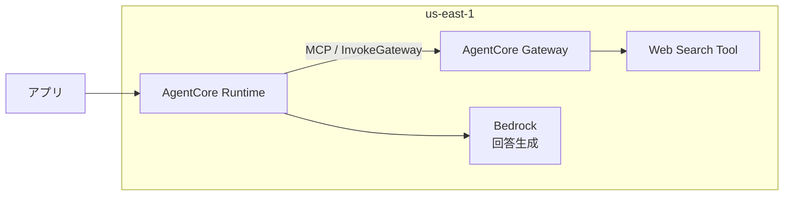

# Web検索（US-1.04）

> 前提: [../../docs/00_user_stories.md](../../docs/00_user_stories.md) 補足A（なぜ検索が要るか）

エージェントに「自分で調べて答える」能力を持たせるため、
**AgentCore Gateway の Web Search Tool**（AWS純正のマネージドコネクタ）を使う。

## 1. 何を使うか

| 項目 | 内容 |
|---|---|
| 実体 | AgentCore Gateway の**組み込みコネクタ**（`connectorId: "web-search"`） |
| 呼び出し方 | MCP。エージェントは `tools/list` で発見し `tools/call` で叩く |
| 認証 | **IAMのみ**（外部APIキー不要） |
| 提供リージョン | **us-east-1 のみ**（2026-08時点） |

**コネクタが us-east-1 限定なので、`touringAgent/` 全体を us-east-1 に置いている。**
Runtime と Gateway を同じリージョンに揃え、リージョンを跨がない構成にした。



> ⚠️ **`backend/`（SAM）は `ap-northeast-1` のまま。** リージョンが用途で分かれている
> （[../../CLAUDE.md](../../CLAUDE.md) の「AWS / バックエンド開発」参照）。
>
> ⚠️ **モデルIDも `us.` 系になる。** `jp.anthropic.claude-sonnet-4-6` は ap-northeast 専用の
> 推論プロファイルで、us-east-1 からは `ValidationException: The provided model identifier is invalid`
> になる（実測）。現在は `us.anthropic.claude-sonnet-4-6` を使用。

## 2. 仕様

### 入力

| フィールド | 必須 | 内容 |
|---|---|---|
| `query` | ✅ | 検索文字列。**200文字以内** |
| `maxResults` | — | 1〜25。既定10 |
| `filters` | — | ドメイン絞り込み・公開日の範囲（コネクタ `1.2.0` 以降） |

### 出力

MCP準拠。各結果は `text`（本文抜粋）・`url`・`title`・`publishedDate` を持つ。
ページ全体のHTMLではなく、**クエリに関連する箇所を抜き出したスニペット**が返る。

> ⚠️ **利用規約上、出力に含めた検索結果には出典（リンク）の表示が求められる。**
> 本アプリは回答を**音声で読み上げる**ため、URLの読み上げは体験を壊す。
> 画面表示との併用など、扱いは実装時に検討が要る。

## 3. コスト

| 項目 | 単価 |
|---|---|
| Web Search Tool | **$7 / 1,000クエリ** |
| AgentCore Gateway | $0.005 / 1,000ツール呼び出し |

**Gateway には時間課金が無い**（呼び出しに対してのみ課金）。

> ✅ この点は AgentCore **Runtime** と性質が異なる。
> Runtime は**アイドル中も課金される**（microVMが文脈保持のまま生存する）ため
> 「作業後に必ず消す」運用が要るが、**Gateway は作って放置しても課金されない**。混同しないこと。

## 4. 必要な権限

`bedrock-agentcore:InvokeGateway` を **Runtime の実行ロール**に付与する。

> ⚠️ これは**呼び出す側**に要る権限。Gateway 自身が引き受ける実行ロールとは別物。
> AWSドキュメントにも「`InvokeGateway` は実行ロールの一部ではなく、呼び出し元に属する」と明記がある。

なお、組み込みコネクタは `GATEWAY_IAM_ROLE` のみに対応する（APIキーやOAuthの指定は不可）。

## 5. 検証結果（2026-08-11）

`agentcore` CLI で検証用プロジェクトを作り、us-east-1 にデプロイして**コネクタを直接叩いた**。
モデルを介さないので、ここでの数値は**検索そのものの性能**を表す（[try_websearch.py](try_websearch.py)）。

> 検証後、スタックは削除済み（Runtimeがアイドル課金するため）。

### レイテンシ: 約0.9〜1.1秒

| クエリ | 往復 |
|---|---|
| 今日の静岡県富士市の天気は？ | 897 / 1003 ms |
| 静岡県富士市 国道1号沿い ガソリンスタンド 営業時間 | 1030 ms |
| 富士市 今日のイベント | 1064 ms |

**1秒前後で安定**。走行中の体験として許容できる範囲。

> ⚠️ **測定条件に注意。** これは**日本のローカルMacから us-east-1 のGatewayを直接叩いた**値で、
> 太平洋を往復する分が含まれている。本番では**Runtimeも us-east-1 にある**ため、
> Runtime→Gateway 間はこれより速いはず（未測定）。
> なおこれは検索単体の時間で、実際にはこの後にモデルの生成時間が乗る。

### 検索品質: 天気は良好、地点の曖昧さに弱い

**✅ 天気**（要件定義 補足Aで「検索なしでは答えられない」とされた質問）

```
[1] 静岡県富士市の天気予報(1時間・今日明日・週間)  weathernews.jp
[2] 富士市の天気 ... 最高 34℃ 最低 26℃ ... tenki.jp
```

地名をピンポイントに解決し、気温・降水確率まで含んだ抜粋が返る。**そのまま回答に使える。**

**⚠️ 地点が曖昧なクエリは精度が落ちる**

「富士市 今日のイベント」で、**山梨県富士吉田市**や富士宮市の結果が混入した。
「ガソリンスタンド」も宇佐美の検索ページなど**一般ページ**が上位に来て、
「この先で給油できるか」への直接的な答えにはならなかった。

> 📌 **示唆**: エージェントが投げるクエリの作り方が品質を左右する。
> 現在地（US-1.01）を**県名まで含めて**渡すよう促す必要がある。
> 「近くの」「この先の」といった相対表現のままでは検索に効かない。

### 判明した仕様

- Gateway は**自身のツール検索**（`x_amz_bedrock_agentcore_search`）も公開する。
  web検索ツールは `<ターゲット名>___WebSearch` という名前になるので、
  **一覧の先頭を掴むのではなく名前で選ぶこと。**
- MCPのレスポンスは `text/event-stream` で返ることがあるため、SSEとJSONの両方を解釈する必要がある。
- 検索結果の本文は、テキストブロックの中に**JSON文字列として入れ子**になっている。

## 6. エージェントに組み込んだ結果（2026-08-12）

`touringAgent` に組み込み、デプロイして実際に会話した結果。

### ✅ US-1.04 は成立した

```
Q. 静岡県富士市の国道1号を東に走っています。今日の天気はどうですか？
A. 今日の富士市は、おおむね晴れで最高気温は33度前後の真夏日になりそうです。
   午後は降水確率が40パーセントあるので、にわか雨に備えておくと安心です。
```

**「アプリで確認してください」を返さなくなった。** これが要件（補足A）の核心。

### ✅ 必要なときだけ検索する

ログ（OpenTelemetryのトレース）で実際のツール呼び出しを確認した:

| 質問 | 検索 | 投げられたクエリ |
|---|---|---|
| 今日の天気は？ | ✅ 1回 | `静岡県富士市 今日の天気` |
| 愛鷹山について教えて | ❌ 0回 | （検索せず即答） |

**クエリに県名と市名が補われている。** §5で見つかった「地点が曖昧だと精度が落ちる」問題に対し、
システムプロンプトで「都道府県名と市町村名を補って検索する」と指示した結果が効いている。

### ✅ 会話継続（US-1.02）と併存する

```
Q1. 静岡県富士市を走っています。今日の天気は？
A1. 今日の富士市は晴れ時々曇りで、最高気温は33度前後まで…

Q2. じゃあ、それは明日も続く？          ← 「それ」だけで通じる
A2. 明日の富士市も晴れベースですが、降水確率が60パーセントと今日より高めで…
```

指示語を文脈から解釈し、**翌日の天気を検索し直して**答えている。

### ⚠️ 給油所の検索は弱い（§5の懸念が再現）

```
Q. 静岡県富士市を走っています。この先で給油できますか？
A. 富士市内の具体的なガソリンスタンド情報が検索で取れませんでしたが、
   国道1号や139号沿いにガソリンスタンドが複数あることは確かです。
   ただし個別の営業状況まで確認できなかったので、正直にお伝えします。
```

**作り話はしなかった**（プロンプトの「分からなければ分からないと答える」が効いている）が、
**US-1.04の受け入れ条件「調べた上で答える」を完全には満たしていない。**

> 📌 これは検索エンジンの問題というより**質問の性質**の問題。
> 「この先」は現在地・進行方向・距離が分からないと答えられず、
> **US-2.03（進行方位の算出）が入って初めて実用になる**可能性が高い。
> Web検索単体で解ける問題ではないため、ここは追わない。

### ⚠️ 口調が音声向けから外れることがある

給油所の回答で「調べます！」「教えていただければ…！」と感嘆符が多用され、
2〜3文という指示も超えていた。検索結果が乏しいときほど冗長になる傾向がある。

> 音声読み上げ時の体験に関わるので、**P1の音声化（US-2.01/02）の際に再調整が要る。**

### 残りの検証項目

- [ ] 出典表示の扱い（§2の警告）を音声前提でどう設計するか

### 再現手順

検証用プロジェクトは `node_modules` と `.venv` で400MB超になるためコミットしていない。
CLIで作り直せる:

```sh
agentcore create --project-name websearchTest --name websearch_test \
  --build CodeZip --language Python --framework Strands \
  --model-provider Bedrock --memory none --protocol HTTP
cd websearchTest

agentcore add gateway --name websearchGw --protocol-type MCP --authorizer-type AWS_IAM
agentcore add gateway-target --name webSearchTarget --gateway websearchGw \
  --type connector --connector web-search

# Web Search Tool は us-east-1 限定
eval "$(aws configure export-credentials --profile touring --format env)"
AWS_REGION=us-east-1 AWS_DEFAULT_REGION=us-east-1 agentcore deploy -y
```

デプロイ結果の `GatewayWebsearchGwUrlOutput` を使って叩く:

```sh
export GATEWAY_URL="https://<gateway-id>.gateway.bedrock-agentcore.us-east-1.amazonaws.com/mcp"
AWS_REGION=us-east-1 python3 try_websearch.py "今日の静岡県富士市の天気は？"
```

> ⚠️ **終わったら必ず消す。** `agentcore` CLI に削除コマンドは無いので CloudFormation で消す。
> Gatewayは呼び出し課金のみだが、**同じスタックに載るRuntimeがアイドル課金する**ため。
>
> ```sh
> aws cloudformation delete-stack --stack-name AgentCore-websearchTest-default --region us-east-1
> ```

## 参考

- [Web Search Tool（AgentCore）](https://docs.aws.amazon.com/bedrock-agentcore/latest/devguide/gateway-target-connector-web-search-tool.html)
- [Gateway Targetの設定](https://docs.aws.amazon.com/bedrock-agentcore/latest/devguide/gateway-add-target-api-target-config.html)
- [AgentCore 料金](https://aws.amazon.com/bedrock/agentcore/pricing/)
