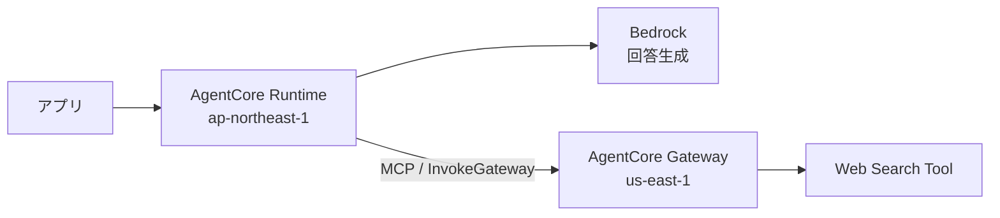

# Web検索（US-1.04）

> 前提: [../../docs/00_user_stories.md](../../docs/00_user_stories.md) 補足A（なぜ検索が要るか）

エージェントに「自分で調べて答える」能力を持たせるため、
**AgentCore Gateway の Web Search Tool**（AWS純正のマネージドコネクタ）を使う。

## 1. 何を使うか

| 項目 | 内容 |
|---|---|
| 実体 | AgentCore Gateway の**組み込みコネクタ**（`connectorId: "web-search"`） |
| 呼び出し方 | MCP。エージェントは `tools/list` で発見し `tools/call` で叩く |
| 認証 | **IAMのみ**（外部APIキー不要） |
| 提供リージョン | **us-east-1 のみ**（2026-08時点） |

Runtime は `ap-northeast-1`、Gateway は `us-east-1` に置くため、**リージョンを跨ぐ**構成になる。

## 2. 仕様

### 入力

| フィールド | 必須 | 内容 |
|---|---|---|
| `query` | ✅ | 検索文字列。**200文字以内** |
| `maxResults` | — | 1〜25。既定10 |
| `filters` | — | ドメイン絞り込み・公開日の範囲（コネクタ `1.2.0` 以降） |

### 出力

MCP準拠。各結果は `text`（本文抜粋）・`url`・`title`・`publishedDate` を持つ。
ページ全体のHTMLではなく、**クエリに関連する箇所を抜き出したスニペット**が返る。

> ⚠️ **利用規約上、出力に含めた検索結果には出典（リンク）の表示が求められる。**
> 本アプリは回答を**音声で読み上げる**ため、URLの読み上げは体験を壊す。
> 画面表示との併用など、扱いは実装時に検討が要る。

## 3. コスト

| 項目 | 単価 |
|---|---|
| Web Search Tool | **$7 / 1,000クエリ** |
| AgentCore Gateway | $0.005 / 1,000ツール呼び出し |

**Gateway には時間課金が無い**（呼び出しに対してのみ課金）。

> ✅ この点は AgentCore **Runtime** と性質が異なる。
> Runtime は**アイドル中も課金される**（microVMが文脈保持のまま生存する）ため
> 「作業後に必ず消す」運用が要るが、**Gateway は作って放置しても課金されない**。混同しないこと。

## 4. 必要な権限

`bedrock-agentcore:InvokeGateway` を **Runtime の実行ロール**に付与する。

> ⚠️ これは**呼び出す側**に要る権限。Gateway 自身が引き受ける実行ロールとは別物。
> AWSドキュメントにも「`InvokeGateway` は実行ロールの一部ではなく、呼び出し元に属する」と明記がある。

なお、組み込みコネクタは `GATEWAY_IAM_ROLE` のみに対応する（APIキーやOAuthの指定は不可）。

## 5. 検証結果

> 📌 **未実施。** 実際に繋いだら、ここに実測を追記する。

検証したいこと:

- [ ] 日本のローカル情報の検索品質（「この先のガソリンスタンド」「今日の天気」が実用になるか）
- [ ] クロスリージョン呼び出しのレイテンシ
- [ ] 検索が不要な質問で無駄に検索しないか（システムプロンプトでの制御が要るか）

判定基準は [../../docs/00_user_stories.md](../../docs/00_user_stories.md) §6 の MVP 成功条件に従う。

## 参考

- [Web Search Tool（AgentCore）](https://docs.aws.amazon.com/bedrock-agentcore/latest/devguide/gateway-target-connector-web-search-tool.html)
- [Gateway Targetの設定](https://docs.aws.amazon.com/bedrock-agentcore/latest/devguide/gateway-add-target-api-target-config.html)
- [AgentCore 料金](https://aws.amazon.com/bedrock/agentcore/pricing/)
